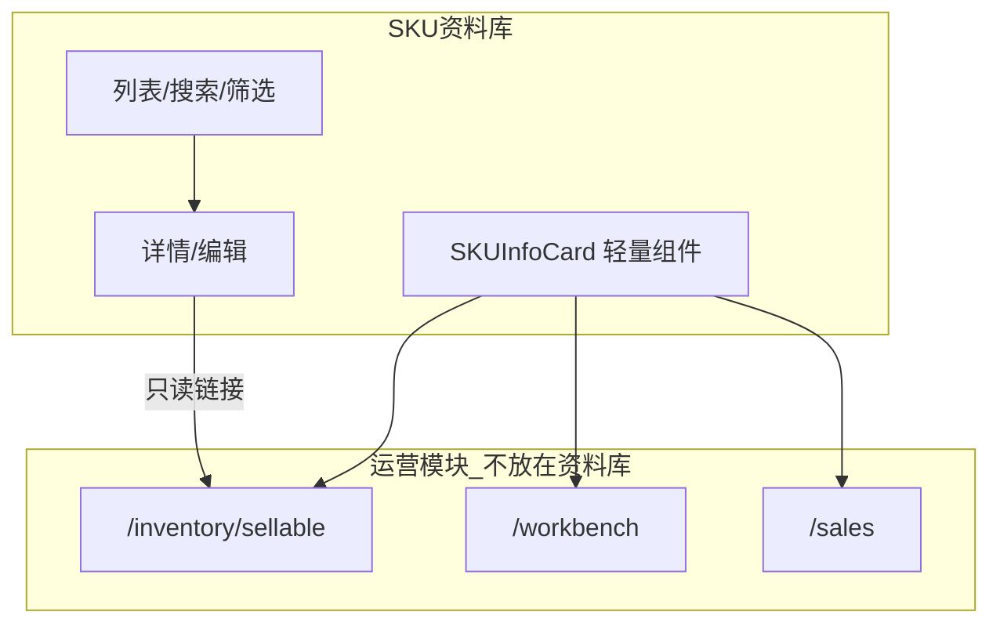

# SKU资料库（商品中心）重构计划

## 现状与文档差异


| 维度   | 当前实现                                                                                                                                            | preview (6) 目标                                               |
| ---- | ----------------------------------------------------------------------------------------------------------------------------------------------- | ------------------------------------------------------------ |
| 定位   | `[/inventory/skus](app/(dashboard)`/inventory/skus/page.tsx) 标题「商品SKU」，列表用 `[SKUCardGrid](components/inventory/sku-card-grid.tsx)` 展示库存/平台/生命周期 | **SKU资料库**：只维护主数据，可被其他模块调用                                   |
| 详情页  | `[skus/[id]/page.tsx](app/(dashboard)`/inventory/skus/[id]/page.tsx) 含可售库存、经营分析、**上架情况**、**发起上架** CTA                                           | 基础信息 + 图片 + 变体 + 全新/中古字段 + **只读**引用摘要                        |
| 数据模型 | `[SKU](prisma/schema.prisma)`：`code/name/brand/category/attributes/imageUrl/parentSkuId`                                                        | 需区分全新/中古、参考价、多图、停用；**你已选：写入 `attributes` JSON，本轮不迁移 schema** |
| 图片   | `[sku-form.tsx](components/inventory/sku-form.tsx)` 已支持 URL + `/api/upload` 单张 `imageUrl`                                                       | 多图 + 封面（存 JSON）                                              |
| 变体   | `parentSkuId` + `childSkus` + `attributes` 键值                                                                                                   | 对齐文档「角色/规格」语义，沿用父子 SKU + attributes                          |
| 删除   | `[deleteSKU](app/actions/skus.ts)` 仅无关联时可删                                                                                                      | 还需「停用」语义（用 `attributes.status = disabled`）                   |





## 设计原则（采纳与保留）

**采纳 preview：**

- 侧栏「商品中心」→ **SKU资料库**（路由仍可用 `/inventory/skus`，避免大面积改链）
- 详情页去掉：发起上架、上架列表、以运营为主的首屏指标
- 列表页去掉：平台运营条、生命周期驱动的主操作

**保留现有能力（反驳文档中不必推倒的部分）：**

- **平台仍从配置选择**（上架在销售模块，不在资料库）
- **父子 SKU** 已满足 POP MART 变体，不必另建变体表
- **删除 SKU** 逻辑保留；「停用」用 `attributes._status = "disabled"`（或约定键 `catalogStatus`）
- `[getSKUById](app/actions/skus.ts)` 的性能指标可降为详情页「只读参考」折叠区，而非首屏

## attributes JSON 约定（本轮数据层）

在 `[lib/application/sku-catalog.ts](lib/application/sku-catalog.ts)`（新建）集中解析/校验，避免 UI 散落魔法键：

```ts
// 示例结构（存于 SKU.attributes）
{
  catalogStatus: "active" | "disabled",
  productKind: "NEW" | "USED",
  referencePrice?: string,
  referenceCost?: string,
  currency?: string,
  tags?: string[],
  series?: string,
  images?: { url: string; isCover?: boolean }[],
  newFields?: { isSealed?: boolean; barcode?: string; ... },
  usedFields?: { defaultConditionGrade?: string; hasBox?: boolean; ... }
}
```

- 主图：继续同步 `imageUrl` = `images` 中 `isCover` 项，兼容现有 `[ProductImage](components/ui/product-image.tsx)` 调用方
- 表单写入时合并 attributes，不破坏已有自定义键值（变体属性）

## 实施阶段

### 阶段 1：信息架构与导航

- `[sidebar.tsx](components/layout/sidebar.tsx)`：`商品中心` → `SKU资料库`
- 列表页 `[skus/page.tsx](app/(dashboard)`/inventory/skus/page.tsx)：标题/描述改为「商品主数据」；替换数据源为新的 `getSkuCatalogList()`（轻量查询，不拉 listing/stock 运营聚合）
- 详情页 `[skus/[id]/page.tsx](app/(dashboard)`/inventory/skus/[id]/page.tsx) 重构布局：
  - **主区**：基础信息、图片画廊、变体（父子 SKU + attributes）、全新/中古扩展表单
  - **侧栏/底部**：`SKUReferencePanel` 只读摘要（可售数量、上架记录数、最近采购/销售各 1–2 条）+ 外链「前往可售库存」「查看销售」
  - 移除：首屏「发起上架」、上架情况 Card 内的创建引导
- 全局文案：工作台/采购等处的「商品中心」改为「SKU资料库」（如 `[pending-action-panel.tsx](components/workbench/pending-action-panel.tsx)`）

### 阶段 2：列表页（资料库风格）

新建 `[components/inventory/sku-catalog-table.tsx](components/inventory/sku-catalog-table.tsx)`（或简化版 `[sku-catalog-grid.tsx](components/inventory/sku-catalog-grid.tsx)`）：

- 列/卡字段：封面、名称、编码、品牌、分类、商品类型（全新/中古）、变体数（childSkus）、参考售价、状态（启用/停用）
- 筛选：搜索、`productKind`、品牌、分类、`catalogStatus`
- 操作：查看 / 编辑 / 停用（无「添加上架」）
- **降级**：`[SKUCardGrid](components/inventory/sku-card-grid.tsx)` + `[getSkuCardOverviews](app/actions/sku-card-overviews.ts)` 保留文件但列表页不再使用（避免删除后其他地方断裂，待确认无引用再清理）

### 阶段 3：表单与图片

扩展 `[sku-form.tsx](components/inventory/sku-form.tsx)` / `[SKUDetailActions](components/inventory/sku-detail-actions.tsx)`：

- 区块：**商品类型**（全新/中古）→ 条件展示 `newFields` / `usedFields` 表单项
- 区块：**参考价/成本/币种/标签/系列**
- 区块：**图片管理**：多图列表、上传、设封面、删除（写 `attributes.images` + 同步 `imageUrl`）
- **停用**：更新 `catalogStatus`，列表筛选生效
- 负责人等 preview 字段：可放在 `attributes.notes`，表单说明即可

`[app/actions/skus.ts](app/actions/skus.ts)`：`createSKU` / `updateSKU` 接收解析后的 attributes；可选新增 `setSkuCatalogStatus(id, status)`

### 阶段 4：可复用轻量组件

新建 `[components/inventory/sku-info-card.tsx](components/inventory/sku-info-card.tsx)`：

- Props：`skuId` 或 `{ code, name, imageUrl, brand, category, productKind, referencePrice }`
- 用于：可售库存卡片头部、采购行、上架表单、工作台（逐步替换内联 SKU 展示）

首批接入点（最小 diff）：

- `[listing-coverage-card.tsx](components/listing/listing-coverage-card.tsx)` 商品标题区
- `[app/(dashboard)/inventory/sellable/page.tsx](app/(dashboard)`/inventory/sellable/page.tsx) 无需改（已用 coverage card）
- 采购/销售表单若有 SKU 选择器，第二轮再接

### 阶段 5：详情「被引用记录」

在详情页增加只读区块（查询现有 `_count` / 简短列表）：

- 库存：链接到 SKU 相关 lots / item units（`[inventory/lots](app/(dashboard)`/inventory/lots/page.tsx) 带 sku 筛选若已有则链详情）
- 上架：链接 `[/inventory/sellable](app/(dashboard)`/inventory/sellable) + `?q=skuCode`
- 采购/销售：最近 3 条（详情页已有类似数据，搬迁到「引用」区）

## 明确不做（本轮）

- Prisma schema 迁移（按你的选择）
- 在 SKU资料库内「添加上架记录 / 登记售出 / 平台覆盖」
- 固定平台矩阵或平台运营 UI
- 完整报表/利润模块搬入 SKU 详情
- 替换所有模块中的 SKU 展示（仅首批 1–2 处接入 `SKUInfoCard`）

## 验收标准

- 侧栏显示「SKU资料库」，进入后心智为「维护商品档案」
- 列表页无平台运营条、无「待上架」主 CTA
- 详情页无「发起上架」主按钮；上架/库存通过外链进入可售库存
- 可创建/编辑 SKU，选择全新或中古并保存到 `attributes`
- 可上传多张图并设置封面，`imageUrl` 与封面一致
- 可停用 SKU 且在列表筛选中生效
- `npm run build` 通过；`createSKU` / `updateSKU` / `deleteSKU` 行为不回归

## 建议实施顺序

1. `sku-catalog.ts` 类型约定 + `getSkuCatalogList` / `getSkuCatalogDetail` 
2. 侧栏与列表页替换
3. 详情页解耦 + `SKUReferencePanel`
4. 表单扩展（类型/多图/停用）
5. `SKUInfoCard` + 1–2 处接入
6. 全局文案与 build 验证

