# 货盘与倒买倒卖全流程审计

> 审计日期：2026-08-03
> 审计范围：采购、质检、转运、库存、货盘、代卖、成交、发货与分账
> 用户视角：做小规模倒买倒卖生意、不了解专业电商术语的普通经营者

> **本次规则澄清：**“按纯利润分成”只是两个测试案例中的具体约定，不是产品应内置的唯一标准。佣金、分成、固定服务费、运费、税费及其他费用由谁承担、是否参与分成、采用固定金额还是比例，均应以双方确认的协议为准。系统可以提供模板、建议和试算，但不能替双方写死规则；确认后的协议版本及成交时快照才是计算与结算依据。

> **状态说明：**第 1–14 节保留 2026-08-03 首次审计时的真实基线和失败证据，不追改历史结论；整改后的当前状态、验证结果和新证据统一记录在第 15 节。

## 1. 执行结论

当前系统已经具备一条有价值的底层主线：商品可以从真实库存选择后发布；同一批实物可在多个账号扩大曝光而不在上架时占库存；订单成交时再锁定库存；并发下不会把 5 件库存卖成 6 件；取消后预留能够释放。

但它还不能安全承载本次两个现实案例。关键阻断集中在四件事：

1. 不同经营主体之间无法完成定向货盘交接。
2. CNY 成本、JPY 售价和固定发货费缺少统一、强制的换汇与币种语义。
3. 当前合作规则被限制为少数固定佣金模型，不能完整记录“双方实际约定”；本次案例约定按利润分成，但系统中的 50% / 20% 只能按成交额返佣。
4. ItemUnit 身份、跨国选仓和货盘余量可能显示或分配错误。

| 维度 | 评分 | 结论 |
| --- | ---: | --- |
| 可用性 | 2 / 5 | 库存选品、发布和共享锁库可用；采购成本不明确、跨主体授权及完整结算主链被阻断。 |
| 易用性 | 2 / 5 | 新货盘页已明显简化，但“返佣、合作方、代发主体、节点”等概念仍要求用户先懂系统模型。 |
| 数据准确性 | 1 / 5 | 已复现跨币种直接相减、按成交额返佣、ItemUnit 替换、错误选仓和货盘余量陈旧。 |

综合判定：适合继续作为内部原型验证，但不适合在未修复 P0/P1 前用于真实跨币种分账或一物一单交易。

## 2. 执行方法与证据边界

### 2.1 隔离环境

- 首饰案例：独立 PostgreSQL 数据库 `erp_v2_audit_jewelry_20260803`，本地端口 `3111`。
- 毛绒案例：独立 PostgreSQL 数据库 `erp_v2_audit_plush_20260803`，本地端口 `3112`。
- 共享库存专项：独立数据库 `erp_v2_audit_crosscut_20260803`。
- 未复用当前演示服务，未执行默认 seed，未修改现有业务数据。
- 两个案例均使用真实登录账号，不使用 `ERP_DEV_USER_EMAIL` 作为浏览器登录替代。

全新数据库执行 `prisma migrate deploy` 时，在迁移 `20260729153000_lock_consolidation_inventory` 失败，错误为 `relation "consolidation_batch_lines" does not exist`。为继续审计，案例库使用 `prisma db push` 建表，并通过显式 fixture 补齐经营主体、库存池、账号和权限。该降级会在报告中与产品流程问题分开记录。

### 2.2 浏览器与截图

两个 sub-agent 的运行环境没有暴露 in-app Browser；经主 agent 明确批准，改用 Chrome 完成 UI 操作。所有采用 fixture 续接的页面均标注“不是完整端到端流程”。主 agent 已逐张检查纳入本报告的截图，未使用空白页或错误账号截图作为业务结论。

### 2.3 外部系统边界

- 未调用 Mercari、Yahoo、闲鱼等真实发布接口，只验证 ERP 内部上架记录。
- 未调用真实承运商轨迹，只验证系统内节点、批次、状态和库存流水。
- 汇率使用固定审计数据，不评价实时行情来源。
- 售后只覆盖取消释放和代码/数据路径复核；发错货、赔付和复杂退换货留作后续专项。

## 3. 标准账号、经营主体与业务关系

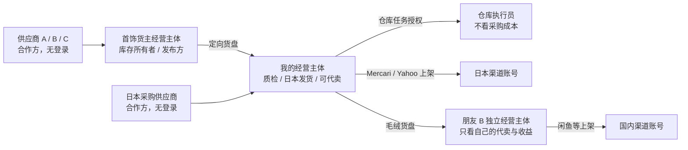
```mermaid
flowchart LR
  SA["供应商 A / B / C\n合作方，无登录"] --> JO["首饰货主经营主体\n库存所有者 / 发布方"]
  JO -->|"定向货盘"| MO["我的经营主体\n质检 / 日本发货 / 可代卖"]
  MO -->|"仓库任务授权"| MW["仓库执行员\n不看采购成本"]
  MO -->|"Mercari / Yahoo 上架"| JP["日本渠道账号"]
  JS["日本采购供应商\n合作方，无登录"] --> MO
  MO -->|"毛绒货盘"| RB["朋友 B 独立经营主体\n只看自己的代卖与收益"]
  RB -->|"闲鱼等上架"| CN["国内渠道账号"]
```

正确的身份边界应是：

- 经营主体拥有货盘、库存权益和结算责任。
- 团队成员账号只决定谁能操作，以及能否查看成本。
- 供应商、代卖方、代发方是合作关系，不等于团队登录账号。
- Mercari、Yahoo、闲鱼是销售渠道账号，不等于供应商或经营主体。
- 仓库只是货物所在和执行任务的节点，不拥有货盘。

## 4. 本次案例的金额约定与真值

固定汇率：`1 CNY = 20 JPY`、`1 JPY = 0.05 CNY`。金额保留两位，汇率保留八位。

本节公式只用于复核本次两个案例，不是系统应写死的通用佣金规则。现实合作可以约定固定金额、成交额比例、利润比例、赚取差价、阶梯规则或成交后人工确认；系统应以双方确认的协议为准，只提供计算建议和快捷模板。

```text
可分配净利润 = 成交额
             - 平台费
             - 折算后的采购成本
             - 分摊物流与税费
             - 售后费用
             - 固定发货服务费
```

缺失汇率时必须阻止利润确认和结算。在本次案例的明确约定中，固定发货费作为独立应付行支付给发货方，剩余净利润再按约定比例分成；其他合作可以采用不同费用承担方式和分钱口径。

### 4.1 首饰黄金算例

| 项目 | 金额（JPY） |
| --- | ---: |
| 成交额 | 5,000.00 |
| 平台费 | -500.00 |
| CNY 100 采购成本折算 | -2,000.00 |
| 分摊物流及税费 | -200.00 |
| 发货服务费 | -240.00 |
| 可分配净利润 | 2,060.00 |
| 货主利润 50% | 1,030.00 |
| 代卖方利润 50% | 1,030.00 |
| 发货兼代卖方合计收益 | 1,270.00 |

### 4.2 毛绒黄金算例

JPY 40,000 是整批采购总价；CNY 180 是某一成交单件在手工分摊后的到岸成本，两者不代表整批只有 10 件或必须平均分配。

| 项目 | 金额（CNY） |
| --- | ---: |
| 成交额 | 300.00 |
| 平台费 | -15.00 |
| 单件到岸成本 | -180.00 |
| 发货费 | -10.00 |
| 可分配净利润 | 95.00 |
| 朋友 B 净利润分成 20% | 19.00 |

## 5. 首饰跨境案例

### 5.1 UI 主链结果

| 步骤 | 结果 | 实际观察 |
| --- | --- | --- |
| 真实账号登录 | 可直接完成 | 没有开发账号兜底；登录页和货主工作台账号一致。 |
| 从库存选择商品 | 可直接完成 | 能看到标准 SKU 和 ItemUnit；页面明确提示上架不占库存。 |
| 设置 JPY 240 发货费和 50% 分成 | 能填写但语义错误 | 50%字段写明“按成交价比例返佣”；固定费没有独立币种。 |
| 发布货盘 | 可直接完成 | 5 件库存发布后仍为 5，预留为 0。 |
| 定向给我的经营主体 | 无法完成 | 发布方创建了“合作方可见”规则，但代卖主体真实登录后货盘为空。 |
| 代卖上架 | 需要绕路 | 将货盘临时改为 PUBLIC 后才可继续；该段不是完整端到端流程。 |
| 跨币种利润预估 | 能完成但数据错误 | JPY 4,000 售价、CNY 120 供货价被直接放进同一减法；50%佣金为 JPY 2,000。 |
| 登记成交与锁库 | 可完成 | 从日本家庭节点预留 1 件；`available=5, reserved=1`。 |
| 仓库执行员接受并发货 | 可完成 | 日本执行员可发货；只产生一条 `OUTBOUND_SALE -1`，发货后按钮变为“标记送达”。 |
| 生成结算与收益 | 能完成但金额错误 | 结算头 CNY 2,120；JPY 240 服务费完全丢失。 |

登录和货主工作台：

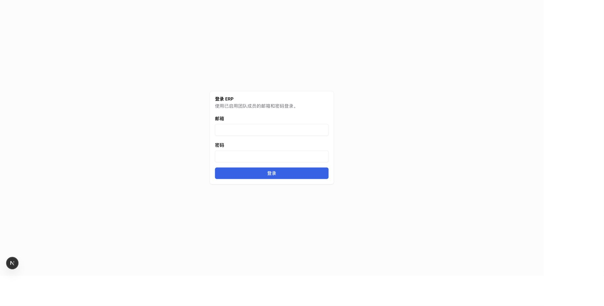

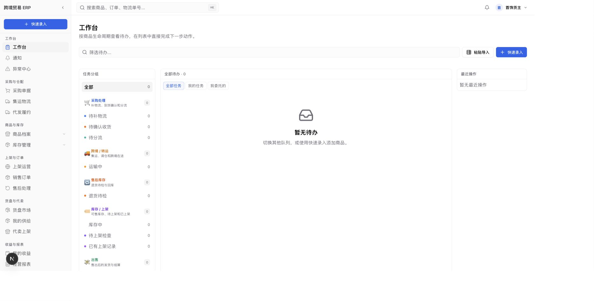

简化后的发布页已经把最常用动作收敛到“选商品 + 定供货价”，这是本轮最明显的正向改进：

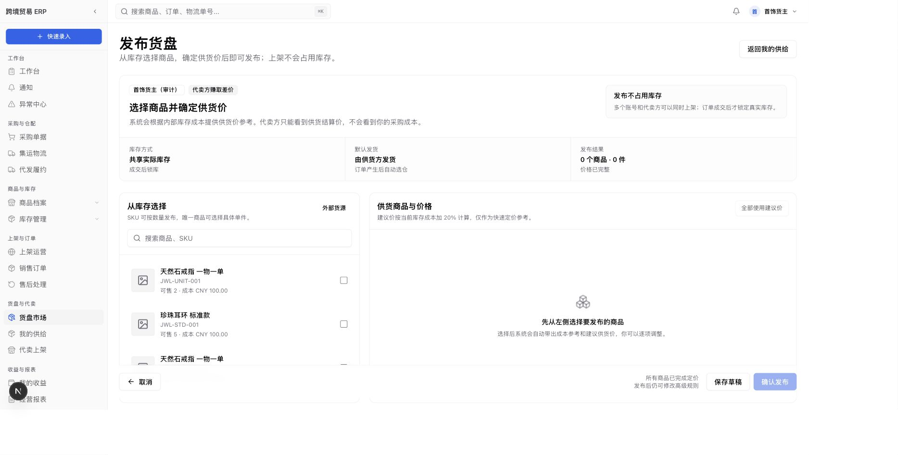

高级区域暴露了核心语义问题：本次用户与合作方约定“净利润对半分”，系统只能提供“成交价 50% 返佣”；问题不在于所有合作都必须按净利润，而在于系统不能忠实记录双方约定。

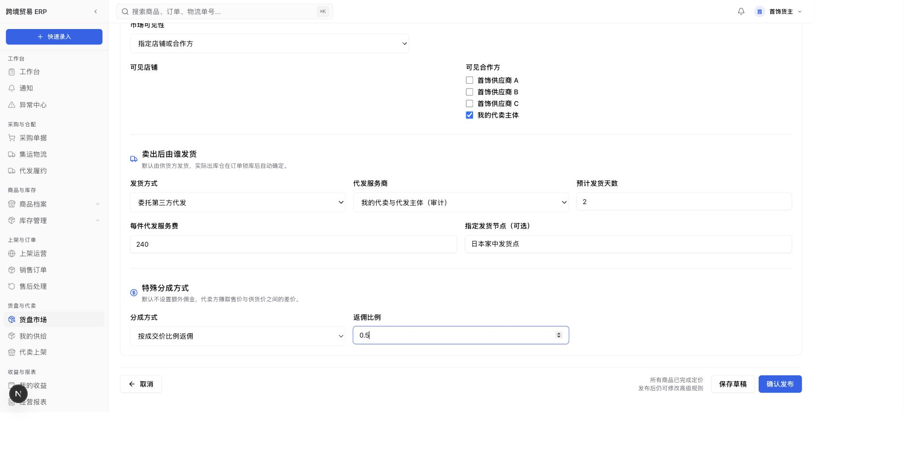

发布结果把本应为 JPY 240 的发货费显示成 CNY 240，说明固定费用没有自己的币种：

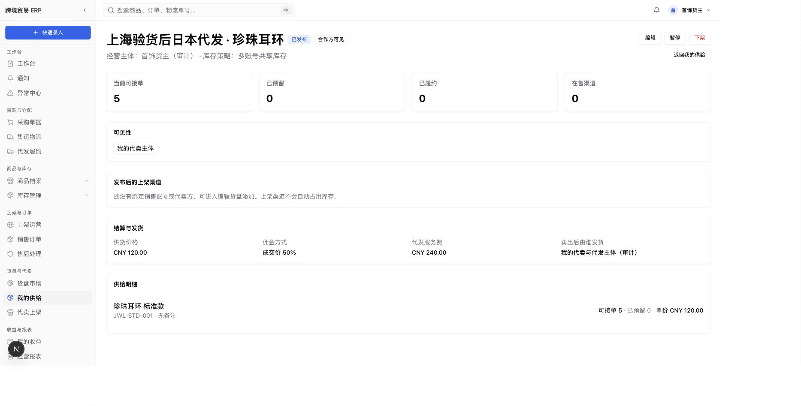

真实代卖主体看不到已经授权给“我的代卖主体”的货盘：

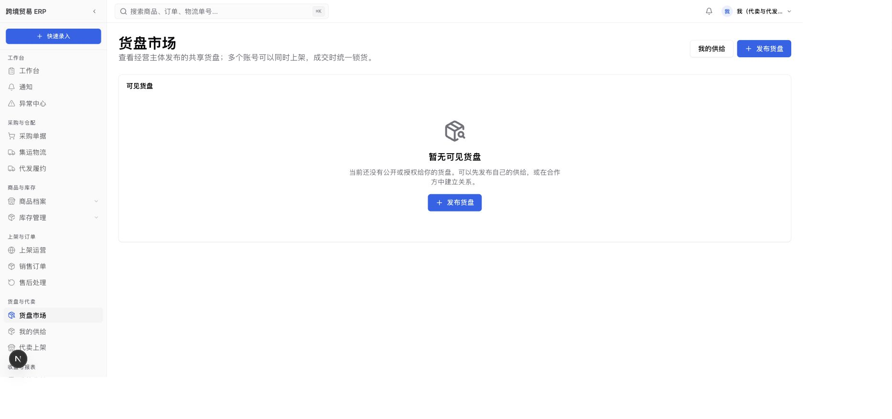

为继续审计，fixture 将同一货盘临时改成公开；此处开始不是完整端到端流程：

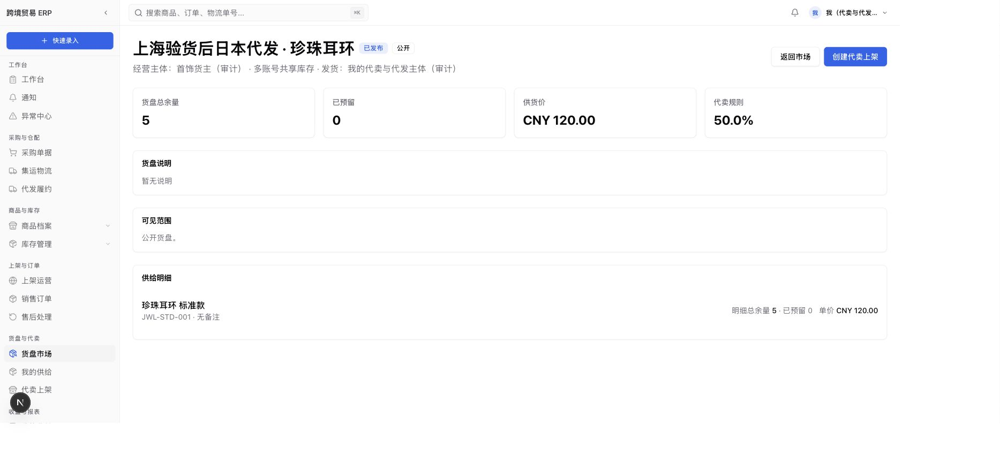

代卖表单同时出现 JPY 售价、CNY 供货价和无币种的 240 固定费：

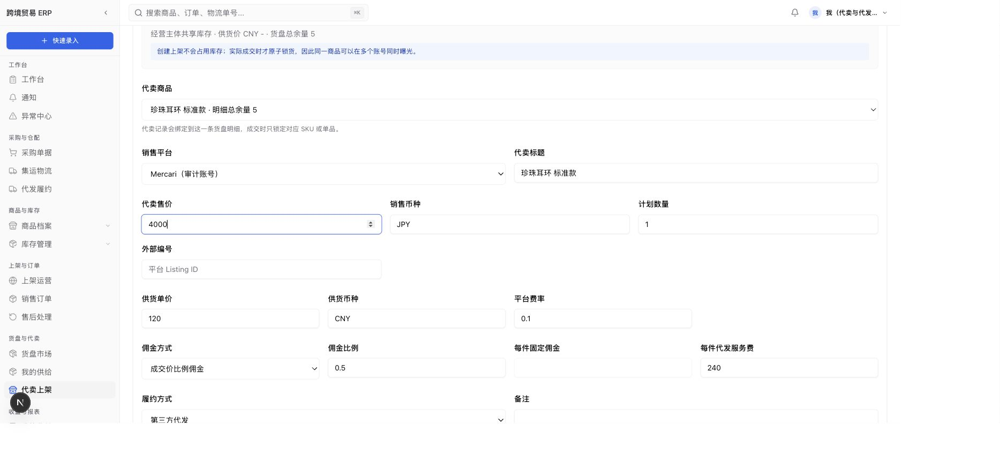

系统给出 JPY 1,240 预计毛利。它的实际公式是 `4000 - 400 - 2000 - 120 - 240`；其中 CNY 120 被当作 JPY 120，且佣金是成交额的 50%。

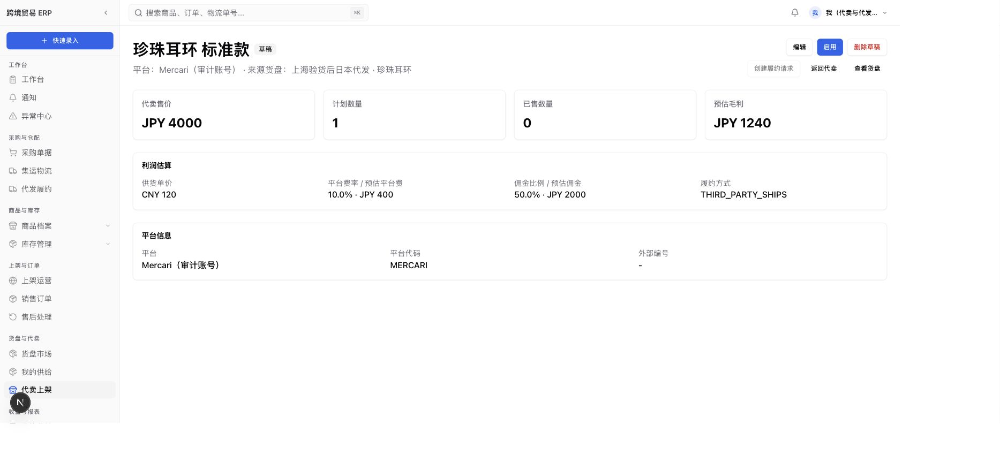

成交登记和日本仓库执行员页面可以继续完成；这里证明角色分工和订单锁库主链本身可用：

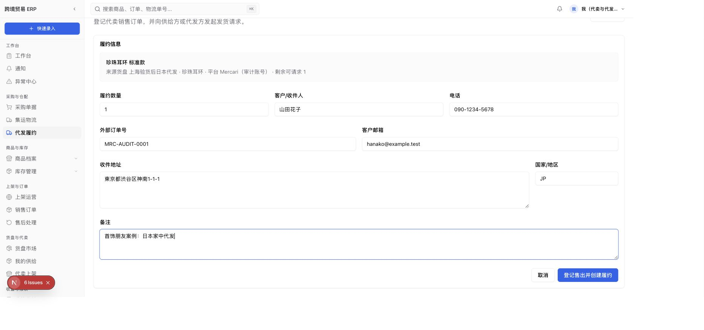

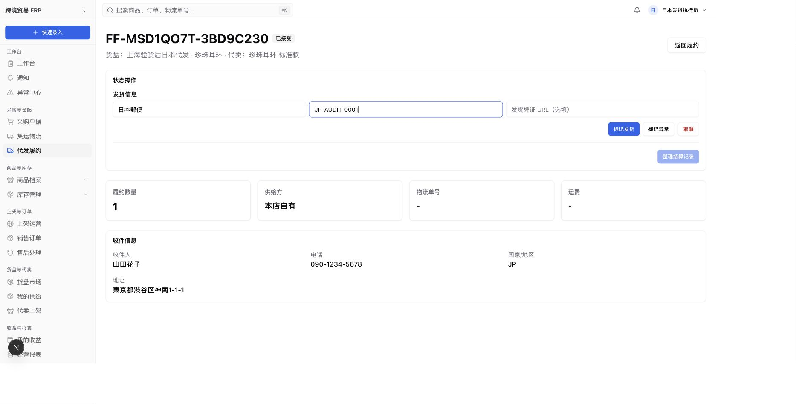

但结算头把 CNY 120 供货价与 JPY 2,000 佣金原值相加成 CNY 2,120；页面下方各结算行仍分别显示 CNY 和 JPY，错误肉眼可见：

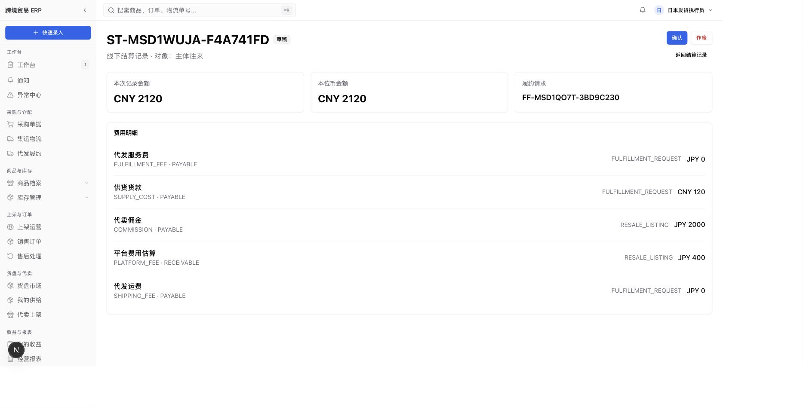

### 5.2 库存、发货与结算断言

| 节点 | 可用 | 预留 | 已履约 |
| --- | ---: | ---: | ---: |
| 发布后 | 5 | 0 | 0 |
| 创建履约后 | 5 | 1 | 0 |
| 发货后 | 4 | 0 | 1 |

- 出库节点：日本家庭仓 `audit_jewelry_japan_home`。
- 出库流水：仅一条 `OUTBOUND_SALE -1`；同一请求没有重复扣减。
- 结算头：`currency=CNY, totalAmount=2120, baseAmount=2120`。
- 结算行本位币净额：供货 CNY 120 + 佣金 CNY 100 - 平台费 CNY 20 = CNY 200，与结算头不一致。
- 代发服务费行和代发运费行均为 JPY 0；`charge_events=0`、`charge_allocations=0`。
- 线下结清仅生成代卖佣金收益 CNY 100；没有生成 JPY 240 的发货收益。

完整数据断言见 [首饰案例 DB 断言](./resale-supply-flow-2026-08-03/evidence-jewelry/db-assertions.md)。

### 5.3 业务能力缺口

- 采购质检只能对整张采购单做 `PASSED` 或 `FAILED`，不能在同一行中表达“部分通过、部分待复检、部分退供应商”。
- 采购收货建批次时只把 `line.unitPrice` 写入库存成本；`allocatedFee`、国际运费、税费和质检服务费不会自动进入 ItemUnit/批次单位成本。
- 供应商字段是自由文本或无外键的 `supplierId`，无法可靠区分 A/B/C，更无法在同一批多来源商品上追溯。
- 集运页面可以表达起运仓和目的仓，但缺少重量、合箱条件、报关金额、税费和“人肉携带”等业务记录。

## 6. 毛绒回国案例

### 6.1 UI 主链结果

| 步骤 | 结果 | 实际观察 |
| --- | --- | --- |
| 真实账号登录 | 可直接完成 | 毛绒货主账号可登录。 |
| 登记 JPY 40,000 整批采购 | 无法按现实数据完成 | 基本信息可填，但每个 SKU 必须立刻有有效单价。 |
| 只知道整批总价 | 无法完成 | 没有“暂不分配成本”或按数量/重量/售价分摊的选择。 |
| 人肉携带 / 集运 / 邮局直邮 | 无法完整表达 | 当前页面以“集运批次”为中心，缺少运输方式、腿、税费和携带人。 |
| 国内家庭仓收货 | fixture 后可见 | 标准品 9 件 + ItemUnit 1 件，库存身份可显示。 |
| 发布货盘 | 可以完成但无法表达本次约定 | 能从库存选择；本次双方约定净利润 20%，页面只能配置成交价返佣。 |
| 朋友 B 跨主体获取货盘 | 公开货盘可见，详情无法打开 | 朋友 B 能看到公开货盘；点击详情后服务端报“请先登录”。定向 Partner 授权仍受首饰案例相同阻断。 |


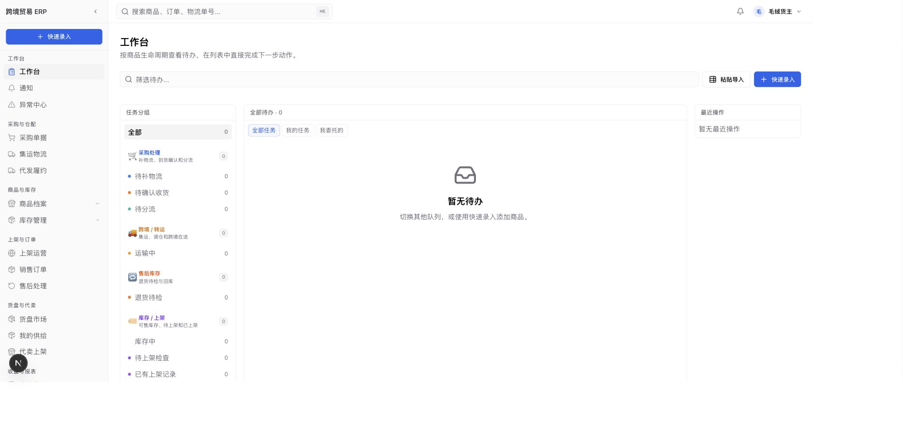

采购基本信息只提供一张采购单级别的供应商名称，无法表达同批 A/B/C 来源：

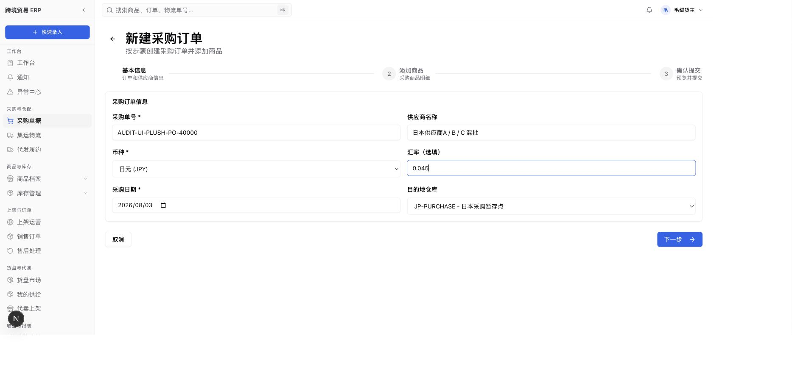

进入商品明细后，未知逐项成本会被“请输入有效单价”阻断：

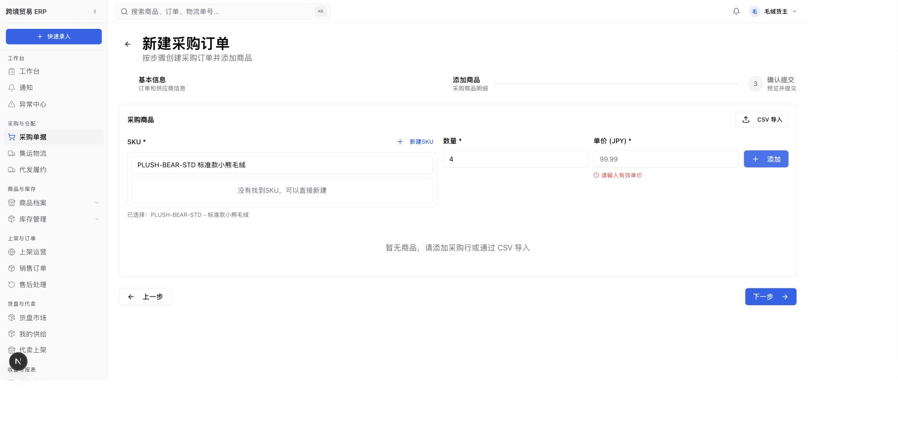

因此后续采购使用 fixture 续接，不视为完整 UI 主链：

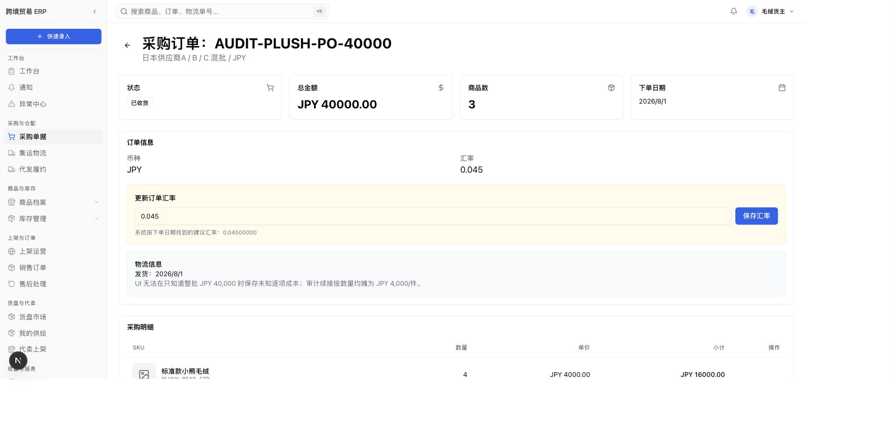

截图 03 和 05 中的 `0.045` 是早期 fixture 准备偏差；最终数据库断言前已改为本报告约定的 `0.05`，不计为产品错误。CNY 180 是某一单件手工分配后的到岸成本，也不是把 JPY 4,000 按 0.045 直接换算所得。

物流页只能看到空的集运批次，无法看出人肉携带、集运商和邮局直邮三种路径：

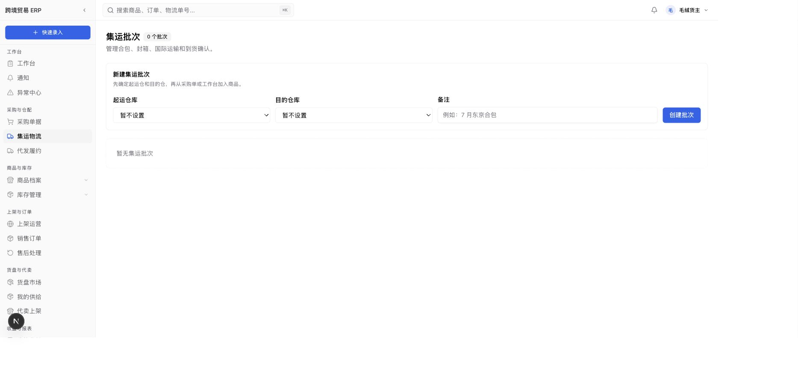

fixture 后国内家庭仓能正确展示两个标准 SKU 和一个 ItemUnit：

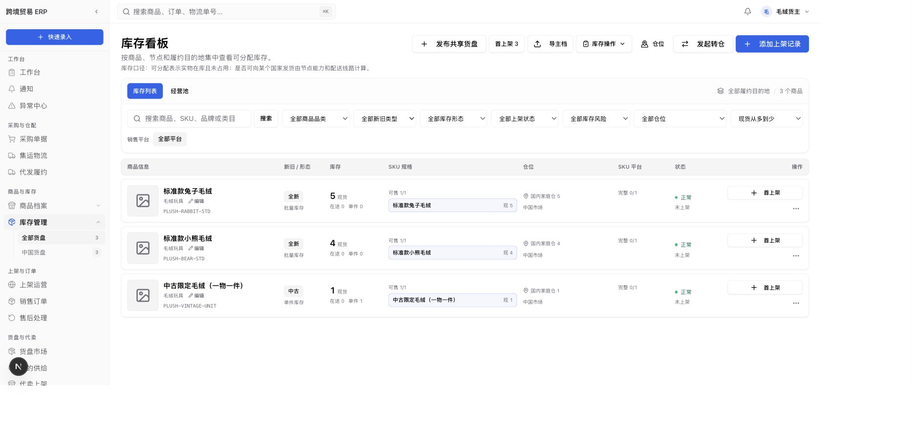

发布入口延续了首饰案例的简化结构：

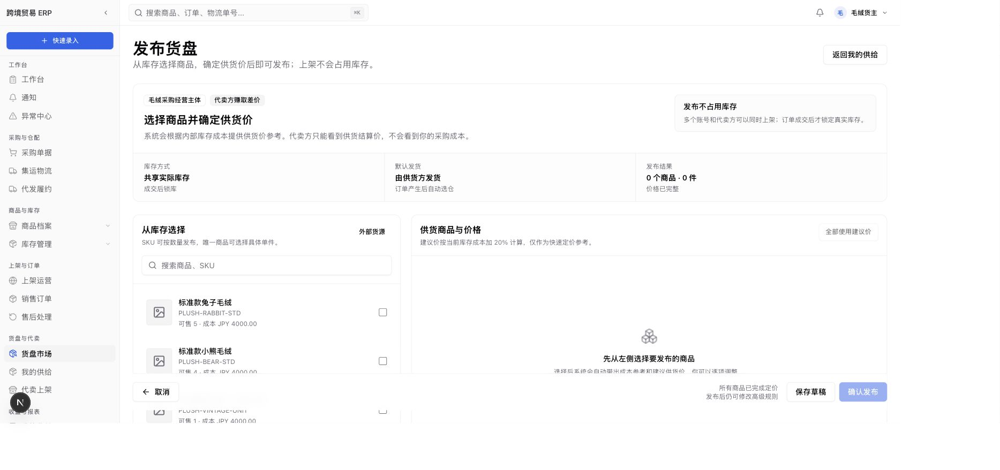

20%字段清楚写成“按成交价比例返佣”，与本次双方约定的“净利润 20%”不一致：

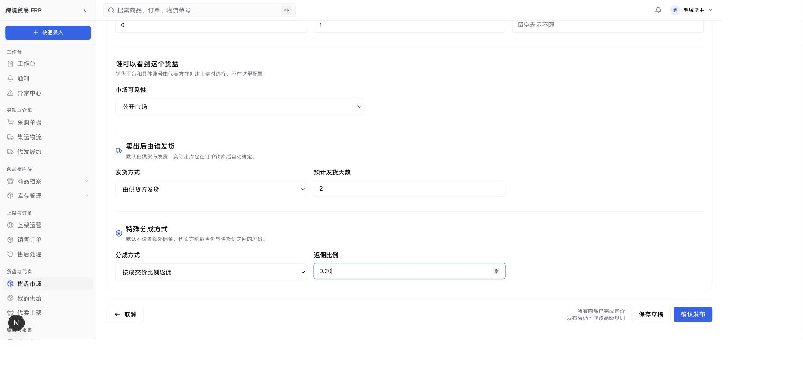

提交发布时出现登录上下文丢失；重新登录后，朋友 B 能看到经 fixture 续接的公开货盘：

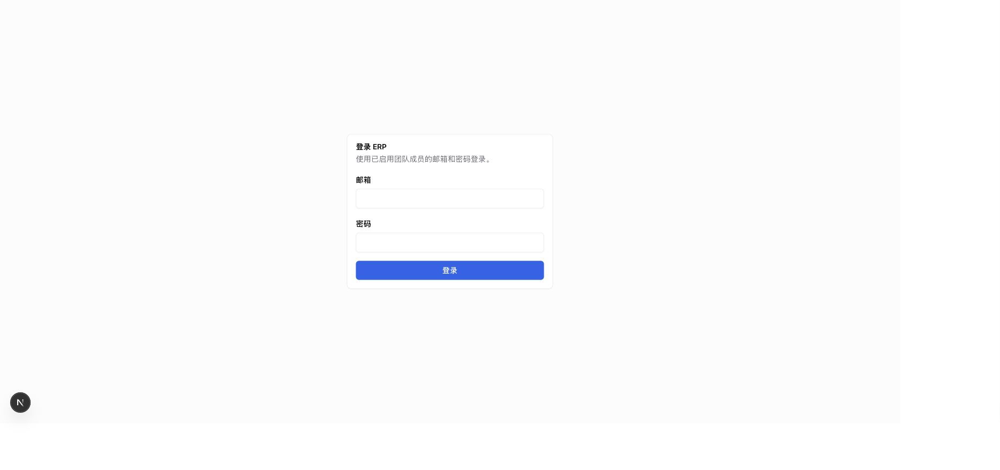

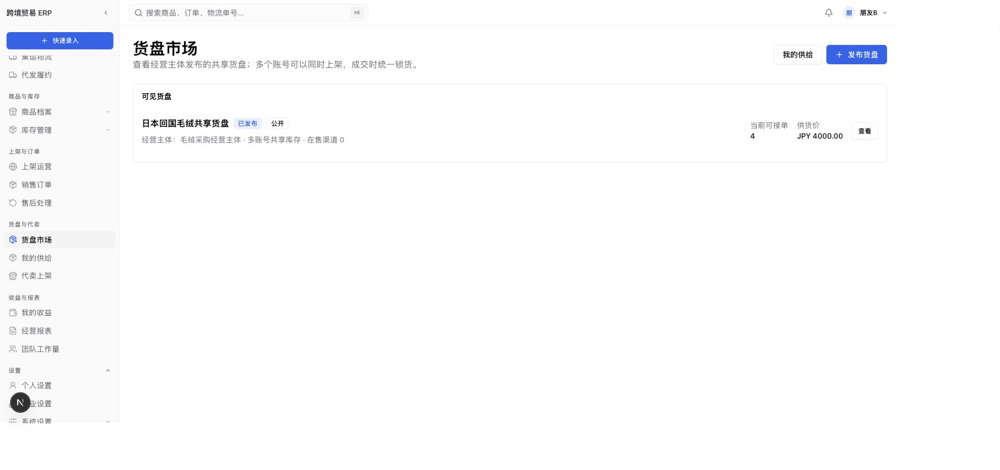

点击货盘详情后页面直接进入服务器 Runtime Error，错误来自 `getCurrentUserEmail` 的“请先登录”，因此代卖、订单和履约 UI 主链在这里结束：

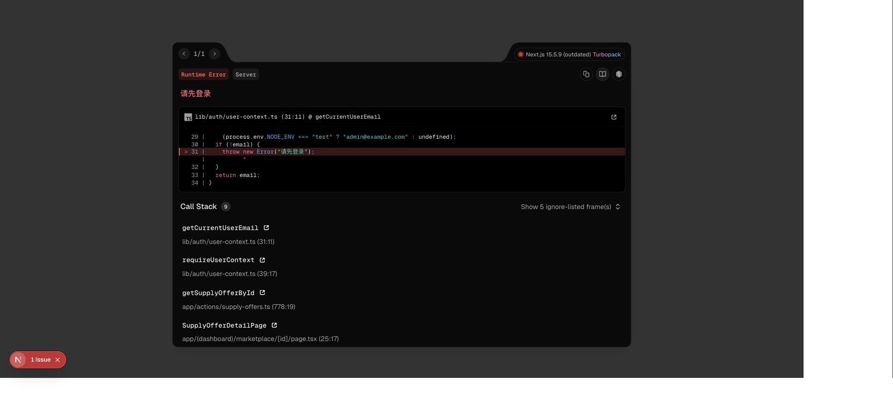

### 6.2 fixture 续接后的 DB 对账

| 数据 | 实际值 |
| --- | --- |
| 采购 | 1 单、3 个 SKU 行、数量 `4 + 5 + 1`、合计 JPY 40,000 |
| 采购附加费用 | 日本运费 JPY 2,000；中国税费 CNY 100 |
| 物流段 | 人肉携带 1、集运商 2、邮局直邮 2，均为 `DELIVERED` |
| 国内库存 | 成交前 10；成交后 9 |
| 货盘 | 发布 4、已履约 1、剩余 3 |
| 销售订单 | CNY 300；平台费 CNY 15；发货费 CNY 10 |
| 手工到岸成本 | CNY 180，但分配记录没有原币、汇率和分摊依据 |
| 佣金 | 黄金值 CNY 19；系统值 CNY 60 |

系统把 CNY 300 售价直接减 JPY 4,000 供货价，再减 CNY 15 和 CNY 60，得到 `-3775`。结算头又把 `JPY 4,000 + CNY 60 + CNY 10` 的数值先相加成 `JPY 4,070`，整体按 0.05 折算为 CNY 203.50；即使暂时接受错误的 CNY 60 佣金，同口径也至少应先换算为 `CNY 200 + 60 + 10 = CNY 270`。

完整数据断言见 [毛绒案例 DB 断言](./resale-supply-flow-2026-08-03/evidence-plush/db-assertions.md)。

## 7. 共享库存、并发、身份与权限专项

以下结果来自独立跨场景数据库和可重复的应用层审计测试。

| 专项 | 预期 | 实际 | 判定 |
| --- | --- | --- | --- |
| 多账号曝光 | 实物 5 件可被多个账号各自上架，不占库存 | Listing 计划曝光 20，货盘可用 5，预留 0 | 通过 |
| 6 笔并发订单 | 恰好 5 成功、1 库存不足 | 5 成功、1 失败，分配总数 5 | 通过 |
| 取消释放 | 预留和锁定归零 | 取消后 `ALLOCATED` 数量归零 | 通过 |
| 重复发货 | 只出库一次、只记一次费用和收益 | 发货后 UI 不再显示发货动作，库存仅一条出库流水；但固定服务费一次也没有入账 | 库存幂等通过，费用链失败 |
| 其他渠道先卖 3 件 | 货盘实时显示 2 | 实物为 2，货盘和明细仍显示 5 | 失败，库存快照错误 |
| 指定 ItemUnit 不可用 | 阻止订单 | 订单成功并改分配同 SKU 普通批次 | 失败，身份错误 |
| 日本订单选仓 | 从日本可售节点锁货 | 未指定发货节点时选择较早的上海批次 | 失败，选仓错误 |
| 跨主体定向可见 | 朋友 B 店铺可选且登录可见 | 发布表单不可选跨主体店铺；Partner 规则创建后仍不可见 | 失败，核心阻断 |
| 缺失汇率 | 阻止金额确认 | GBP 10,000 被原样当成 CNY 10,000 | 失败，金额错误 |
| 过期汇率 | 阻止或要求确认 | 2020 年汇率在 2026 年直接使用 | 失败，缺少时效控制 |
| 业务日期汇率 | 按业务日期选择最近不晚于该日的汇率 | 8 月 2 日取 7，8 月 3 日取 8 | 通过 |

并发审计的关键断言：

```text
physicalBefore=5
listingExposure=20
offerAvailableBefore=5
successes=5
failures=1
allocated=5
allocatedAfterCancel=0
```

陈旧余量断言：

```text
physicalSellableAfterOtherChannelSale=2
offerAvailableShown=5
offerItemAvailableShown=5
```

ItemUnit 断言：

```text
exactItemUnitStatus=RETURN_CHECK
expected=BLOCK
actual=SUCCESS with same-SKU lot
allocatedItemUnitId=null
allocatedLotMatchesFallback=true
```

选仓断言：

```text
orderCountry=JP
expectedLocation=日本家庭仓
actualLocation=上海家庭仓
shipFromConfigured=false
```

## 8. 金额对账

### 8.1 跨币种代卖复现

为隔离单一算法问题，专项使用以下输入：

| 项目 | 正确口径 | 系统结果 |
| --- | ---: | ---: |
| 售价 | JPY 5,000 | JPY 5,000 |
| 供货成本 | CNY 100 = JPY 2,000 | 参与计算时直接使用数值 100 |
| 平台费 10% | JPY 500 | JPY 500 |
| 可分利润（暂不含物流和发货费） | JPY 2,500 | 未作为分成基数 |
| 代卖方 50% | JPY 1,250 | JPY 2,500 |
| 系统预计毛利 | 不应在缺少完整费用时确认 | JPY 1,900，即 `5000-100-500-2500` |

因此当前“供货价 + 返佣”不能表达本次双方所说的“先收回成本和费用，再分剩余利润”。这不是要求所有货盘都采用净利润分成，而是要求系统支持并准确执行已确认的合作条款。

### 8.2 汇率安全

| 场景 | 正确行为 | 系统行为 |
| --- | --- | --- |
| 无 GBP→CNY 汇率 | 阻止确认或结算 | `GBP 10000` 返回 `CNY 10000` |
| 仅有 2020 年 EUR→CNY 汇率 | 2026 业务应阻止或明确确认旧汇率 | 直接得到 CNY 700 |
| 同币种 | 原值 | 正常 |
| 不同业务日期 | 取不晚于业务日的最新汇率 | 正常 |

### 8.3 毛绒成交与结算

| 项目 | 黄金值（CNY） | 系统值 / 行为 |
| --- | ---: | --- |
| 销售价 | 300.00 | 300.00 |
| 手工到岸成本 | -180.00 | 保存为 180，但缺少币种和来源 |
| 平台费 | -15.00 | 15.00 |
| 发货费 | -10.00 | 10.00 |
| 可分配净利润 | 95.00 | 没有该中间结果 |
| 朋友 B 20% | 19.00 | 60.00，按成交额计算 |
| 结算合计 | 应逐行换汇后再汇总 | 先把 4000 JPY、60 CNY、10 CNY 混加为 4070，再折算为 CNY 203.50 |

### 8.4 首饰 UI 实际成交与结算

首饰 UI 使用售价 JPY 4,000、供货价 CNY 120、平台费 10%、成交额返佣 50% 和固定服务费数值 240。

| 项目 | 正确处理 | 系统结果 |
| --- | --- | --- |
| CNY 120 供货价 | 按 20 换为 JPY 2,400 | 直接当数值 120 扣减 |
| 平台费 | JPY 400 | JPY 400 |
| 分成前利润（暂不含服务费） | JPY 1,200 | 没有该中间结果 |
| 净利润 50% | JPY 600 | JPY 2,000，按成交额计算 |
| 固定发货费 | JPY 240，独立支付 | 发布页按 CNY 240 显示，结算/收益为 0 |
| 结算头 | 各行先换为结算币种，再按收付方向汇总 | CNY 120 + JPY 2,000 = CNY 2,120 |
| 结算行本位币净额 | 应与结算头一致 | CNY 200，与头部 CNY 2,120 不一致 |

## 9. P0–P3 问题清单

| ID | 严重度 | 分类 | 问题与影响 | 最短复现 / 证据 |
| --- | --- | --- | --- | --- |
| A-01 | P0 | 数据错误 | 缺失汇率时返回原数值，可能把外币直接当本位币。 | 调用 `convertMoney(GBP 10000 → CNY)`，结果 10000。 |
| A-02 | P0 | 数据错误 | CNY 供货成本直接从 JPY 售价中相减。 | JPY 5000、CNY 100，系统毛利按 100 扣减；见首饰截图 09。 |
| A-03 | P1 | 协议表达能力不足 | 合作方式被写死为少数佣金模型，无法忠实记录双方约定的计算基础、费用承担方式、自定义条款和人工调整。问题不是缺少某一个“纯利润分成”选项，而是系统把具体算法当成了标准答案。 | 本次约定按利润分成，但 50% 得到 JPY 2500；毛绒页面也只能选择“成交价返佣”。其他固定金额、差价或费用另议的合作同样会被限制。 |
| A-04 | P0 | 身份错误 | 指定 ItemUnit 不可用时会换成同 SKU 普通批次。 | 将目标单件设为 `RETURN_CHECK` 后登记订单，仍成功并分配 lot。 |
| A-05 | P0 | 库存错误 | 其他渠道售出后货盘余量仍显示发布快照。 | 实物 2，货盘和明细仍为 5。 |
| A-06 | P0 | 履约错误 | 日本订单在未明确 `shipFromLocation` 时可锁上海库存。 | JP 收件地址，实际分配上海较早批次。 |
| A-07 | P0 | 金额错误 | 固定代发费没有独立币种，在货盘页显示 CNY 240，在 JPY 代卖计算中又按数值 240 使用。 | 首饰截图 05、08、09。 |
| A-08 | P0 | 结算错误 | 结算头把不同币种的原值直接相加。 | CNY 120 + JPY 2000 被显示为 CNY 2120；首饰截图 12。 |
| A-09 | P0 | 收益错误 | 已配置的 JPY 240 发货服务费在发货和结算后完全丢失。 | 服务费行 0、charge event 0、钱包无发货收益。 |
| B-01 | P1 | 无法完成 | 跨经营主体定向货盘不可达。 | Partner 规则已创建，真实代卖账号货盘市场仍为空；首饰截图 06。 |
| B-02 | P1 | 无法完成 | 只知道整批总价时无法建采购单。 | SKU 行单价为空即提示“请输入有效单价”；毛绒截图 04。 |
| B-03 | P1 | 数据缺失 | 运费、税费、质检费不会自动进入库存单位成本。 | 收货逻辑以 `line.unitPrice` 建库存；`allocatedFee` 未参与。 |
| B-04 | P1 | 无法完成 | 部分质检和部分退供应商不受支持。 | 检查动作只接受整单 `PASSED` / `FAILED`。 |
| B-05 | P1 | 无法完成 | 人肉携带、集运、邮局直邮及多运输腿不能完整表达。 | 物流页只有集运批次，缺少方式、费用、税费和携带人；毛绒截图 06。 |
| B-06 | P1 | 环境风险 | 全新数据库无法完整执行迁移。 | `20260729153000_lock_consolidation_inventory` 引用尚不存在的表。 |
| B-07 | P1 | 数据关系 | 供应商 A/B/C 无稳定业务关系。 | 采购单只有自由文本名称和无 Partner 外键的 supplierId。 |
| B-08 | P1 | 无法完成 | 登录态在发布与货盘详情跨页面操作中丢失，详情页直接显示服务器 Runtime Error。 | 毛绒截图 10、12；重新登录只能暂时恢复市场列表。 |
| B-09 | P1 | 数据不可审计 | `OrderAllocation` 保存了成本数值，但没有成本币种、原币金额、汇率和分摊依据。 | CNY 180 无法追溯到 JPY 整批成本和费用。 |
| B-10 | P1 | 主体错误 | 日本执行员页面把跨主体货物显示为“供给方：本店自有”。 | 首饰截图 11。 |
| B-11 | P1 | 表单状态 | 唯一代发服务商视觉上已默认选中，首次提交仍要求选择，必须手动重选。 | 首饰发布 UI 操作记录。 |
| C-01 | P2 | 功能过重 | 高级设置一次暴露可见性、合作方、代发主体、节点、返佣等概念。 | 首饰截图 04。 |
| C-02 | P2 | UI 不友好 | “返佣”文案掩盖了它按成交额计算，普通用户容易误以为是利润分成。 | 首饰截图 04、毛绒截图 09。 |
| C-03 | P2 | UI 不友好 | 合作方记录、经营主体、团队账号和销售账号的关系没有在流程中解释。 | 发布方以为选择“我的代卖主体”即可授权，但登录账号仍不可见。 |
| C-04 | P2 | 可恢复性 | 测试中出现页面仍显示账号但提交提示“请先登录”，重新登录后恢复。 | 毛绒案例浏览器操作记录。 |
| C-05 | P2 | 测试/模型 | 已有共享库存测试的保证配额场景拿不到 `supplyOfferChannelId`。 | 应用测试 4 项中 3 项通过、保证配额项失败。 |
| C-06 | P2 | 技术可用性 | Next 服务端持续提示 Prisma `Decimal` 直接传给 Client Component。 | 首饰服务端日志；可能导致序列化不稳定。 |
| D-01 | P3 | 文案 | `THIRD_PARTY_SHIPS`、SKU、ItemUnit 等内部枚举/术语出现在面向普通经营者的页面。 | 首饰截图 09 等。 |

## 10. 四类汇总

### 10.1 无法完成

- 货主定向发布给另一个独立经营主体，并让对方真实账号看到货盘。
- 只知道整批总价时先登记采购、后补或分摊 SKU 成本。
- 同一采购行部分通过、部分待检、部分退供应商。
- 将人肉携带、邮局直邮、集运合箱作为不同物流路径完整登记。
- 按双方已经确认的合作条款结算；本次案例恰好是“扣除约定成本和费用后的利润按 50% / 20% 分成”。

### 10.2 功能过重

- 发布时要求用户同时理解市场可见性、店铺、合作方、代发组织和发货节点。
- “渠道是否可卖”“谁负责发货”“谁能看见”混在同一高级区。
- 用户只想说“给朋友 B 卖、我发货、利润给他 20%”，系统却要求先理解多个主数据模型。

### 10.3 UI 不友好

- 页面先要求选择固定佣金类型，不能先记录“双方到底怎么约定”；“成交价返佣”和本次的“剩余利润分成”又很容易被误认为同一件事。
- 固定发货费旁没有币种，详情页又跟随供货币种显示。
- 采购页没有“总价已知、明细成本稍后分配”的入口。
- 物流页没有按现实语言提供“我带回国 / 集运 / 邮寄”的选择。
- 跨主体授权失败时，代卖方只看到空状态，不知道是未发布、未授权还是关系未建立。

### 10.4 数据错误

- 缺汇率仍继续金额计算。
- 成本和售价跨币种直接相减。
- 系统只能执行固定的成交额返佣等模式，无法准确执行本次已经确认的利润分成约定。
- ItemUnit 被替换。
- 日本订单锁上海货。
- 其他渠道出库后货盘余量仍为旧值。
- 运费、税费和质检费未形成可追溯的到岸成本。
- 不同币种的结算行被原值相加，结算头与行级本位币金额不一致。
- 固定发货费虽已配置，发货后没有费用事件、应付行或执行人收益。

## 11. 建议的简化方案

### 11.1 发布货盘默认只保留五件事

1. 选哪些商品。
2. 我每件至少要收多少钱，以及这个价格的币种。
3. 谁可以卖：公开、指定朋友/经营主体。
4. 谁发货：我发、对方发、指定服务方；固定发货费和币种。
5. 双方怎么约定分钱：先记录约定原文，再由系统建议结构化计算方式。

其余内容放进“高级规则”，并仅在用户选择对应模式后逐步出现。

### 11.2 用生活化表达替换内部模型

| 当前表达 | 建议表达 |
| --- | --- |
| 经营主体 | 这批生意归谁 |
| 合作方可见 | 只给指定朋友/公司看 |
| 代发服务商 | 谁负责打包发货 |
| 指定发货节点 | 通常从哪里发货 |
| 返佣比例 | 你和对方约定怎么分钱 |
| ItemUnit | 一物一单 / 指定这一件 |
| 库存池 | 共享的真实库存 |

### 11.3 库存模型

- “上架曝光数量”和“真实可售数量”必须分开显示。
- Listing 不占库存；订单成交时加锁，这一点保留。
- 货盘余量必须实时由库存、预留、安全库存和可发市场计算，不存成长期快照。
- ItemUnit 订单只允许锁定指定单件；不可用就阻止并提示重新选择，绝不自动换货。
- 发货仓按订单国家、节点能力和 ShippingLane 选择；若无可用路径必须阻止，不用最早入库批次兜底。

### 11.4 成本和分账模型

- 整批采购允许处于“成本待分配”状态，但此状态下禁止确认利润和结算。
- 提供按数量、重量、申报价、手工金额四种分摊方式。
- 采购成本、国际运费、税费、质检费分别保留原币、汇率日期和本位币金额。
- 固定发货费拥有自己的币种和收款方，不跟随供货价或销售价猜测。
- 结算使用双方确认的规则版本和费用行；确认前展示货主、代卖方、发货方各自应收。
- 任一跨币种行缺汇率或汇率过期时，阻止“确认利润/生成结算”。

### 11.5 以双方约定为核心，而不是写死佣金类型

> 补充结论：佣金、分成和费用承担没有一个应被系统写死的“标准答案”。按纯利润、固定金额、成交额比例或赚差价都只是具体合作案例；最终依据必须是双方确认的约定。系统负责提供建议、试算、版本和留痕，不负责替双方决定如何分钱。

- 系统先保存合作条款原文、参与方、生效时间和适用商品，固定金额、成交额比例、利润比例、赚差价、阶梯规则等只是建议模板。
- 系统可以根据条款推荐供货价或计算方式，但必须明确标记为“系统建议”，不能替代双方约定。
- 双方确认后的结构化规则才是订单和结算依据；成交时保存规则快照，后续修改不得改变历史订单。
- 无法完全结构化的特殊合作允许“成交后确认”和人工调整，但必须记录金额、币种、原因、操作人和确认人。
- 费用是否进入计算基础、由谁承担、谁收取以及使用什么币种，都属于合作条款，不应由系统根据字段位置自行猜测。
- “费率”只是一条协议中的可选参数，不应默认等同于佣金率或净利润分成比例；同一协议可以同时包含固定金额、比例、差价、封顶/保底和人工调整。
- 运费、税费、平台费、发货服务费等也不应固定视为“必扣成本”。系统应让双方逐项约定承担方、收款方、币种以及是否进入分成基数。
- 通用计算模型应是 `双方约定的规则（成交额、数量、成本、指定费用等） + 经确认的调整项`，而不是预设一个唯一的“纯利润”公式。

### 11.6 跨角色交接

- Partner 应能明确关联目标 `organizationId`，授权对象是经营主体，不是发布方自己库里的孤立合作方记录。
- 给代卖方一个“朋友发给我的货盘”入口，显示授权来源、可卖商品、供货价和自己的预计收益。
- 给仓库执行员一个任务收件箱，只展示收货、质检、转仓和发货所需字段；采购成本默认隐藏。
- 空状态要区分“没有公开货盘”“尚未建立合作关系”“有货盘但未授权给当前主体”。

## 12. 建议修复顺序

### 第一阶段：金额、库存与身份安全

1. 缺失/过期汇率阻断；所有金额先转换到明确结算币种再计算。
2. 建立可版本化的双方合作条款与结算规则；固定金额、比例、差价、利润分成等只作为模板，固定发货费仍需独立币种和收款方。
3. 禁止 ItemUnit 回退到同 SKU 库存。
4. 按国家和 ShippingLane 选仓，无路径即阻止。
5. 货盘余量改为实时计算，并保留并发锁库。

### 第二阶段：打通现实主流程

1. 修复跨经营主体定向授权和 Partner↔Organization 关系。
2. 支持批次总成本待分配、费用资本化和完整成本追溯。
3. 支持数量级部分质检、待复检和退供应商。
4. 支持人肉携带、直邮、集运及多运输腿。
5. 修复全新数据库迁移顺序和测试初始化。

### 第三阶段：UI 简化

1. 默认发布页只展示五个核心决策。
2. 用生活化语言替换内部枚举，所有高级项渐进展开。
3. 增加交易前分账预览和错误解释。
4. 为代卖方和仓库执行员提供各自的任务入口，而不是共享货主视角页面。

## 13. 已验证的正向能力

- 真实账号登录有效，没有用开发兜底假装多账号。
- 新货盘发布页已从四步重表单收敛到库存选品和供货定价为主的一页。
- 同一实物可以在多个账号扩大曝光，上架本身不锁货。
- PostgreSQL 事务锁能保证 5 件库存面对 6 笔并发订单时恰好只成功 5 笔。
- 订单取消会释放履约库存分配。
- 发货完成后动作状态会前进，同一请求本次只产生一条出库流水。
- 业务日期汇率选择逻辑能取“不晚于业务日的最新一条”。
- 标准批次和 ItemUnit 能在库存看板中并列展示。

这些能力值得保留；后续应把它们包在更安全的金额、身份、权限与成本模型中，而不是重新推翻。

## 14. 复现与验证记录

主 agent 的隔离审计测试位于 `.codex/audit-work/crosscut/currency-profit-audit.test.ts`，最终结果为 8/8 通过。这里的“通过”表示稳定复现了当前行为，其中部分断言故意确认错误现状，不能理解为业务正确。

覆盖内容：

- 缺失汇率和过期汇率。
- 按业务日期选择汇率。
- 跨币种毛利与成交额返佣。
- 5 件库存面对 6 笔并发订单。
- ItemUnit 不可用时的同 SKU 替换。
- 日本订单错误选上海库存。
- 跨经营主体 Partner 定向可见性。
- 其他渠道出库后的货盘余量快照。

仓库内现有的三个相关应用测试在隔离库上执行结果为：1 个测试文件通过，2 个失败；共 7 个测试通过、1 个失败、7 个因套件初始化失败而跳过。

- `supply-offer-shared-inventory.test.ts`：4 项中 3 项通过；保证配额项因 `supplyOfferChannelId=null` 失败。
- `marketplace-resale-flow.test.ts`：通过。
- `multi-party-subledger.test.ts`：新 Store 没有自动生成预期的 InventoryPool，套件初始化失败，7 项跳过。

全新数据库的迁移验证失败于 `20260729153000_lock_consolidation_inventory`。这说明在修复业务 P0 的同时，也需要把数据库初始化和测试 fixture 纳入发布门禁，否则新环境无法可靠复现跨主体能力。

## 15. 整改结果与重新验证

### 15.1 当前结论

本轮已完成报告中 P0/P1 核心问题及货盘主流程的 UI 简化。第 1 节的评分是整改前基线；按同一口径重新评估如下：

| 维度 | 整改前 | 整改后 | 当前结论 |
| --- | ---: | ---: | --- |
| 可用性 | 2 / 5 | 4 / 5 | 采购、部分质检、转运、库存、定向货盘、代卖、成交、选仓、发货和分账的系统内主链可以完成。 |
| 易用性 | 2 / 5 | 4 / 5 | 货主发布时只需处理商品、供货价、可卖对象、发货责任和双方约定；平台与销售账号移到代卖方上架阶段。 |
| 数据准确性 | 1 / 5 | 4 / 5 | 已修复混币、缺汇率继续计算、单件替换、陈旧余量、错误选仓、费用丢失和结算方向问题；所有覆盖到的金额与库存断言通过。 |

没有评为 5 分的原因不是仍保留已知 P0，而是 Mercari、Yahoo、闲鱼、真实承运商、实时税费和复杂售后赔付仍属于外部集成或后续专项边界。

### 15.2 问题关闭记录

| 原问题 | 状态 | 整改结果与证明 |
| --- | --- | --- |
| A-01、A-02、A-07、A-08、A-09 | 已解决 | 所有跨币种金额先按业务日汇率换到明确结算币种；缺失、未来或过期汇率直接阻止。固定发货费拥有独立币种、收付款方和费用流水，结算头由同币种行汇总。 |
| A-03 | 已解决 | 合作条款原文是依据，模板只是可选试算建议；支持差价、成交额比例、每件固定金额、组合方式、利润比例和人工确认。利润模板允许逐项决定供货成本、平台费、发货服务费和本单运费是否进入分成基数；无法结构化的约定走人工确认，不自动编造金额。成交时保存协议版本与快照。 |
| A-04 | 已解决 | 指定的一物一单商品不可用时直接拒绝订单，不再回退为同货号的另一件或普通批次。 |
| A-05、C-05 | 已解决 | 货盘余量改为由真实库存、订单预留、安全库存和渠道保证配额实时计算；多账号上架不占货，订单并发锁货，取消后释放。 |
| A-06 | 已解决 | 订单按收货国家、节点能力和有效配送线路选择发货仓；没有可行路线时阻止，不再用最早批次兜底。 |
| B-01 | 已解决 | 合作方可关联目标经营主体，定向可见性按经营主体授权；目标方可查看并创建代卖，未授权主体不可见，代卖方响应中不包含采购成本。 |
| B-02、B-03、B-07、B-09 | 已解决 | 采购支持“只知道整批总价、稍后分摊”，供应商使用合作方关系；费用可按数量、金额或手工方式分摊，保留原币、汇率日期和成本追踪。成本待分配时禁止销售和利润确认。 |
| B-04 | 已解决 | 同一收货行支持按数量登记通过、退供应商和待复检，并生成对应库存状态与检查记录。 |
| B-05 | 已解决 | 物流段可记录人肉携带、集运商、邮局、快递、货运及其他方式，并记录携带人、运费、税费和多段状态。 |
| B-06 | 已解决 | 修复历史迁移依赖并补齐 schema 缺口；全空数据库已连续应用 40 条迁移，迁移后 schema diff 为零。 |
| B-08、C-04、C-06 | 已解决 | 登录回跳只接受站内安全路径，页面间使用签名会话；服务端数据在进入 Client Component 前完成 Decimal/JSON 序列化，生产构建无相关告警。 |
| B-10 | 已解决 | 履约详情显示货盘所属经营主体，跨主体货物不再显示为“本店自有”；服务方测试明确看到货主名称。 |
| B-11 | 已解决 | 切换到“指定服务方发货”时，唯一可用服务方会同步写入表单状态，不再只有视觉默认值。 |
| C-01、C-02、C-03、D-01 | 已解决 | 删除四步重表单和重复隐藏区；使用“谁可以卖、卖出后谁发货、双方怎么约定分钱、标准商品、一物一单、通常从哪里发货”等生活化表达，内部枚举不再作为用户文案。 |

### 15.3 “双方约定优先”的最终产品规则

- 纯利润 50% / 20% 只保留为本报告算例，不是系统默认答案。
- “费率”只是协议中的可选参数，可以与固定金额、差价、保底/封顶和人工调整组合，也可以完全不用费率。
- 运费、税费、平台费、供货成本和发货服务费是否由某方承担、是否进入分成基数、使用什么币种，都由本次协议决定。
- 系统建议必须可修改并明确标注为建议；双方确认的原文、结构化规则版本和成交快照共同形成审计依据。
- 规则无法可靠自动化时必须选择“成交后双方人工确认”，系统不得根据一个百分比自行推断结算。

页面证据：发布页首先解释“不占库存”和三项核心决策，定价建议明确标为参考。

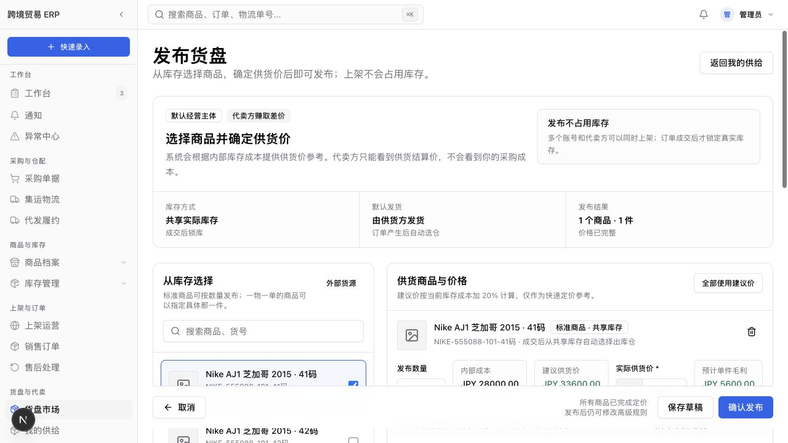

页面证据：选择利润试算后，可逐项决定哪些费用进入计算基数；截图中“本单运费”已被取消选择，其余费用保持选中。

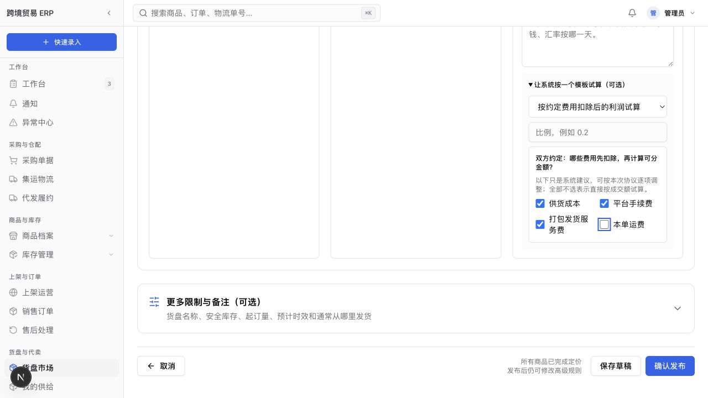

### 15.4 发布门禁结果

- 全新隔离数据库：`erp_v2_codex_completion_20260803_1945`。
- `prisma migrate deploy`：40 / 40 条迁移成功。
- `prisma migrate diff --exit-code`：`No difference detected`。
- 完整应用测试：82 个测试文件、306 项测试全部通过；为避免本地 PostgreSQL 连接数干扰，采用单 worker 串行执行。
- `npm run typecheck`：通过。
- `npm run lint -- --no-cache`：通过，无告警。
- `npm run build`：通过。
- 运行页面复核：选择库存商品、展开试算模板、切换为利润比例、取消“本单运费”均正常；浏览器 Console 无 warning/error。
- 验证完成后已停止本地测试服务并删除隔离数据库；未修改或重置现有演示库。

### 15.5 仍在本轮范围之外的边界

- 未向 Mercari、Yahoo、闲鱼等真实平台提交上架或拉取真实订单。
- 未接入真实承运商轨迹、海关计税或实时汇率服务，只验证系统内部记录、换算、阻断和追踪。
- 售后本轮只保证取消释放、标准商品退货回库和一物一单退回待检；发错货、责任赔付和多方争议仍应单独设计。
- 人工确认协议能够阻止错误自动结算并通过费用台账留痕，但电子签署、争议仲裁和法律效力不属于当前 ERP 范围。
