# 货盘与倒买倒卖第二轮截图实证审计

> 审计日期：2026-08-03
> 审计范围：采购、质检、物流、库存、货盘、代卖、履约、费用约定与结算
> 判定原则：只有本轮用户界面截图可以证明用户能够使用某项功能；代码、自动化测试和数据库只作为辅助解释。

## 1. 执行摘要

本轮在三个全新 PostgreSQL 数据库和三个本地端口中，以货主、采购管理员、朋友代卖方、第三方发货方、仓库执行员及未授权主体等角色重新操作页面。报告只把本轮截图可见的能力计为“用户能够使用”；fixture、数据库与迁移结果仅用于续接阻断流程或解释页面现象。

总体结论：系统已经具备“小生意货盘”的若干关键骨架——发布货盘不占库存、同一实物库存可被多个渠道展示、成交时才预留、定向合作方可见、采购成本对代卖方隐藏、整批采购可暂记总价并以后分摊、第三方发货地址在接受前隐藏。这些能力均有本轮 UI 截图。

但完整闭环仍不能稳定完成，且存在会影响真实钱货的高风险问题：

- “一物一单”采购最终进入数量型库存批次，没有生成独立单件身份。
- 采购显示已收货，而同一运输段仍显示 `IN_TRANSIT`。
- 已收货后没有可见的部分质检、待复检、退供应商入口，也无法从当前页面把采购库存加入集运批次。
- 利润分成黄金算例中，系统因没有本单运费输入项，把 CNY 30 运费漏出费用基数，40% 分成从正确的 CNY 84 变成 CNY 96。
- 多个关键提交在操作中途出现“请先登录”，页面不保存草稿，也没有继续操作的恢复入口。

因此本轮不建议把“货盘发布成功”视为业务闭环完成。优先级应是：先修单件身份、库存/物流状态和金额计算，再补齐质检、集运、协议版本与取消/退货恢复，最后压缩专业术语和前置配置。

## 2. 审计方法与证据边界

### 2.1 隔离环境

| 场景 | 数据库 | 端口 | 证据目录 |
| --- | --- | ---: | --- |
| 采购、质检、物流、到岸成本 | `erp_v2_reaudit_a_20260803` | 3211 | `resale-supply-flow-reaudit-2026-08-03/evidence-a` |
| 货盘、协议、代卖、结算 | `erp_v2_reaudit_b_20260803` | 3212 | `resale-supply-flow-reaudit-2026-08-03/evidence-b` |
| 共享库存、单件身份、权限、售后 | `erp_v2_reaudit_c_20260803` | 3213 | `resale-supply-flow-reaudit-2026-08-03/evidence-c` |

本轮不复用上一轮截图、测试数据或成功结论；测试期间不修改业务代码。UI 阻断时先保存截图，再用隔离 fixture 续接，以继续检查后续页面。所有这种续接均在对应步骤中标注为“不是完整端到端”。

### 2.2 结论等级

- 可直接完成。
- 可以完成但需要绕路。
- 无法完成。
- 页面显示成功但数据错误。
- 权限或隐私错误。
- UI、术语或步骤过重。
- 后端可能存在，但 UI 无法确认。

严重度使用 P0–P3：P0 为金额、库存、单件身份或隐私错误；P1 为核心业务阻断；P2 为明显绕路或难用；P3 为文案、视觉和提示问题。

### 2.3 外部边界

本轮不向真实 Mercari、Yahoo、闲鱼等平台提交数据，不调用真实承运商、海关计税或实时汇率服务。复杂发错货、责任赔付和多方争议不在本轮范围内。

## 3. 账号、经营主体与业务关系

| 场景 | 登录角色 / 经营主体 | 业务身份 | 页面验证重点 |
| --- | --- | --- | --- |
| A | 采购审计管理员 / 跨境采购实证审计主体 | 采购方、库存拥有方 | 供应商、采购、运输、成本分摊 |
| A | 首饰供应商 A/B/C、日本毛绒供应商 | 合作方，不是登录账号 | 供应商选择与采购归属 |
| B | 本轮货主经营主体 | 货主、库存拥有方、发布方 | 供货价、协议、货盘余量 |
| B | 朋友 B | 独立代卖经营主体 | 定向货盘、自己的闲鱼账号、自己的收益 |
| B | 第三方发货服务商 | 独立履约主体 | 接受任务、地址解锁、运费和服务费 |
| C | 相机货主小王 / 第二轮审计·相机货主 | 货主与渠道管理员 | 5 件实物、8 个渠道、订单预留 |
| C | 仓库执行员 | 受限执行角色 | 发货、退货和成本隐私 |
| C | 未授权外部主体 | 无合作关系 | 货盘不可见、单件库存隔离 |

销售平台账号与团队成员、供应商保持分离：Mercari、Yahoo、eBay、闲鱼等是渠道账号；供应商是合作方；朋友 B 和第三方发货方各自属于独立经营主体。

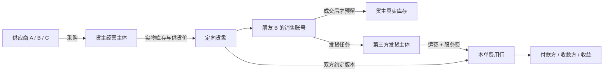
```mermaid
flowchart LR
  S["供应商 A / B / C"] -->|采购| O["货主经营主体"]
  O -->|实物库存与供货价| P["定向货盘"]
  P --> R["朋友 B 的销售账号"]
  R -->|成交后才预留| I["货主真实库存"]
  R -->|发货任务| F["第三方发货主体"]
  F -->|运费 + 服务费| C["本单费用行"]
  P -->|双方约定版本| C
  C --> X["付款方 / 收款方 / 收益"]
```

两个现实案例在系统中的目标链路：

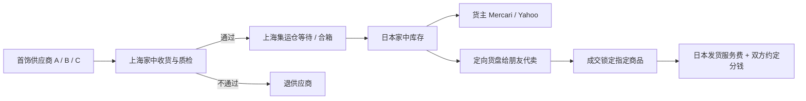
```mermaid
flowchart LR
  A["首饰供应商 A / B / C"] --> B["上海家中收货与质检"]
  B -->|通过| C["上海集运仓等待 / 合箱"]
  B -->|不通过| R["退供应商"]
  C --> D["日本家中库存"]
  D --> E["货主 Mercari / Yahoo"]
  D --> F["定向货盘给朋友代卖"]
  F --> G["成交锁定指定商品"]
  G --> H["日本发货服务费 + 双方约定分钱"]
```

```mermaid
flowchart LR
  J["日本供应商整批 JPY 40,000"] --> T["人肉携带 / 集运商 / 邮局直邮"]
  T --> L["邮费、税费、质检费分摊"]
  L --> C["国内家中库存"]
  C --> O["发布货盘与素材"]
  O --> B["朋友 B 用自己的平台账号销售"]
  B --> S["成交后货主发货"]
  S --> P["按双方约定计算固定额、比例、组合或人工确认"]
```

## 4. 场景 A：采购、质检、物流与到岸成本

### 4.1 流程健康状态

| 步骤 | 判定 | 本轮实际结果 |
| --- | --- | --- |
| 选择供应商、仓库和币种 | 可直接完成 | 页面能选择供应商 A/B/C、日本毛绒供应商及三个节点；实际提交供应商 A。 |
| 标准商品 + 一物一单采购 | 页面成功但数据错误 | 两行都能创建，但“一物一单”最终成为数量型批次。 |
| 首饰采购运输登记 | 可直接完成 | 可选择快递并形成可见运输段。 |
| 收货 | 页面成功但数据错误 | 采购状态变为已收货，运输段仍为 `IN_TRANSIT`。 |
| 部分通过、待复检、退供应商 | 无法完成 | 采购详情无动作，工作台待分流为 0。 |
| JPY 40,000 整批总价 | 可直接完成 | 可选择“只知道整批总价”，两个 SKU 显示待分摊。 |
| 运费、税费、质检费与汇率 | 可直接阻断错误 | 过期 214 天的 CNY→JPY 汇率会阻止确认。 |
| 到岸成本分摊 | 可以完成但无法从 UI 核清 | 汇总金额为 JPY 44,500，但没有逐 SKU 到岸成本，并同时显示金额不一致红色警告。 |
| 人肉携带、集运商、邮局直邮 | UI 选项真实存在 | 三种方式均能填写对应字段；邮局直邮提交时会话失效。 |
| 集运等待、合箱、封箱、发出 | 无法完成 | 能建立空集运批次，但采购详情和工作台没有“加入集运”入口。 |

### 4.2 本轮截图证据

整批总价与待分摊状态：

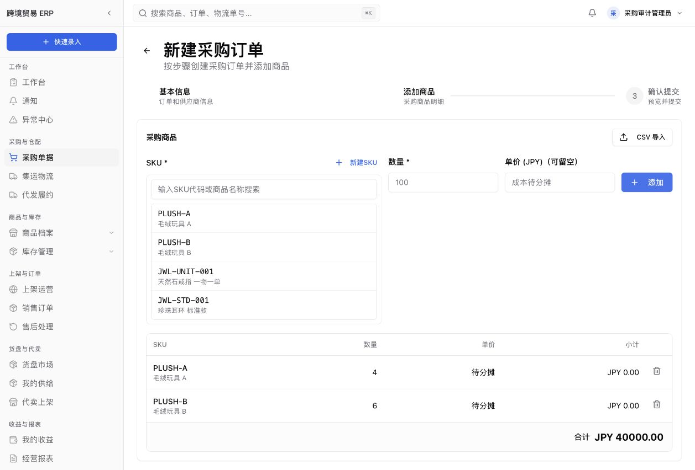

过期汇率在页面阻止确认：

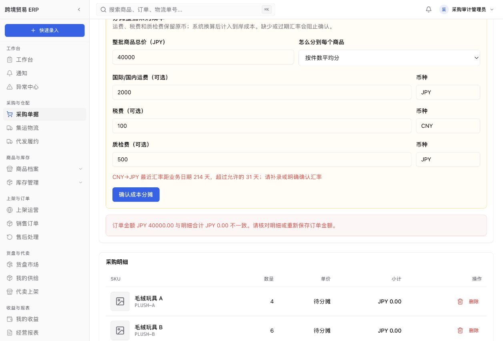

成本已确认与金额不一致警告同时出现：

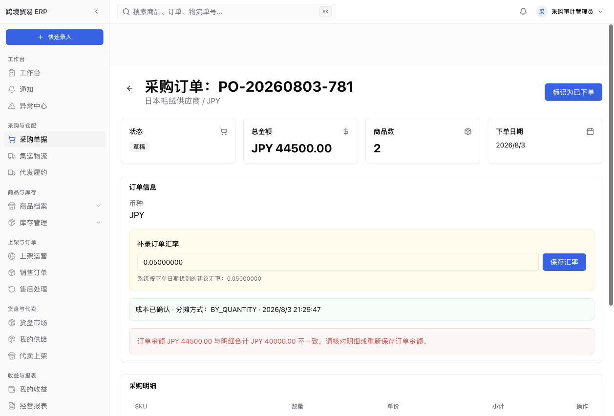

一物一单被放进普通库存批次：

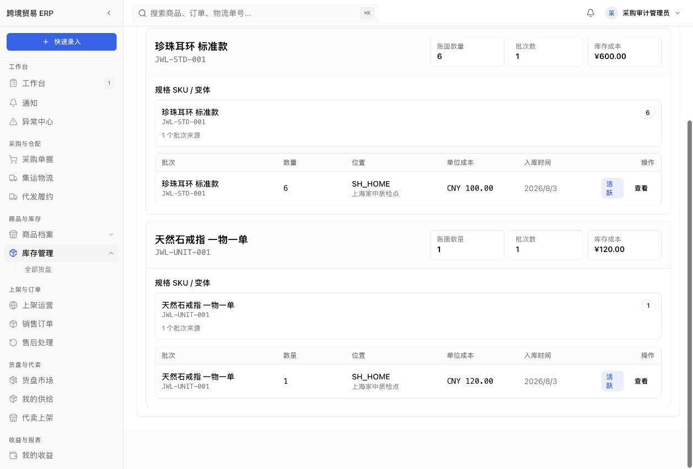

集运页只有空批次创建，缺少从库存选择商品的主动作：

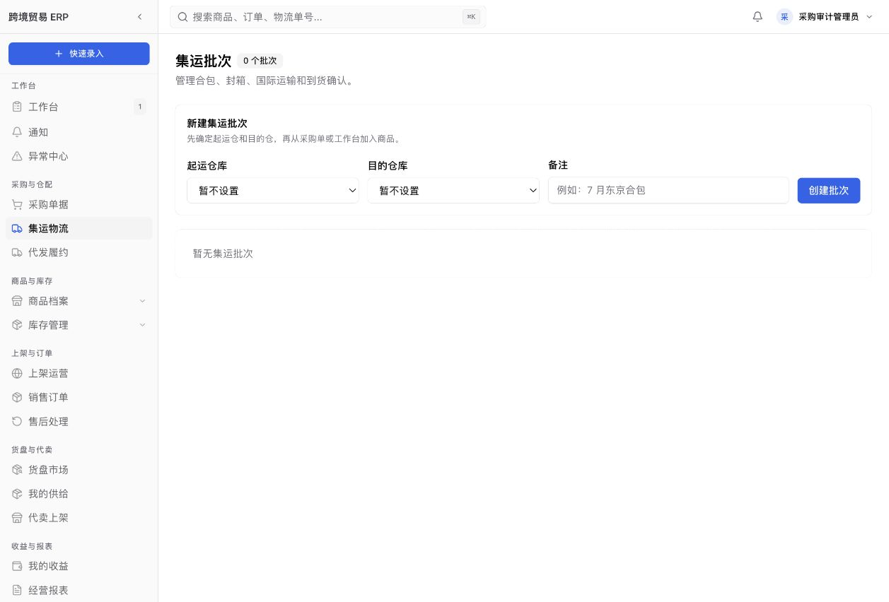

### 4.3 数量与成本对账

| 项目 | 预期 | UI / 辅助结果 | 判定 |
| --- | ---: | ---: | --- |
| 毛绒商品总价 | JPY 40,000 | JPY 40,000 | UI 可确认 |
| 运费 | JPY 2,000 | JPY 2,000 | UI 可录入 |
| 税费 | CNY 100 × 20 = JPY 2,000 | CNY 100，使用 0.05 JPY→CNY 汇率换算 | UI 可录入与阻断过期汇率 |
| 质检费 | JPY 500 | JPY 500 | UI 可录入 |
| 正确到岸总额 | JPY 44,500 | JPY 44,500 | 汇总正确 |
| PLUSH-A 到岸金额 | JPY 17,800 | 页面只显示商品金额 JPY 16,000 | 后端可能存在，UI 无法确认 |
| PLUSH-B 到岸金额 | JPY 26,700 | 页面只显示商品金额 JPY 24,000 | 后端可能存在，UI 无法确认 |
| 标准品库存 | 6 | 6 | UI 与辅助数据一致 |
| 一物一单 | 1 个 ItemUnit | 1 件普通批次，ItemUnit 0 | P0 身份错误 |

辅助数据表明按数量分摊后的 PLUSH-A / PLUSH-B 到岸金额分别为 JPY 17,800 / 26,700，但页面没有显示这些数值，所以不能把它判定为用户可核对的功能。

## 5. 场景 B：货盘、协议、代卖与结算

### 5.1 流程健康状态

| 步骤 | 判定 | 本轮实际结果 |
| --- | --- | --- |
| 发布不占库存 | 可直接完成 | 发布页明确说明只共享可售量，成交后才预留。 |
| 定向给朋友 B | 可直接完成 | 货主发布后，朋友 B 登录可以看到；未授权主体看不到。 |
| 合作约定原文与建议模板 | 可直接完成 | 页面提供协议原文、建议模板、比例和费用基数，但高级字段默认折叠。 |
| 固定供货价、赚差价 | 可直接完成 | 供货价 CNY 500，朋友 B 可按 CNY 800 售出。 |
| 固定金额、成交额比例、组合、人工确认 | UI 选项存在，完整结算未逐一跑通 | 发布页可切换规则；本轮只把可见表单判定为存在，不把未成交模板判定为计算正确。 |
| 朋友 B 使用自己的平台账号 | 可以完成但需要绕路 | 没有销售平台时被阻断，先通过 fixture 添加朋友 B 的闲鱼账号后才能继续。 |
| 成交时库存锁定 | 可直接完成 | 登记成交后货盘从 10/9 变为已预留 1。 |
| 第三方发货 | 可以完成但需要前置协议 | 收件国家有可服务节点后，仍需货主与发货主体存在覆盖该货盘/仓库的代发协议。 |
| 发货地址隐私 | 可直接完成 | 第三方发货方接受任务前只看到“已隐藏”；接受后才显示姓名、电话和地址。 |
| 运费与发货服务费独立记账 | 可直接完成 | 发货页分别输入 CNY 30 与 CNY 20，生成两条 payable 费用行。 |
| 朋友 B 的利润分成 | 页面显示成功但金额错误 | 页面预计 40% 为 CNY 96；由于没有本单运费字段，少扣 CNY 30，正确金额应为 CNY 84。 |
| 发货后自动分账与收益 | 无法完成 | 发货后工作台显示已发货 1、待结算 0；朋友 B 的收益四项仍为 CNY 0。 |
| 历史协议 v1/v2 快照 | 部分可确认 | 货盘详情显示 `v1 · 已确认`；本轮尚无完整 UI 证据证明修改后旧订单不变化。 |
| 重复确认服务结算 | 可直接防重复 | 确认后按钮变为“标记线下已结清”，不再提供第二次“确认”。 |
| 履约与结算角色权限 | 权限错误 | 请求方朋友 B 能看到接受/拒绝/发货按钮；收款方朋友 B 能确认或作废利润结算草稿。 |

### 5.2 本轮截图证据

发布页可以写合作约定、选择利润比例和费用基数：

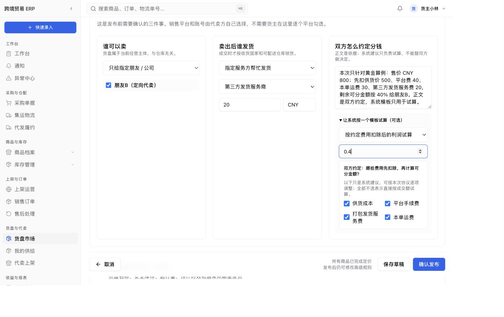

朋友 B 能看到定向货盘，但第一次上架被“先维护销售平台”阻断：

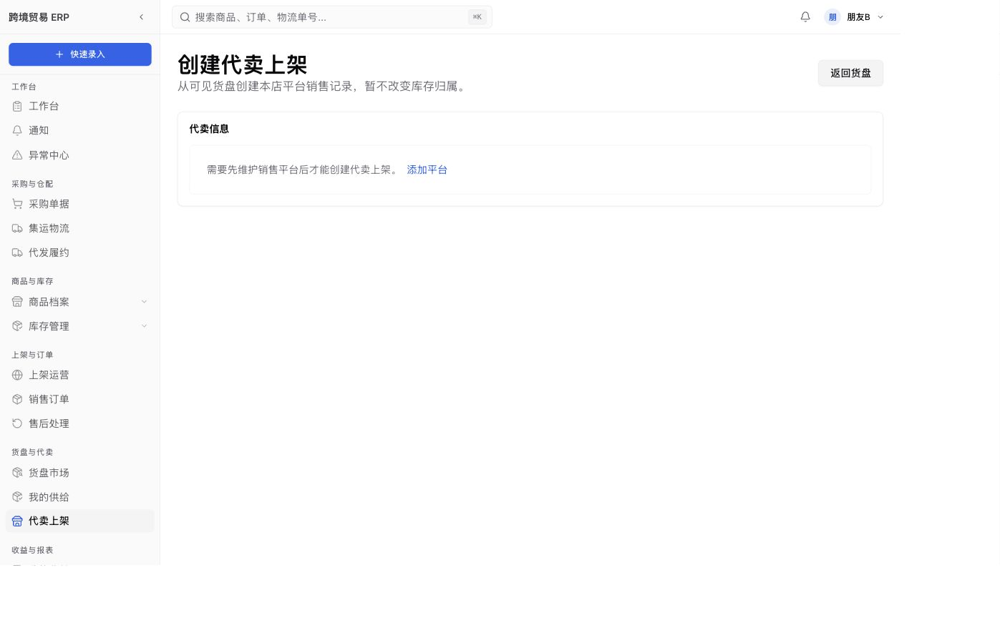

黄金算例页面把 40% 显示为 CNY 96：

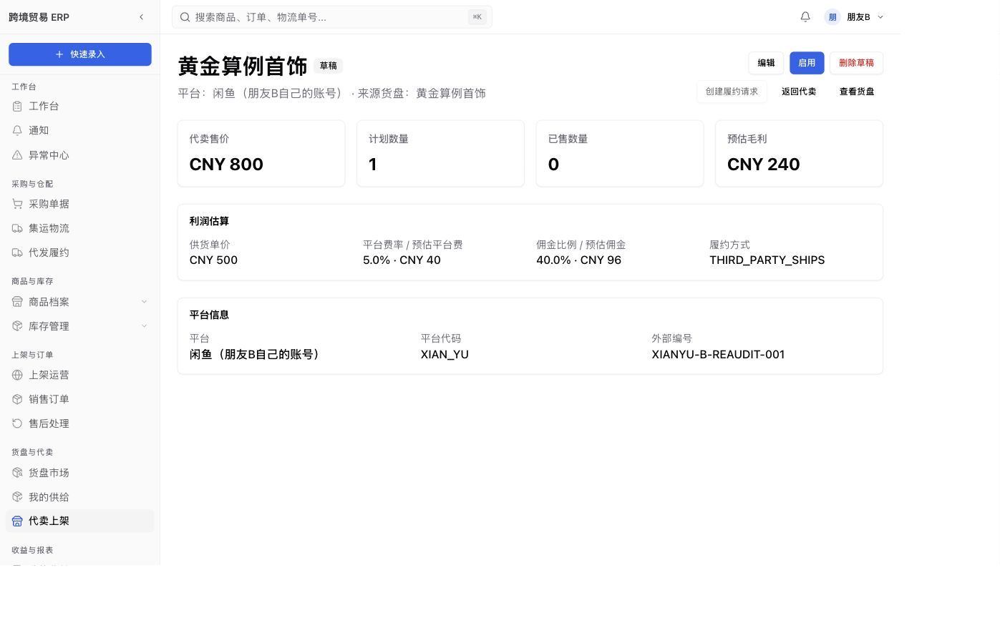

第三方发货方接受前收件地址隐藏：

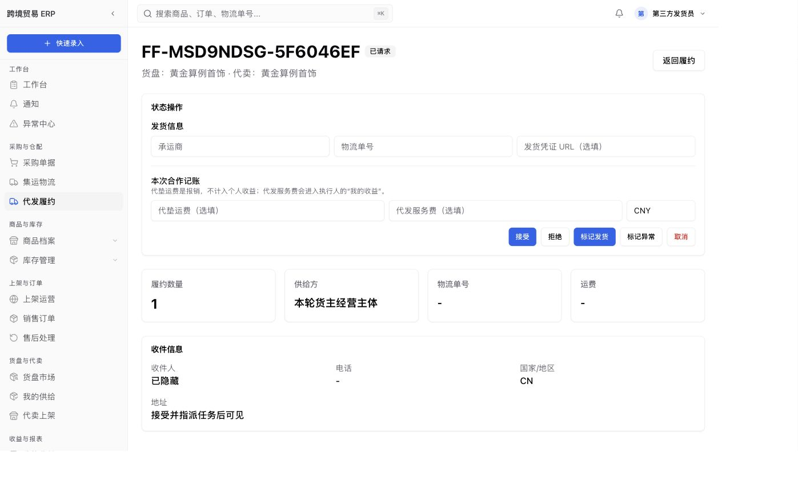

发货后形成 CNY 20 服务费和 CNY 30 运费两条费用行：

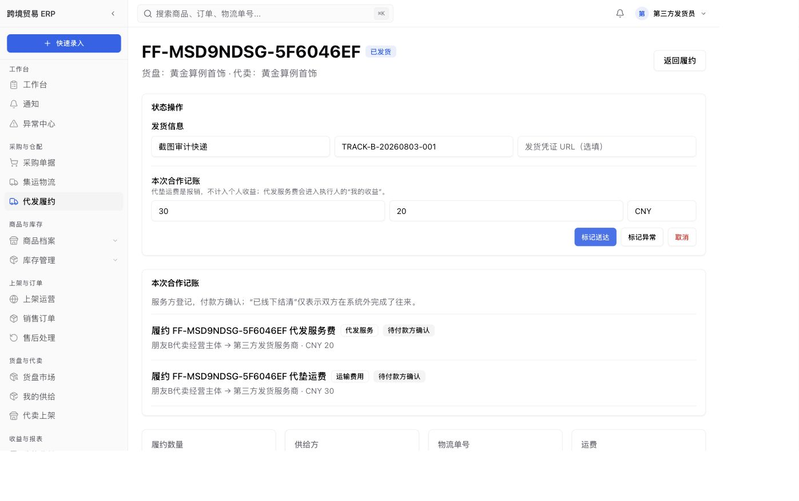

fixture 续接后的服务结算页可见总额、币种和费用明细，确认后不再出现第二次确认按钮：

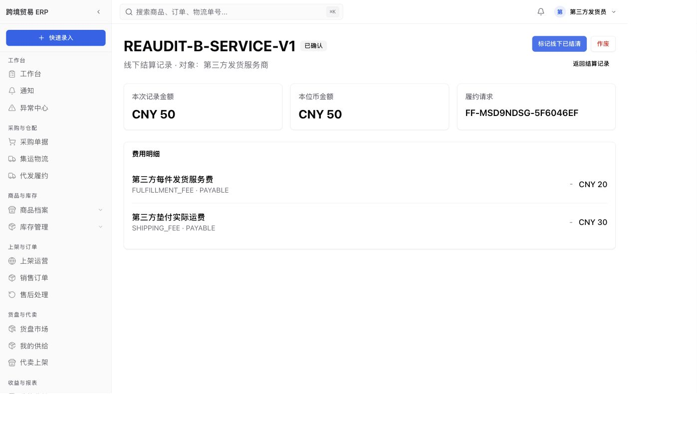

发货后没有形成待结算和个人收益：

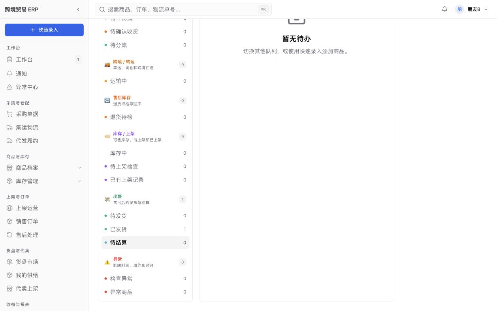

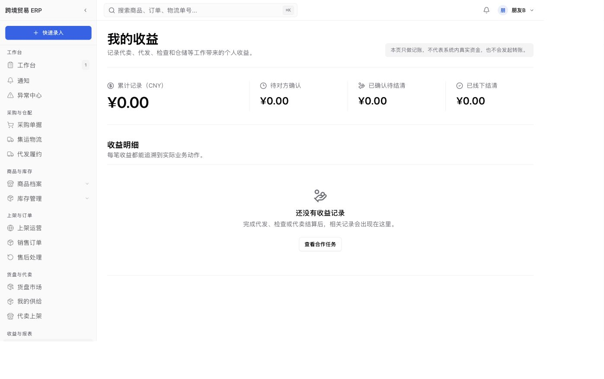

### 5.3 合作约定与金额对账

本轮所有分钱方式都只是双方协议的具体例子，不是系统应写死的标准答案。系统可以提供差价、固定金额、比例、费用扣除后分成、组合方式和人工确认等建议模板，但最终计算必须以双方确认的约定、费用承担方式、币种及协议版本为准。

| 算例 | 预期 |
| --- | ---: |
| 成交价 | CNY 800.00 |
| 采购成本 | CNY 500.00 |
| 平台费 | CNY 40.00 |
| 运费 | CNY 30.00 |
| 发货服务费 | CNY 20.00 |
| 全部扣除后可分金额 | CNY 210.00 |
| 可分金额 40% | CNY 84.00 |
| 不扣采购成本时的可分金额 | CNY 710.00 |
| CNY 710.00 的 40% | CNY 284.00 |

人工确认模式不得自动生成佣金；修改协议后，历史订单必须继续使用成交时的旧版本快照。

| 对账行 | 正确金额 | UI 金额 | 差异 |
| --- | ---: | ---: | ---: |
| 售价 | 800.00 | 800.00 | 0.00 |
| 供货价 / 约定采购成本 | 500.00 | 500.00 | 0.00 |
| 平台费 5% | 40.00 | 40.00 | 0.00 |
| 本单运费 | 30.00 | 无输入项 | -30.00 |
| 第三方发货服务费 | 20.00 | 20.00 | 0.00 |
| 可分金额 | 210.00 | 240.00 | +30.00 |
| 朋友 B 40% | 84.00 | 96.00 | +12.00 |

这里的 P0 不是“利润必须按哪一种固定公式计算”，而是系统没有忠实执行双方已经在协议原文中写明的费用承担方式。系统应允许双方自由约定差价、固定金额、比例、组合公式、费用扣除范围或人工确认；一旦确认，就必须把协议版本和实际费用快照应用到本单。

## 6. 场景 C：共享库存、单件身份、权限与售后

### 6.1 流程健康状态

| 步骤 | 判定 | 本轮实际结果 |
| --- | --- | --- |
| 5 件库存挂 8 个渠道 | fixture 续接后 UI 可确认结果 | 发布提交没有得到有效成功截图；续接后页面同时显示可接单 5、在售渠道 8、已预留 0。 |
| 上架是否占库存 | UI 结果可确认 | 8 个渠道展示后仍可接单 5，但 8 个渠道状态由 fixture 准备。 |
| 前 5 笔订单 | 可直接完成 | 五笔登记成功，货盘变为可接单 0、已预留 5。 |
| 第 6 笔订单 | 可直接阻断错误 | 页面明确提示“该货盘商品的实时可售数量不足”。 |
| 取消订单释放库存 | UI 无法直接完成；fixture 续接后结果可见 | 点击取消出现“请先登录”；fixture 取消一单后页面显示可接单 1、已预留 4。 |
| 三台同型号相机身份 | 可直接完成 | 单件库存工作台同时显示序列号、成色、位置和不同成本。 |
| 指定相机不可用时拒绝替换 | 可直接阻断错误 | fixture 准备指定单件与不可用状态后，从 UI 提交；页面明确拒绝且写明不能替换同 SKU。 |
| 仓库执行员权限 | 权限或隐私错误 | 执行员能看到全部左侧菜单、三台相机成本和“删除”动作。 |
| 未授权经营主体 | 可直接隔离 | 看不到相机单件库存，也看不到定向货盘。 |
| 标准品退货回库、ItemUnit 退待检 | 后端/页面入口可能存在，UI 无法确认完整流程 | 售后页有类型和目标仓字段，但没有本轮成功结果；ItemUnit 待检状态由 fixture 准备。 |

### 6.2 本轮截图证据

5 件真实库存可以同时挂在 8 个渠道，展示不扣库存：

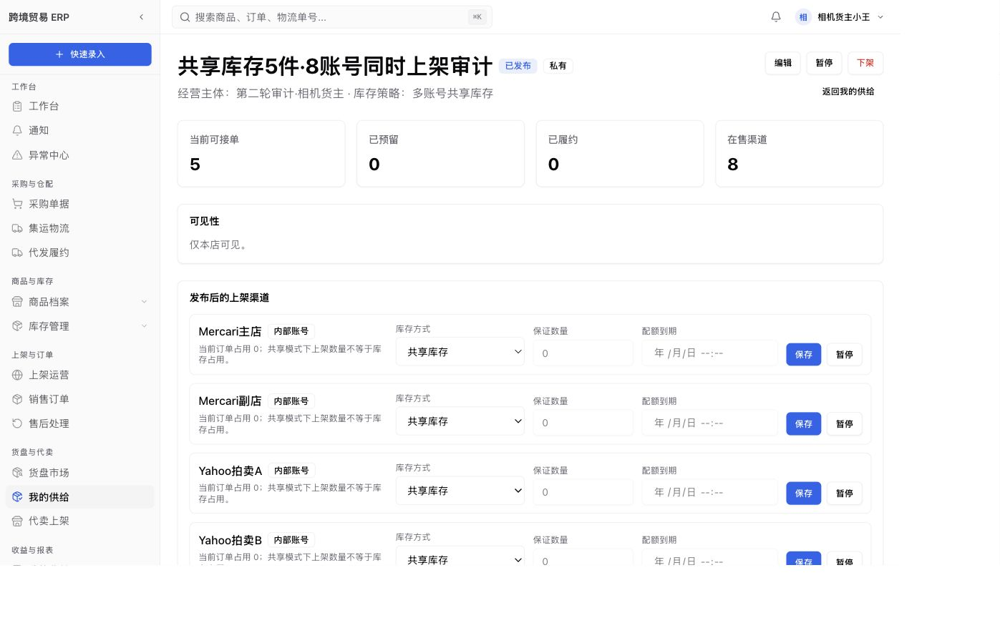

前 5 单预留后，第 6 单出现实时库存不足：

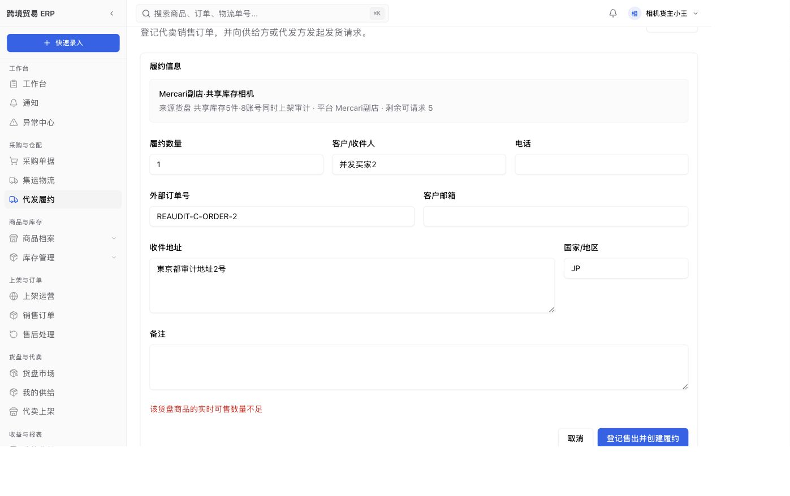

五件全部预留后的货盘状态：

fixture 取消一单后，恢复为可接单 1、已预留 4；这张图只证明续接后的结果页，不证明用户从 UI 完成了取消：

单件库存工作台展示三台相机的独立身份：

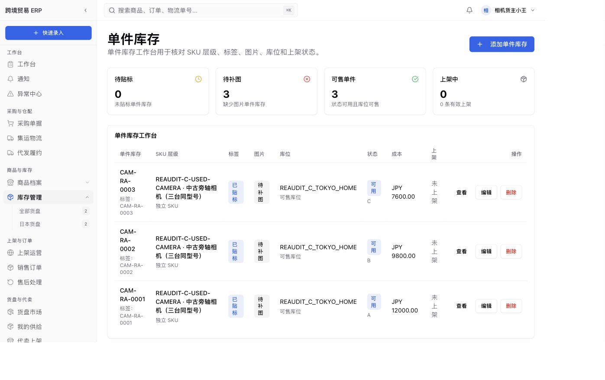

仓库执行员可以看到成本并拥有删除动作：

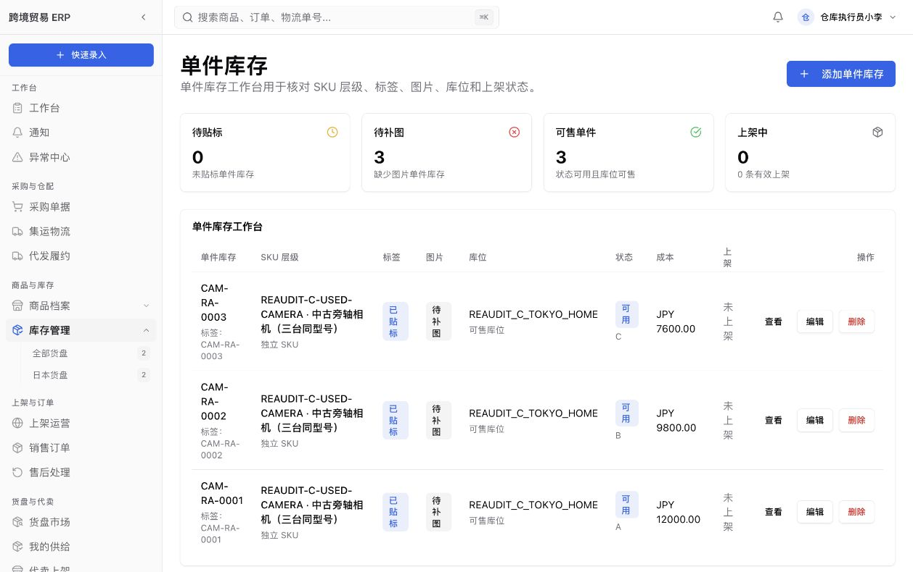

### 6.3 库存与身份对账

| 状态 | 可接单 | 已预留 | 在售渠道 | UI 判定 |
| --- | ---: | ---: | ---: | --- |
| 上架前 / 8 渠道展示后 | 5 | 0 | 8 | 展示不占库存，正确 |
| 5 笔订单后 | 0 | 5 | 8 | 成交预留，正确 |
| 第 6 笔提交 | 0 | 5 | 8 | 明确拒绝，正确 |
| fixture 取消 1 笔后 | 1 | 4 | 8 | 恢复结果正确，但 UI 取消链路未完成 |

三台中古相机的序列号 `CAM-RA-0001/0002/0003`、成色 A/B/C 和 JPY 12,000 / 9,800 / 7,600 成本在同一页面可见，证明系统已有单件身份工作台。问题在于：采购向导中的“一物一单”没有进入这套模型；同时仓库执行员不应看到这些成本，也不应拥有删除主数据的动作。

另外，目标单件已经进入“退货待检”后，登记订单表单仍显示“剩余可请求 1”，但提交时才拒绝。最终库存保护是正确的，表单提示却会诱导用户填写一整页后才失败。

## 7. 主 agent 跨场景专项

### 7.1 汇率与跨币种

固定审计汇率：`1 CNY = 20 JPY`、`1 JPY = 0.05 CNY`。缺失、未来或不满足时效规则的汇率必须在 UI 阻止利润确认或结算。

| 场景 | UI 结果 | 判定 |
| --- | --- | --- |
| 有效 CNY→JPY，1 CNY = 20 JPY | CNY 500 折为 JPY 10,000；JPY 16,000 - 10,000 - 800 = 5,200，再扣 CNY 20 服务费折 JPY 400 后毛利 JPY 4,800，40% 为 JPY 1,920 | 正确 |
| 缺失 CNY→GBP | 页面提示缺少 2026-08-03 或之前汇率，不能确认金额 | 正确阻断 |
| 只有未来 CNY→CAD | 页面仍按业务日查询“或之前”的汇率并阻断 | 正确阻断 |
| 过期 CNY→JPY | 页面提示最近汇率距业务日 214 天，超过允许的 31 天 | 正确阻断 |
| 汇率维护入口 | 系统设置页只看到分类、销售平台和仓库位置 | 当前页无法维护，不能据此断言全系统没有入口 |

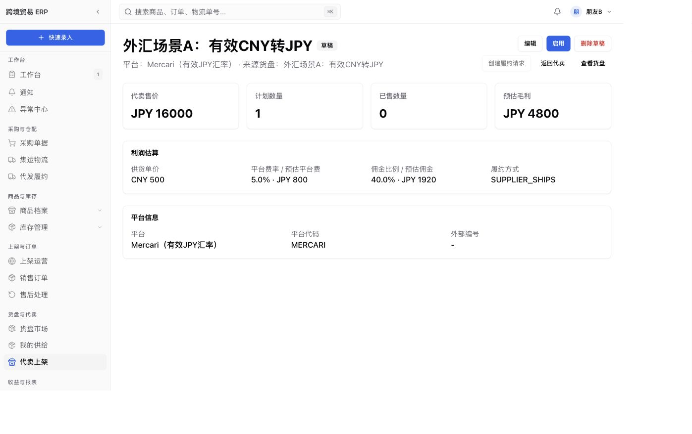

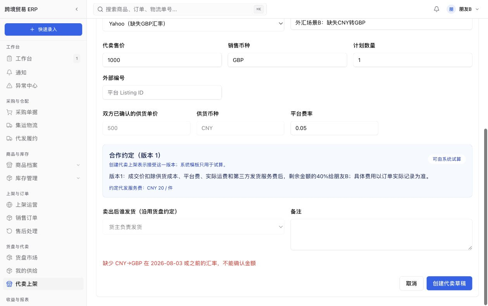

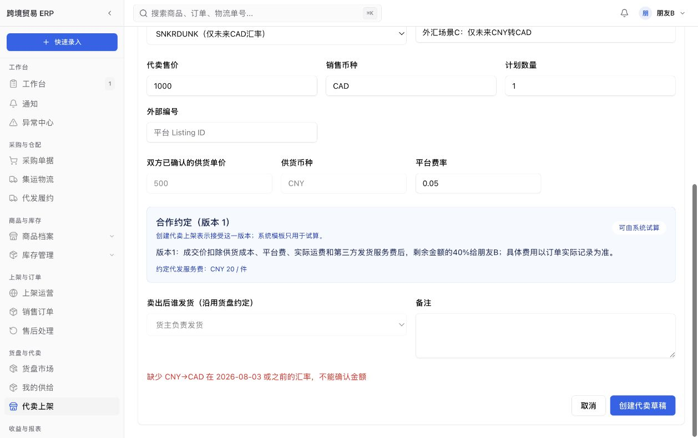

### 7.2 发货节点、幂等和重复费用

- CN 地址没有可服务当前国家的库存节点时，页面拒绝创建履约；同一隔离库补入 CN 可服务节点和代发协议后，才能创建请求并预留 1 件。这是安全阻断，但前置配置对普通用户偏重。
- JP 地址的 5 笔订单能从位于东京的可售库存中预留，第 6 笔因实时库存不足被拒绝。本轮页面没有把最终选中的库存节点显示在订单结果页，因此只能确认“错误国家会被阻止”，不能完整确认每单路由详情。
- 第三方发货页面把运费 CNY 30 和服务费 CNY 20 生成一次且只生成两条费用行；发货后主按钮变为“标记送达”，不再出现第二个“标记发货”。
- 服务结算确认后，“确认”按钮消失并变为“标记线下已结清”。这能证明页面状态阻止普通重复点击，但本轮没有做网络重放级幂等压力测试。
- 发货动作本身没有生成利润分账：朋友 B 工作台显示“已发货 1、待结算 0”，收益页四项均为 CNY 0。正确的 CNY 84 分账页只能由 fixture 续接，不能视为系统自动闭环。

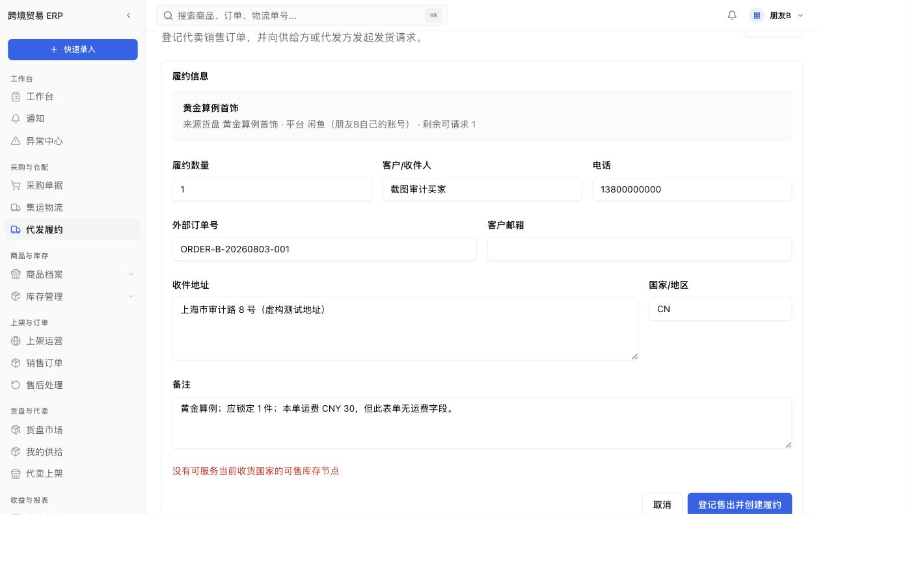

### 7.3 登录、跨主体授权与隐私

- 主 agent 独立重放了朋友 B 的定向可见性：朋友 B 可以看到目标货盘及 `v1 · 已确认` 的约定，页面显示供货价但不显示采购成本。
- 未授权经营主体的货盘市场显示“暂无可见货盘”，直接打开已知货盘地址也没有得到业务详情；空白直达页截图本身不作为有效证据，列表空状态截图有效。
- 第三方发货方接受前看不到姓名、电话和地址，接受后才解锁，符合最小披露。
- 仓库执行员却能看到完整采购成本、全套业务菜单以及单件库存“删除”动作，构成 P0 权限与隐私错误。
- 朋友 B 作为履约请求方可以看到“接受、拒绝、标记发货”等服务方动作；作为利润结算收款方，又可以确认或作废结算草稿。两个页面都没有按职责限制高风险动作。
- 运输提交和订单取消都在已登录页面中途返回“请先登录”；错误可见，但没有重新登录后继续、保存草稿或恢复动作。

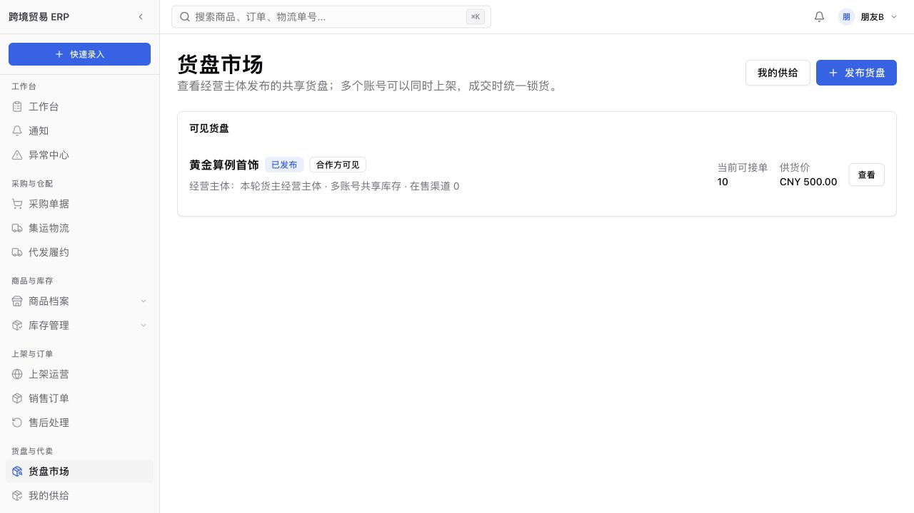

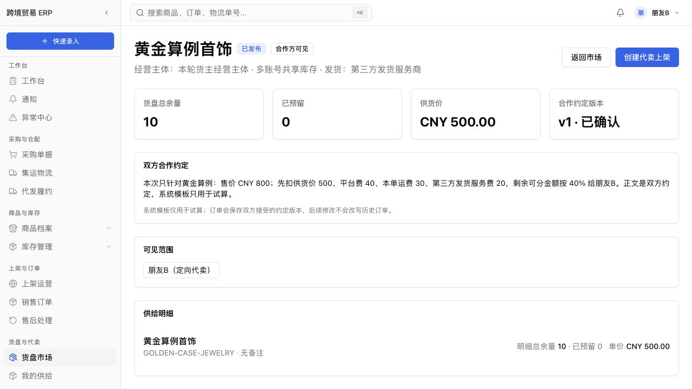

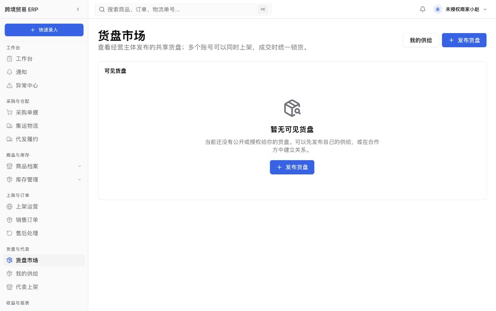

### 7.4 全新数据库迁移

迁移和 schema 一致性只作为环境辅助证据，不能证明用户界面功能存在。

三个 agent 均从全新数据库执行完整迁移后再加载各自 fixture，随后页面可以登录并访问采购、货盘和库存主流程。迁移数量与 schema 状态只记入辅助证据，不作为任何业务功能“可用”的证明。

审计结束后，三个 agent 分别停止 3211/3212/3213 服务并精确删除 `erp_v2_reaudit_a_20260803`、`erp_v2_reaudit_b_20260803`、`erp_v2_reaudit_c_20260803`。各 agent 查询确认数据库不存在；主 agent 再次执行端口复核，三个端口均无监听。未触碰现有演示库或 3000 端口。

## 8. 评分

| 维度 | 评分 | 依据 |
| --- | ---: | --- |
| 可用性 | 2.0 / 5 | 货盘、共享库存、汇率阻断、代发都有骨架，但质检、集运、退货、自动分账和协议快照仍未闭环。 |
| 易用性 | 2.5 / 5 | 发布页较上一轮明显简化，但平台账号、可服务节点、代发协议等前置配置需要多次绕路。 |
| 数据准确性 | 2.0 / 5 | 并发预留和有效汇率计算正确；单件身份、物流状态及 CNY 84/96 分成存在 P0 错误。 |
| 权限安全 | 1.5 / 5 | 定向货盘与发货地址隐私正确；仓库执行员、履约请求方、结算收款方均看到不应拥有的高风险数据或动作。 |
| 可恢复性 | 1.5 / 5 | 运输提交和取消均出现登录失效，表单无草稿与续接；取消恢复只能靠 fixture 继续。 |

本轮无障碍观察仅限截图和实际页面中可见的键盘操作、标签、焦点和错误提示风险，不构成完整 WCAG 审计。

可见风险包括：错误多显示在长表单底部，截图中没有焦点移动或顶部错误摘要；费用金额与币种视觉上并排，但缺少稳定的字段级关联证据；`IN_TRANSIT`、`BY_QUANTITY`、`PAYABLE/RECEIVABLE` 等内部枚举直接暴露；部分高级协议藏在折叠区域，不容易被普通用户发现；会话过期后没有键盘可达的恢复步骤。本轮未使用真实读屏器，因此不对可访问名称和朗读顺序作通过结论。

## 9. 上一轮问题对照

| 上一轮问题 | 本轮状态 | 本轮 UI 证据 |
| --- | --- | --- |
| 跨经营主体定向货盘 | 已修复 | 朋友 B 可见，未授权主体不可见；成本对朋友 B 隐藏。 |
| 跨币种金额计算 | 已修复 | 有效 CNY→JPY 算例正确；缺失、未来和过期汇率都被阻断。 |
| 合作约定被写死为少数佣金模型 | 已修复 | 页面允许协议原文、模板、费用基数和人工确认；但执行结果仍可能漏费用。 |
| 指定 ItemUnit 被同 SKU 替换 | 已修复 | 指定 `CAM-RA-0001` 不可用时，页面明确拒绝且写明不能替换同 SKU。 |
| 货盘余量未响应其他渠道销售 | 已修复 | 8 个渠道共享 5 件；5 笔订单后实时余量为 0，第 6 笔被拒绝。 |
| 日本订单误锁上海库存 | 无法从 UI 验证 | 国家不匹配会被阻断，但订单结果页不显示最终锁货节点。 |
| 部分质检、退供应商 | 仍然存在 | 已收货详情和工作台均无可见动作。 |
| 整批成本待分配、费用资本化 | 已修复 | 整批总价、待分摊和费用录入可见；逐 SKU 到岸成本仍无法从 UI 核对。 |
| 登录丢失、详情页错误 | 重新出现 | 运输提交与取消动作都出现“请先登录”。 |
| 新数据库迁移失败 | 已修复 | 三个全新隔离数据库均可迁移、登录并打开主页面；仅属辅助证据。 |

状态只能填写为：仍然存在、已修复、重新出现、新问题或无法从 UI 验证。

## 10. P0–P3 问题与最短复现

### P0

1. **A-P0-01：一物一单采购落成普通数量批次。** 采购向导添加“一物一单”数量 1 → 收货 → 打开库存批次；结果显示批次数 1、数量 1，而单件工作台无新 ItemUnit。
2. **A-P0-02：已收货采购仍显示运输中。** 登记发货 → 确认收货 → 返回采购详情；采购状态为已收货，运输段仍为 `IN_TRANSIT`。
3. **B-P0-01：已约定的本单运费没有进入利润分成基数。** 协议写明扣供货成本、平台费、实际运费和服务费 → 售价 800、成本 500、平台费 40、运费 30、服务费 20 → 页面显示 40% = 96，而正确为 84。
4. **C-P0-01：仓库执行员看到成本并可删除单件库存。** 以仓库执行员登录 → 库存管理 → 单件库存；三台相机成本和“删除”按钮全部可见。
5. **B-P0-02：请求方与收款方拥有对方职责的高风险动作。** 朋友 B 打开已请求履约，可见接受/拒绝/发货；打开自己作为收款方的利润结算草稿，可确认或作废。

### P1

6. **A-P1-01：已收货采购无法做部分质检、待复检、退供应商。** 采购详情和工作台都没有下一步动作。
7. **A-P1-02：采购库存无法从可见 UI 加入集运批次。** 集运页只能创建空批次；采购详情/工作台无“加入集运”。
8. **A-P1-03 / C-P1-01：关键提交会话失效且无法恢复。** 填完邮局直邮或打开已请求订单取消 → 提交 → 页面只显示“请先登录”。
9. **B-P1-01：历史代卖订单页面不显示合作约定版本。** 新建 v2 后查看 v2 创建页可见版本 2；返回旧 v1 代卖详情，只有金额与预计毛利，没有协议版本，无法从 UI 审计旧订单快照。
10. **B-P1-02：结算页没有明确展示付款方与收款方。** 页面显示“对象”和 `PAYABLE/RECEIVABLE`，但普通用户无法直接读出谁付给谁。
11. **B-P1-03：发货后未自动形成利润结算与收益。** 第三方发货完成 → 朋友 B 工作台；已发货 1、待结算 0，收益页全为 0。
12. **C-P1-02：标准品退货回库和 ItemUnit 退回待检未形成可完成的截图链路。** 工作台虽有队列文案，但本轮 UI 无成功结果页。

### P2

13. **A-P2-01：成本确认成功与红色金额不一致警告同屏。** 差额正是已资本化费用，提示却要求重新核对。
14. **A-P2-02：分摊结果不显示逐 SKU 到岸成本。** 用户无法核对 17,800 / 26,700。
15. **B-P2-01：代卖方必须先到别处维护销售平台。** 当前页面不提供内联创建或直接恢复路径。
16. **B-P2-02：代发需要额外地点和协议配置，但错误提示没有直接带到缺失配置。** 普通用户需要多次试错。
17. **C-P2-01：角色菜单未裁剪。** 仓库执行员与未授权账号仍看到大量与职责无关的采购、货盘和报表导航。
18. **C-P2-02：不可用 ItemUnit 在表单中仍显示可请求 1。** 只有提交时才拒绝，造成无效录入。
19. **ALL-P2-01：系统术语直接暴露。** `IN_TRANSIT`、`BY_QUANTITY`、`PAYABLE`、`RECEIVABLE`、`THIRD_PARTY_SHIPS` 降低普通倒买倒卖用户的理解速度。

### P3

20. **A-P3-01：集运空状态没有“从库存选择”主按钮。** 页面文案告诉用户去别处加入，但没有直接下一步。
21. **ALL-P3-01：长表单错误缺少顶部摘要与焦点反馈。** 用户可能提交后仍不知道页面底部发生了什么。
22. **B-P3-01：协议高级设置默认折叠，且缺少“本单怎么算”的即时逐行预览。** 用户容易以为正文写了就一定会被系统执行。

## 11. 四类汇总

### 11.1 无法完成

- 部分质检、待复检、退供应商。
- 把已收货采购库存加入集运并完成等待、合箱、封箱、发出闭环。
- 在登录失效后继续已填写的运输或取消操作。
- 从历史代卖详情确认当时使用的协议版本、付款方和收款方。
- 发货完成后自动生成利润分账并进入朋友 B 的收益。
- 从 UI 完整证明标准品退货回库及 ItemUnit 退回待检。

### 11.2 功能过重

- 代卖上架前必须另外维护平台账号。
- 第三方发货需要可服务节点、跨主体协议、任务接受等配置，但缺少一步式检查清单。
- 货盘高级协议把规则、费用基数、发货主体和渠道配置放在多个页面，普通用户难以形成“我到底怎么分钱”的整体心智模型。

### 11.3 UI 不友好

- 成本确认成功与红色不一致警告冲突。
- 到岸成本不展示到具体 SKU。
- 内部枚举和会计方向术语直接显示。
- 错误集中在表单底部，缺少就地修复链接、顶部摘要和草稿恢复。
- 仓库执行员和未授权账号菜单没有按角色收敛。

### 11.4 数据错误

- 一物一单被创建为普通批次。
- 收货后运输段仍在途。
- 黄金算例漏扣 CNY 30 运费，朋友 B 分成多算 CNY 12。
- 发货成功后没有自动利润结算与收益记录。
- 权限数据错误：仓库执行员看到采购成本并可删除单件库存。

## 12. 简化建议与修复顺序

1. **先修钱、货、身份与权限。** 统一 ItemUnit 创建入口；收货必须关闭对应运输段；利润计算从协议版本快照读取本单真实费用；仓库角色默认隐藏成本并移除删除权限。
2. **再补完整主链路。** 收货后直接进入“通过 / 待复检 / 退供应商”；通过项一键加入集运；取消和退货形成可恢复状态机；历史订单始终显示协议版本、付款方、收款方和逐行费用。
3. **把协议做成可组合约定，不写死佣金模型。** 系统只提供建议模板：固定供货价、固定金额、成交额比例、扣除双方勾选费用后的比例、组合规则或人工确认；双方确认的原文、结构化参数、币种和版本共同构成订单快照。
4. **在同一页给出“本单会怎么算”。** 用生活化逐行预览展示“卖了多少—扣了哪些—谁拿多少”，任何协议正文中提到但系统没有结构化字段的费用都要提醒，而不是静默忽略。
5. **把前置配置变成检查清单。** 在代卖页直接显示并修复“缺销售账号 / 缺可服务发货点 / 缺代发协议 / 缺汇率”，完成一项后回到原表单，不丢输入。
6. **隐藏内部实现语言。** 把 `IN_TRANSIT` 改为“运输中”，`PAYABLE/RECEIVABLE` 改为“你需要支付 / 你将收到”，`BY_QUANTITY` 改为“按件数分摊”；高级字段渐进展开。
7. **最后优化视觉与无障碍。** 错误顶部摘要、自动聚焦首个错误、金额与币种成组、明显的会话过期恢复、角色化导航和高风险删除二次确认。

建议验收顺序：P0 金额/库存/单件身份/隐私 → P1 主流程阻断 → P2 前置配置与审计可见性 → P3 文案、层级和键盘体验。

## 附录：辅助证据

Console、数据库断言和自动化测试只用于解释 UI 现象或核对数据，不作为功能存在的单独证明。

### A. 截图清单与复核状态

- 场景 A：`evidence-a/01`–`25`，25 张均由 agent 保存后重开，主 agent 再次逐张复核。
- 场景 B：`evidence-b/01`–`29`，29 张均由 agent 保存后重开，主 agent 再次逐张复核。
- 场景 C：有效证据为 `01`–`07`、`09`–`18`、`20`–`22`，共 20 张；`08` 和两张 `19` 因没有可见错误或为空白而明确排除。
- 主 agent：`evidence-main/03`–`13`，11 张用于独立重放定向可见性、成本隐私、库存和未授权主体。

本轮共保留 88 张原始 PNG，其中 85 张通过有效性复核。正文内嵌 26 张最关键证据，其余截图保留在同名证据目录，按账号登录、操作前、填写完成、结果/阻断、恢复状态顺序编号。

### B. fixture 与数据库辅助边界

- A：fixture 只建立主体、账号、合作方、商品、位置和固定汇率；部分质检续接失败，没有把后端动作冒充为 UI 通过。
- B：平台账号、配送节点和服务协议用于绕过已截图的前置阻断；CNY 84 利润结算页为 fixture 续接，只证明页面可展示正确拆分，不能证明系统会自动生成。
- C：5 件 / 8 渠道状态、取消恢复和精确单件不可用状态由 fixture 准备；6 笔订单提交与错误、精确单件拒绝均从 UI 实际执行。
- 数据库辅助断言只用于确认：A 的 ItemUnit 数量为 0、B 发货后没有自动 Settlement、C 取消后的 1 可售 / 4 预留；这些断言不改变对应 UI 判定。
