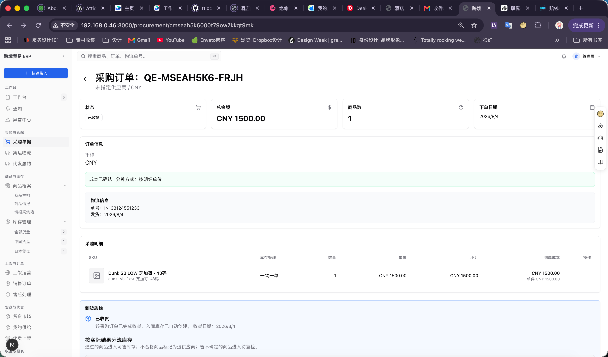
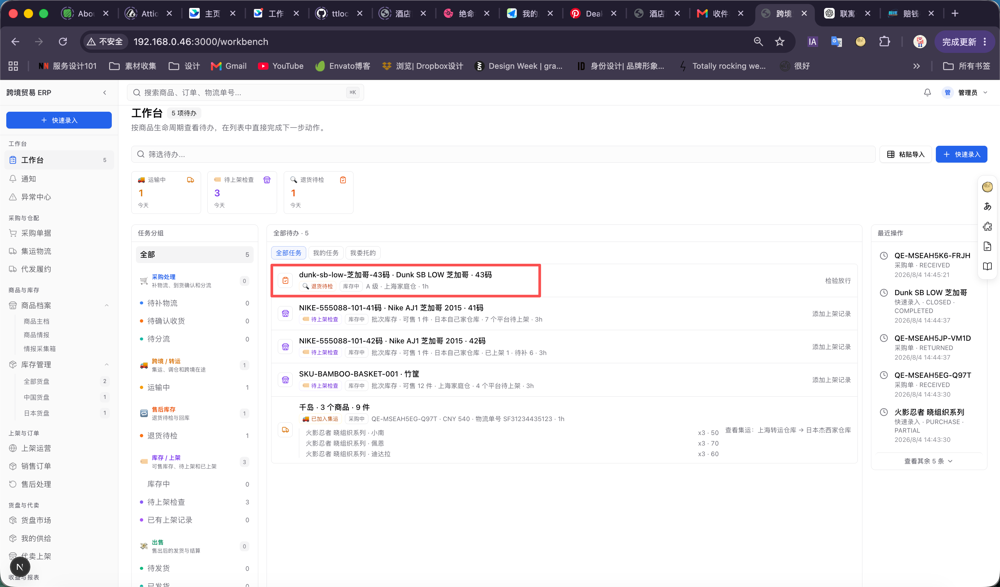
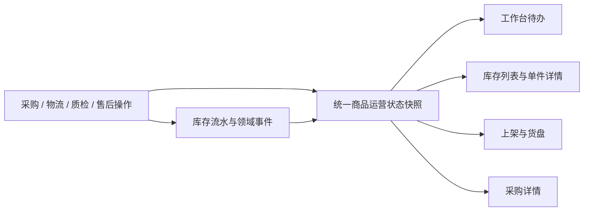
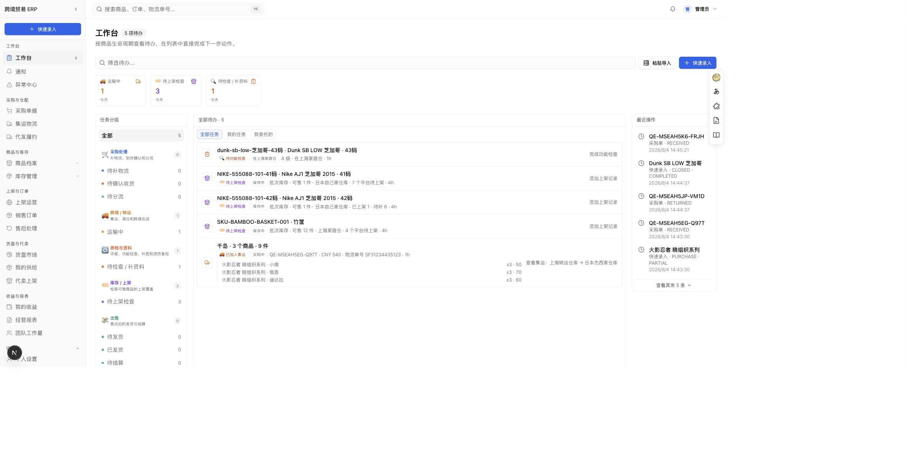

# 工作台状态与触发机制复核（2026-08-04）

## 审计范围

本次复核工作台中的采购、运输、库存、质检、上架和售后队列，重点检查：

1. `Dunk SB LOW 芝加哥 · 43码` 收货后为什么在库存看板中找不到。
2. “收到货有问题并退回卖家”与“退货待检”的含义是否一致。
3. “库存中”到底代表库存状态、生命周期，还是一个待办队列。

## 截图证据

### Step 1：采购单已收货

健康状态：**页面成功，但状态解释不完整。**

- 采购单 `QE-MSEAH5K6-FRJH` 显示已收货。
- 页面声明“入库库存已自动创建”。
- 商品采用一物一单，成本 CNY 1500。
- 页面没有在首屏说明该单件目前不可售，也没有直接给出单件库存入口。

### Step 2：工作台显示退货待检与库存中

健康状态：**数据存在，但术语和状态层级有误导。**

- 商品同时显示“退货待检”和“库存中”。
- “检验放行”是唯一明显下一步。
- 用户容易理解为“已经退回卖家但仍在库存”，或误以为它应当出现在可售库存看板。

## 当前数据真值

### `QE-MSEAH5K6-FRJH` / 43码

- 采购单状态：`RECEIVED`。
- 单件库存 ID：`cmsean88o002379owxl4h0wew`。
- 单件状态：`RETURN_CHECK`。
- 实物账：上海家庭仓 `+1`，原因 `INBOUND_PURCHASE`。
- 商品状态：中古、A 级。
- 功能状态：`UNTESTED`。
- 照片：无。
- 质检记录：无。
- 结论：这件商品**没有退回供应商**。它确实在上海家庭仓，但因为功能未测试而不可售。

### `QE-MSEAH5JP-VM1D` / 46码

- 采购单状态：`RETURNED`。
- 备注：`批量退货终止`。
- 单件库存：无。
- 库存流水：无。
- 结论：这张才是已退回卖家的采购单。它没有进入库存，只保留在最近操作和采购历史中，属于已关闭流程。

## 当前工作台队列与触发条件

| 页面状态 | 当前触发条件 | 当前含义 | 复核结论 |
| --- | --- | --- | --- |
| 待补物流 | 采购单 `ORDERED` 且没有物流单号 | 等待登记卖家发货 | 合理 |
| 待确认收货 | 采购单已有物流号，或采购首段物流仍为 `IN_TRANSIT/DELIVERED` 且未确认 | 等待确认采购到货 | **边界过宽；把在途和到货待确认混在一起** |
| 待分流 | 采购单 `RECEIVED`，但仍有明细没有库存、没有进入集运；或目的地是非可售节点 | 决定入库、集运或转仓 | 逻辑基本合理，但与“确认收货自动创建库存”冲突 |
| 运输中 | 采购明细已加入未完成集运，或第 2 段以后物流在途 | 集运、转仓、跨境段在途 | 合理 |
| 检查异常 | 可售库存关联到失败质检 | 质检失败待处理 | **容易被 `RETURN_CHECK` 抢走，存在不可达风险** |
| 退货待检 | 任意单件状态为 `RETURN_CHECK` | 当前实际包括：退货回库、未评级、功能未测试、缺图等 | **严重过载，不等于退货** |
| 库存中 | 类型中存在，但不在主动待办查询中；同时又作为 `IN_STOCK` 生命周期标签 | 表示实物仍在库，而非可售 | **不是有效待办队列，常年为 0，名称容易误导** |
| 待上架检查 | 可售库存存在上架覆盖缺口 | 需要添加或补齐上架记录 | 合理，但它实际上由另一套上架查询合并进入工作台 |
| 已有上架记录 | 类型中存在，但不在主动待办查询中 | 理论上表示已有上架 | **当前不是有效待办队列，通常为 0** |
| 待发货 | 销售单草稿已完整锁货，或订单已确认 | 等待确认或发货 | 合理 |
| 已发货 | 订单 `SHIPPED` 且未结算 | 等待确认妥投 | 合理 |
| 待结算 | 订单 `DELIVERED` 且未结算 | 等待录入真实费用和到账 | 合理 |
| 异常商品 | 快速录入失败，或没有生成业务对象的待补全记录；以及物流异常 | 需要人工恢复 | 部分待补全记录生成采购单后会从异常队列隐藏 |

## 核心问题

### P0：各模块共享原始数据，但没有共享唯一的商品状态输出

当前并不是完全“没有联通”：采购、物流、质检、库存、售后和上架模块会读写同一批业务表。但它们没有共同消费一个稳定的商品状态快照，而是各自重新推导页面状态：

- 采购详情根据采购单和收货结果显示“已收货、库存已创建”；
- 工作台重新组合采购单、物流、单件状态、质检和上架缺口，再翻译成待办；
- 可售库存根据单件/批次状态、地点和占用量重新计算，只展示可售结果；
- 单件详情直接展示 `ItemUnit.status`；
- 上架待办又单独计算平台覆盖缺口；
- 最近操作读取业务活动记录，不代表当前可操作状态。

因此系统现在是“共享数据，没有共享输出契约”。同一件商品在不同页面可能分别被解释为“已收货”“退货待检”“库存中”或直接不可见。`Dunk SB LOW 芝加哥 · 43码` 正是这个问题的完整样本：采购模块确认其已收货，单件模块实际记录为 `RETURN_CHECK`，工作台把它翻译成“退货待检”，生命周期又翻译成“库存中”，可售库存则将它过滤掉。

这不是模块化本身的问题。正确方向是保留采购、物流、库存、质检、上架和售后的领域边界，同时建立统一的商品运营状态投影，供所有页面读取。

统一快照至少需要分开保存：

- `physicalState`：未到货、在库、在途、已出库、已退供应商；
- `availabilityState`：可售、暂停、已预留、已售；
- `qualityState`：未检查、通过、不通过、有问题、待补资料；
- `workflowReason`：待功能测试、采购质检、客户退货复检、待退供应商等；
- 当前地点、来源单据、目标单件身份和唯一下一步动作。

工作台只消费统一快照产生的“下一步任务”，不再自行拼接并猜测商品状态。所有状态写入应经过统一的状态转换服务，在同一事务内更新业务对象、库存流水、质检记录和状态快照。

### P1：`RETURN_CHECK` 被多个业务原因共用

当前 `RETURN_CHECK` 同时代表：

- 售后退货回库待检；
- 采购到货待复检；
- 中古商品未评级；
- 功能未测试；
- C/D 级或异常商品缺少照片。

工作台却统一翻译成“退货待检”。因此截图中的 43 码商品并不是退货，而是功能未测试。状态名称与真实原因不一致。

### P1：收货、质检、分流的实现存在两套互相冲突的路径

- 工作台动作说明写的是“确认收货后进入待分流，不直接创建库存”。
- 采购详情和部分收货动作实际会立即创建库存。
- 用户因此无法预判点击确认后商品会进入待分流、待复检还是可售库存。

### P2：“库存中”同时承担两种含义

- 行内的“库存中”是生命周期标签，意思是实物还在本方仓库。
- 左侧的“库存中”又被表现为一个队列，但主动待办查询并不产生该队列。

这使用户看到“库存中 0”，同时某个任务又带有“库存中”标签。

### P2：不可售单件缺少稳定入口

`RETURN_CHECK` 单件不会进入“全部货盘/可售库存”页面，这是库存过滤逻辑的正常结果；但侧边栏又没有明显的“单件库存/待复检库存”入口，只能从工作台任务打开。一旦任务被处理或筛选，用户会认为商品丢失。

## 建议的状态重组

1. 先建立统一的商品运营状态快照，所有页面只从该快照读取物理状态、可售状态、质检状态、业务原因和下一步动作。
2. 将行内第二个标签从“库存中”改为明确的物理状态：`在上海家庭仓`、`转运中`、`已退供应商`。
3. 将 `RETURN_CHECK` 拆分原因，至少显示：`待评级`、`待功能检查`、`待补图`、`采购待复检`、`售后退货待检`。
4. 只有真实的客户退货回库使用“退货待检”；采购退供应商使用“待寄回供应商/已退供应商”。
5. 从工作台删除无实际触发的“库存中”和“已有上架记录”队列，或将它们改为可点击的库存视图而非待办。
6. 在侧边栏增加“单件库存”或“待复检”入口，让不可售单件仍然可发现。
7. 统一收货规则：`确认到货 → 质检/分流 → 创建库存`，不要让不同入口采用不同顺序。
8. 为状态和原因使用受约束的枚举，并增加“状态快照—库存流水—来源单据”的定期一致性校验，避免页面静默漂移。

## 修复实施结果（2026-08-04）

本轮已经完成第一阶段修复，并通过当前真实商品在 UI 中复核：

- 新增统一的单件商品运营状态投影，将实物、可售性、质检和业务原因拆开输出；
- 工作台、单件库存列表、单件详情和 SKU 卡片共用这套状态解释；
- 示例商品现在显示为“待功能检查”“在上海家庭仓”，不再显示“退货待检”“库存中”；
- `RETURN_CHECK` 会按售后回库、检查失败、待评级、待功能检查、待补图、采购复检分别显示；
- 检查失败进入“检查异常”，不再混入普通待检查队列；
- 资料不完整的单件不能从工作台直接放行，会进入单件详情补齐信息；
- 放行前校验品级、功能状态及必要图片，成功放行同时生成单件质检记录；
- 工作台移除了没有实际任务触发的“库存中”和“已有上架记录”伪队列；
- 确认收货文案与真实行为统一为“创建库存”；只有转运节点到货才继续进入待分流；
- 单件详情新增“实物位置 / 销售状态 / 检查状态 / 下一步”状态区；侧边栏已有稳定的“单件库存”入口。

当前采用的是共享读取投影，而不是新增一张持久化状态快照表。这已经解决主要页面各自翻译状态的问题，同时避免在现有脏工作区中引入高风险迁移。后续如状态写入方继续增加，再将该投影物化并增加库存流水一致性任务。

验证结果：

- TypeScript 类型检查通过；
- 单件状态、工作台阶段和中古品级规则测试共 14 项通过；
- 单件动作、采购退货、采购转仓、物流分组、库存看板和 SKU 详情回归测试共 25 项通过；
- UI 已确认示例商品显示“待功能检查 / 在上海家庭仓 / 完成功能检查”。

## 证据边界

- 截图能够证明页面同时显示“退货待检”和“库存中”，以及采购详情显示已收货。
- 数据库只用于确认该单件的实际状态、仓库流水和退回采购单是否创建库存。
- 本轮没有重新提交退货、质检或放行动作，因此没有对按钮幂等性和提交后的跳转进行重新验证。
- 仅凭截图不能确认键盘焦点、读屏播报和状态变化提示；本轮不声明完整无障碍合规。
