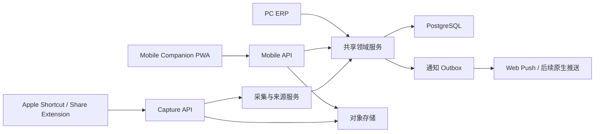

# ERP 随身助手技术架构

状态：PWA、S3 兼容存储和生产运维接口已落地；原生 iOS 容器为可选渠道项
最后更新：2026-08-01

## 1. 架构结论

移动端采用独立客户端和独立 API 表达层，但复用现有 ERP 的领域服务和 PostgreSQL 数据库。

它不是把 `app/(dashboard)` 增加响应式样式，也不直接复用 PC 工作台的复杂组件。



## 2. 技术选型

### 2.1 第一阶段客户端

推荐独立 PWA：

- React + TypeScript。
- 可以使用现有 Next.js 工程提供独立路由组，或建立 `clients/mobile` 独立构建。
- 独立应用壳、导航、组件和样式令牌。
- Web App Manifest + Service Worker。
- Camera/File API、BarcodeDetector 可用时渐进增强；不支持时提供手输/粘贴兜底。
- Web Push 在完成站内通知闭环后启用。

选择 PWA 的原因是第一版无需应用商店发布，同时能验证移动任务模型。PWA 不意味着复用 PC 页面。

### 2.2 后续原生能力

当系统分享、离线队列、后台上传或扫码稳定性成为核心要求时，再增加：

- iOS SwiftUI 容器 App。
- Share Extension。
- Keychain + App Group。
- Apple Vision OCR。
- 原生相机/扫码能力。

原生客户端仍调用相同 Mobile API 和 Capture API，不新增第二套领域逻辑。

## 3. 仓库结构

实际采用的结构：

```text
erp-v2/
├── app/                                  # 现有 Next.js ERP 与 API
│   ├── (mobile)/m/                       # 独立移动 PWA 路由组
│   └── api/v1/
│       ├── mobile/                       # Mobile API
│       └── product-intelligence/captures/# Capture API
├── components/mobile/                    # 移动端专用交互组件
├── packages/
│   ├── mobile-contract/                  # OpenAPI/JSON Schema/生成类型
│   └── capture-contract/
├── lib/
│   ├── application/                      # 现有领域/应用服务
│   ├── mobile/                           # Mobile DTO 与编排
│   └── capture/                          # Capture/Source/Extract/Match
└── prisma/
```

当前基线放在 `app/(mobile)/m`，并满足：

- 不加载 PC DashboardShell。
- 不导入 PC 工作台布局组件。
- 独立移动导航和页面预算。
- API 与 UI 解耦，未来可无痛迁移到 `clients/mobile`。

## 4. 共享与隔离边界

### 4.1 必须共享

- 用户、组织、店铺和权限。
- SKU、采购、库存、订单和任务状态机。
- `WORKFLOW_ACTION_SPECS` 对业务动作的定义。
- Prisma 数据访问与事务。
- 金额、币种、数量校验。
- ActivityLog、Notification 和任务完成规则。

### 4.2 必须隔离

- PC 与手机页面布局。
- Mobile DTO 与 PC 页面查询 DTO。
- 移动端字段裁剪和动作展示。
- PWA 缓存和本地草稿。
- 设备令牌、推送订阅和系统分享生命周期。

### 4.3 禁止的复用方式

- 手机直接渲染 PC `NextActionWorkbench`。
- 手机从 PC 宽表格 DOM 中隐藏列。
- 客户端直接修改 Prisma 数据。
- 为手机复制一套采购/库存状态变更代码。

## 5. 移动动作定义

现有 `WorkflowActionSpec` 增加移动策略：

```ts
type MobileRiskLevel = "LOW" | "MEDIUM" | "HIGH";
type MobileCompletionPolicy = "DOMAIN_ACTION_REQUIRED" | "TASK_ONLY";

interface MobileActionPolicy {
  enabled: boolean;
  summaryFields: string[];
  editableFields: string[];
  requiredEvidence?: Array<"PHOTO" | "BARCODE" | "SIGNATURE">;
  riskLevel: MobileRiskLevel;
  completionPolicy: MobileCompletionPolicy;
  requiresOnline: boolean;
  requiresSecondConfirm?: boolean;
}
```

移动任务 API 根据服务端动作定义返回 UI Schema，客户端不自行决定当前状态允许执行什么。

示例：

```json
{
  "action": "shipOrder",
  "title": "确认发货",
  "riskLevel": "MEDIUM",
  "expectedVersion": "2026-08-01T09:30:00.000Z",
  "fields": [
    { "name": "shippingMethod", "type": "text", "required": false },
    { "name": "trackingNo", "type": "barcodeOrText", "required": false },
    { "name": "proofImages", "type": "assetList", "required": true }
  ],
  "submitLabel": "确认已发货"
}
```

## 6. Mobile API

### 6.1 首页

`GET /api/v1/mobile/home`

返回：

- 当前用户和店铺。
- 我的待办数、逾期数、异常数、未读通知数。
- 优先任务摘要。
- 我委托的异常/超时摘要。
- 客户端配置和 feature flags。

首页接口只返回有限条目，不能把 PC 工作台 120 条任务和所有辅助数据一次发送到手机。

### 6.2 任务列表

`GET /api/v1/mobile/tasks`

查询参数：

- `scope=mine|open|delegated|completed`
- `group=procurement|warehouse|fulfillment|exception`
- `status`
- `cursor`
- `limit`

必须使用游标分页。

### 6.3 任务详情

`GET /api/v1/mobile/tasks/:taskId`

返回：

- Task 摘要。
- 关联业务对象摘要。
- 当前允许的移动动作。
- 表单 UI Schema。
- 证据要求。
- `expectedVersion`。
- 允许查看的有限历史。

### 6.4 开始和委托

- `POST /api/v1/mobile/tasks/:taskId/start`
- `POST /api/v1/mobile/tasks/:taskId/assign`

委托请求：

```json
{
  "assignedToId": "user_xxx",
  "dueAt": "2026-08-01T10:00:00.000Z",
  "note": "请到货后拍照",
  "expectedVersion": "2026-08-01T09:30:00.000Z"
}
```

### 6.5 执行业务动作

`POST /api/v1/mobile/tasks/:taskId/actions/:action`

请求头：

```text
Idempotency-Key: <uuid>
```

请求体：

```json
{
  "expectedVersion": "2026-08-01T09:30:00.000Z",
  "fields": {
    "trackingNo": "SF123456",
    "shippingMethod": "顺丰"
  },
  "assetIds": ["asset_xxx"],
  "confirmation": {
    "acceptedImpact": true
  }
}
```

服务端执行顺序：

1. 校验用户、组织、店铺和任务访问权限。
2. 校验 Task 与业务对象当前版本。
3. 校验动作是否仍允许。
4. 校验字段和证据。
5. 执行现有领域动作。
6. 在领域事务中更新业务状态、库存账与领域日志。
7. 将请求持久化为 `DOMAIN_COMPLETED`，保存可重放结果。
8. 完成或推进 Task，并写站内通知。
9. 标记移动请求 `COMPLETED`。
10. Web Push 以 best-effort 方式发送；失败不回滚站内通知。

### 6.6 通知

- `GET /api/v1/mobile/notifications`
- `POST /api/v1/mobile/notifications/:id/read`
- `POST /api/v1/mobile/notifications/read-all`
- `POST /api/v1/mobile/push-subscriptions`
- `DELETE /api/v1/mobile/push-subscriptions/:id`

通知返回 `actionUrl`，例如：

```text
/m/tasks/task_xxx
/m/captures/cap_xxx
```

### 6.7 附件

- `POST /api/v1/mobile/assets/presign`
- 客户端直传对象存储。
- `POST /api/v1/mobile/assets/:id/complete`

只有 `READY` 且归属当前用户/组织的资产可以用于业务动作。

## 7. Capture API 与采购转换

沿用商品情报采集方案的 Capture/SourceListing/Snapshot 结构，并增加业务意图和采购草稿。

### 7.1 创建 Capture

`POST /api/v1/product-intelligence/captures`

新增字段：

```json
{
  "captureType": "SCREENSHOT",
  "businessIntent": "RECORD_PURCHASE",
  "storeId": "store_xxx",
  "assets": ["asset_xxx"],
  "purchaseHint": {
    "platform": "XIANYU",
    "externalOrderNo": "123456",
    "sellerName": "卖家 A"
  }
}
```

### 7.2 确认价格观察

`POST /api/v1/product-intelligence/captures/:id/confirm-observation`

服务端创建/更新：

- SourceListing。
- SourceListingSnapshot。
- ProductIntelligenceObservation。
- CaptureBusinessLink。

### 7.3 确认真实购入

`POST /api/v1/product-intelligence/captures/:id/confirm-purchase`

请求包含一条或多条采购行：

```json
{
  "externalOrderNo": "123456",
  "supplierName": "卖家 A",
  "currency": "CNY",
  "purchasedAt": "2026-08-01T08:00:00.000Z",
  "shippingFee": "12.00",
  "lines": [
    {
      "matchedSkuId": "sku_xxx",
      "rawProductName": "米奇玩偶",
      "rawVariant": "米妮",
      "conditionType": "中古",
      "quantity": "1",
      "unitPrice": "320.00"
    }
  ]
}
```

每一行至少生成：

- `REAL_PURCHASE + PURCHASE` Observation。
- QuickEntry。
- Capture 与 QuickEntry/Observation 的链接。

如果满足现有结构化条件，再生成或关联 PurchaseOrder/PurchaseLine；否则保持 QuickEntry `PARTIAL` 并进入 PC/移动待补任务。

## 8. 数据模型

### 8.1 CompanionDevice

建议将原计划的 `CaptureDevice` 扩展为通用设备：

- `id`
- `organizationId`
- `userId`
- `name`
- `clientKind`
- `tokenHash`
- `scopes`
- `pushEnabled`
- `lastUsedAt`
- `revokedAt`
- `createdAt`

Scope 示例：

```text
mobile:tasks:read
mobile:tasks:act
mobile:capture:create
mobile:notifications:read
```

### 8.2 ProductIntelligenceCapture 扩展

除现有方案字段外增加：

- `businessIntent`
- `visibility`
- `extractionStatus`
- `extractionVersion`
- `confirmedById`
- `confirmedAt`

### 8.3 CapturePurchaseDraft

- `id`
- `captureId`
- `storeId`
- `platformCode`
- `externalOrderNo`
- `supplierName`
- `currency`
- `purchaseDate`
- `shippingFee`
- `status`
- `purchaseBatchKey`
- `createdAt`
- `updatedAt`

### 8.4 CapturePurchaseDraftLine

- `id`
- `draftId`
- `matchedSkuId`
- `rawProductName`
- `rawVariant`
- `conditionType`
- `quantity`
- `unitPrice`
- `lineAmount`
- `confidence`
- `evidenceClaimIds`

### 8.5 CaptureBusinessLink

通用可追溯关联：

- `id`
- `captureId`
- `refType`
- `refId`
- `relationType`
- `createdAt`

`refType` 可为：

- `PRODUCT_INTELLIGENCE_OBSERVATION`
- `QUICK_ENTRY`
- `PURCHASE_ORDER`
- `PURCHASE_LINE`
- `TASK`

同一 Capture 可以关联多条采购行和多个业务对象。

### 8.6 MobilePushSubscription

- `id`
- `userId`
- `deviceId`
- `endpointHash`
- `endpointEncrypted`
- `p256dhEncrypted`
- `authEncrypted`
- `userAgent`
- `expiresAt`
- `revokedAt`
- `lastSuccessAt`
- `lastFailureAt`

### 8.7 MobileActionRequest

保存幂等结果，可使用通用 Idempotency 表实现：

- `id`
- `organizationId`
- `userId`
- `deviceId`
- `idempotencyKey`
- `taskId`
- `action`
- `requestHash`
- `status`
- `responsePayload`
- `createdAt`

唯一约束：`(deviceId, idempotencyKey)`。

### 8.8 Notification 扩展

建议增加：

- `priority`
- `actionUrl`
- `deliveredAt`
- `deliveryStatus`

推送失败不影响站内通知创建。

## 9. 并发与一致性

### 9.1 乐观并发

移动任务详情返回 `expectedVersion`，提交时必须带回。

如果业务对象或 Task 的 `updatedAt` 已变化，返回 `409 CONFLICT`：

```json
{
  "code": "STALE_TASK",
  "message": "该任务已由李四在 10:32 处理，请刷新。"
}
```

### 9.2 幂等

以下操作必须幂等：

- Capture 创建。
- 确认购入。
- 确认到货。
- 确认入库。
- 确认发货。
- 登记退货。

相同幂等键和相同请求返回第一次结果；相同键不同请求返回冲突。

### 9.3 事务边界

正式状态动作的当前实现采用“领域事务 + 持久恢复点 + 任务收尾”：

```text
领域事务：业务对象变化 + 库存账 + ActivityLog
恢复编排：MobileActionRequest(DOMAIN_COMPLETED) → Task 完成 + Notification
```

现有 PC Server Action 各自拥有领域事务，因此移动编排不强行跨 Server Action 包一层伪事务。若领域动作已经成功而 Task/通知收尾失败，相同幂等请求只补齐收尾，不会再次执行发货、入库或采购动作。Web Push 失败不会影响已保存的站内通知。后续若引入统一事务客户端和 Outbox，可将收尾进一步合并为单数据库事务。

## 10. 附件与隐私

当前开发适配器把文件保存在 `.data/mobile-assets`，并通过登录与店铺权限校验的内容接口读取。生产环境必须替换为私有对象存储和预签名上传，API 合约无需变化。

服务器校验：

- MIME 和扩展名。
- 文件大小和图片尺寸。
- SHA-256。
- 用户、设备、组织和店铺归属。
- EXIF 清理策略。
- 恶意文件扫描策略。

微信聊天和订单截图可能包含姓名、地址、手机号和头像：

- 默认使用私有对象。
- URL 短期签名。
- 只对有权访问关联业务对象的用户开放。
- 支持删除和保留期配置。
- AI/OCR 服务只接收完成授权的必要图片。

## 11. 推送架构

当前实现先持久化站内通知，再 best-effort 发送 Web Push：

```text
写 Notification
→ 尝试 Web Push
→ 成功记录 lastSuccessAt
→ 404/410 撤销失效订阅
→ 其他失败记录 lastFailureAt，站内通知仍保留
```

大规模生产环境可再增加 Outbox、队列和指数退避重试；这不改变移动端订阅与深链协议。

通知去重键建议：

```text
recipientId + type + taskId + businessVersion
```

## 12. 安全

- Web 会话继续使用现有登录，但必须补充移动设备撤销能力。
- Share Extension/快捷入口使用可撤销的 scoped token，不保存用户密码。
- 所有 API 重新校验组织、店铺和业务对象权限，不能信任客户端传入的 storeId。
- 服务端决定允许动作和字段。
- 高风险动作检查角色和审批要求。
- 资产访问使用短期授权。
- 推送正文不包含完整地址、电话、成本或敏感聊天内容。

## 13. 可观测性

至少记录：

- Mobile API 延迟和错误率。
- 每个动作成功/失败/冲突数。
- 重复幂等请求数。
- 附件上传失败率。
- OCR/提取字段人工修正率。
- Push 成功、失效订阅和重试次数。
- 从任务创建到接受、开始、完成的耗时。

## 14. 测试策略

### 14.1 单元测试

- 动作移动策略。
- UI Schema 生成。
- 权限与风险等级。
- 采集字段校验。
- 采购金额、数量和币种计算。
- 通知去重。

### 14.2 应用/集成测试

- 业务动作成功后 Task 自动完成。
- 业务动作失败时 Task 不完成。
- 重复请求不重复扣库存/建采购行。
- 并发处理返回冲突。
- Capture 同时生成 Observation 与 QuickEntry。
- 已购买不直接增加库存。
- 多行采购合并规则。
- 租户和店铺隔离。

### 14.3 端到端测试

- 手机登录与店铺切换。
- 我的任务/我委托的。
- 补物流 → 到货 → 分流 → 入库。
- 订单确认 → 发货凭证 → 已发货。
- 手动记录价格。
- 截图登记购入。
- 图片上传失败与恢复。
- 任务被另一用户处理后的冲突提示。
- 推送深链。

### 14.4 真机验收

- iPhone Safari 添加到主屏幕。
- Android Chrome 安装 PWA（若进入支持范围）。
- 相机、相册、扫码和键盘遮挡。
- 弱网、断网、切后台和重新打开。
- 推送授权拒绝、撤销和失效订阅。
