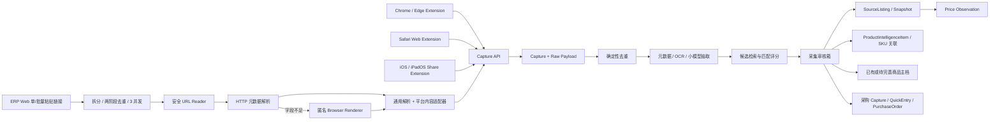

# 商品情报采集技术架构

状态：Web 单/批量链接采集、可插拔平台适配与业务转化架构已实现
最后更新：2026-08-09

## 1. 架构原则

1. 客户端负责接收用户当前主动分享或选择的内容。
2. ERP 负责鉴权、留存、幂等、来源版本和标准商品匹配。
3. URL/平台商品 ID 是来源身份；标题和图片只能用于候选匹配。
4. 原始数据不可覆盖，标准化结果可重新计算。
5. 规则优先于 AI，小模型优先于大模型。
6. Apple、Chrome 和 ERP Web 使用同一个版本化采集协议。

## 2. 总体架构



## 3. 当前技术基线

现有仓库已经使用：

- Next.js App Router、React、TypeScript
- Next.js Server Actions / Route Handlers
- Prisma
- PostgreSQL
- Zod
- Decimal.js
- Vitest / Playwright

现有 `ProductIntelligenceItem` 与 `ProductIntelligenceObservation` 可以继续使用，但缺少来源、快照、资产和设备鉴权。

## 4. 推荐技术栈

### 4.1 ERP Web / API

| 能力                | 选择                                         |
| ------------------- | -------------------------------------------- |
| Web                 | 现有 Next.js App Router                      |
| API                 | Next.js Route Handlers，版本前缀 `/api/v1`   |
| 校验                | Zod + 共享 JSON Schema/OpenAPI               |
| ORM/主库            | Prisma + PostgreSQL                          |
| 金额                | Decimal.js + PostgreSQL Decimal              |
| 测试                | Vitest + Playwright                          |
| 文件存储（开发）    | 现有本地上传                                 |
| 文件存储（生产）    | S3-compatible Object Storage + signed upload |
| 异步任务（MVP）     | 数据库任务表/显式重试                        |
| 异步任务（规模化）  | Redis + BullMQ，可后置引入                   |
| 向量检索（AI 阶段） | PostgreSQL + pgvector，可选                  |

说明：当前 `package.json` 尚未安装 Redis、BullMQ、AI SDK 或 pgvector。文档中的这些能力是后续阶段选型，不是当前已实现依赖。

### 4.2 Chrome / Edge

- Manifest V3
- TypeScript
- `activeTab`
- `scripting`
- `sidePanel`
- `contextMenus`
- `storage`
- Vite 或轻量扩展构建配置
- 与 Safari 共享纯 TypeScript 的网页解析核心

Chrome 仅在用户点击扩展、右键菜单或快捷键时获得当前页临时权限，默认不使用 `<all_urls>` 永久权限。

### 4.3 Apple

一个 Xcode 工程包含：

- 极简 SwiftUI 容器 App
- iOS/iPadOS Share Extension
- Safari Web Extension
- Keychain 中的设备令牌
- App Group 共享少量配置和待上传草稿
- Apple Vision `RecognizeTextRequest` 做截图 OCR
- `URLSession` 调用 Capture API

Safari Web Extension 的 HTML/TypeScript 页面解析器尽量复用 `capture-web-core`，原生 Share Extension 使用 Swift 解析 `NSExtensionItem`。

### 4.4 AI 层

定义供应商无关接口，不在业务服务中直接调用某个模型 SDK：

```ts
interface CaptureIntelligenceProvider {
  extractClaims(input: CaptureEvidence): Promise<ExtractedClaim[]>;
  rankCandidates(
    input: CaptureEvidence,
    candidates: ProductCandidate[]
  ): Promise<RankedCandidate[]>;
  summarizeChange(previous: Snapshot, current: Snapshot): Promise<ChangeSummary>;
}
```

第一阶段可以完全没有 AI；确定性模型和采集 API 不依赖 AI 才能工作。

## 5. 仓库结构

在不迁移现有 Next.js 根目录的前提下，计划增加：

```text
clients/
├── chrome-capture/
│   ├── manifest.json
│   ├── src/background/
│   ├── src/content/
│   ├── src/sidepanel/
│   └── tests/
└── apple-capture/
    ├── ERPProductCapture.xcodeproj
    ├── CaptureApp/
    ├── ShareExtension/
    ├── SafariWebExtension/
    └── Tests/

packages/
├── capture-contract/
│   ├── openapi.yaml
│   ├── schemas/
│   └── generated/
└── capture-web-core/
    ├── src/
    └── tests/
```

### 5.1 共享边界

可共享：

- Capture JSON Schema/OpenAPI
- URL 规范化
- 平台识别
- 页面元数据解析
- 内容哈希
- 通用网页图片候选逻辑

不可强行共享：

- iOS Share Extension 生命周期
- Keychain/App Group
- Chrome service worker 和权限 API
- Apple Vision OCR
- App Store/Chrome Web Store 构建和签名

## 6. Capture API

### 6.1 创建采集

`POST /api/v1/product-intelligence/captures`

请求头：

```text
Authorization: Bearer <device-access-token>
Idempotency-Key: <uuid>
Content-Type: application/json
X-Capture-Contract-Version: 1
```

示例：

```json
{
  "captureType": "SHARE_URL",
  "storeId": "store_xxx",
  "source": {
    "url": "https://example.com/item/123",
    "platformHint": "MERCARI",
    "externalListingId": "m123",
    "sharedTitle": "卖家提供的原始标题",
    "sharedText": "宿主 App 提供的文字"
  },
  "observed": {
    "amount": "12800",
    "currency": "JPY",
    "conditionText": "中古"
  },
  "assets": [],
  "client": {
    "kind": "APPLE_SHARE_EXTENSION",
    "version": "0.1.0",
    "locale": "zh-CN"
  },
  "capturedAt": "2026-07-31T09:00:00.000Z",
  "visibility": "ORGANIZATION"
}
```

响应：

```json
{
  "captureId": "cap_xxx",
  "status": "NEEDS_REVIEW",
  "duplicate": {
    "kind": "SAME_SOURCE_CHANGED_PRICE",
    "sourceListingId": "src_xxx"
  },
  "reviewUrl": "https://erp.example.com/product-intelligence/captures/cap_xxx"
}
```

### 6.2 资产上传

生产环境使用两步上传：

1. `POST /api/v1/product-intelligence/capture-assets/presign`
2. 客户端直接上传对象存储
3. Capture 请求引用 `assetId`

服务器必须校验：

- MIME
- 文件大小
- 图片尺寸
- 所属组织/设备
- SHA-256
- EXIF 处理策略

### 6.3 获取处理状态

- `GET /api/v1/product-intelligence/captures/:id`
- Web 端可使用轮询；后续再引入 Server-Sent Events。

### 6.4 人工确认

- `POST /api/v1/product-intelligence/captures/:id/confirm`
- `POST /api/v1/product-intelligence/captures/:id/dismiss`
- `POST /api/v1/product-intelligence/captures/:id/retry`

## 7. 数据模型建议

### 7.1 CaptureDevice

- `id`
- `organizationId`
- `userId`
- `name`
- `clientKind`
- `tokenHash`
- `scopes`
- `lastUsedAt`
- `revokedAt`
- `createdAt`

### 7.2 ProductIntelligenceCapture

- `id`
- `organizationId`
- `storeId`
- `userId`
- `deviceId`
- `captureType`
- `status`
- `contractVersion`
- `idempotencyKey`
- `rawPayload`
- `sourceUrl`
- `normalizedUrl`
- `platformHint`
- `externalListingId`
- `contentHash`
- `capturedAt`
- `processedAt`
- `errorCode`
- `createdAt`

唯一约束：

- `(deviceId, idempotencyKey)`

### 7.3 SourceListing

- `id`
- `organizationId`
- `platformCode`
- `externalListingId`
- `canonicalUrl`
- `sellerExternalId`
- `firstSeenAt`
- `lastSeenAt`
- `listingStatus`
- `matchedItemId`
- `matchStatus`

推荐唯一约束：

- `(organizationId, platformCode, externalListingId)`，外部 ID 存在时
- `(organizationId, canonicalUrl)`，无法取得外部 ID 时

### 7.4 SourceListingSnapshot

- `id`
- `sourceListingId`
- `captureId`
- `title`
- `description`
- `amount`
- `currency`
- `conditionText`
- `contentHash`
- `observedAt`
- `rawData`

同一来源、同一 `contentHash` 不重复保存内容快照。

### 7.5 SourceAsset

- `id`
- `sourceListingId`
- `snapshotId`
- `assetType`
- `storageKey`
- `sourceUrl`
- `sha256`
- `perceptualHash`
- `width`
- `height`
- `isEvidence`
- `isCanonicalCandidate`

底层文件可以按哈希去重，但不同来源的资产关联必须保留。

### 7.6 ExtractedClaim

- `id`
- `snapshotId`
- `field`
- `value`
- `normalizedValue`
- `evidenceText`
- `evidenceAssetId`
- `boundingBox`
- `confidence`
- `extractorType`
- `extractorVersion`
- `reviewStatus`

### 7.7 MatchCandidate

- `id`
- `sourceListingId`
- `itemId`
- `score`
- `signals`
- `matcherVersion`
- `status`
- `reviewedById`
- `reviewedAt`

### 7.8 ProductIntelligenceObservation 扩展

新增可选关联：

- `sourceListingId`
- `snapshotId`
- `captureId`

价格观察仍属于具体商品情报 SKU，但可以追溯到来源证据。

## 8. 处理流水线

### 8.1 接收

1. 校验设备令牌和租户范围。
2. 校验合约版本。
3. 使用 `Idempotency-Key` 去重请求。
4. 保存原始 Capture，立即返回。

### 8.2 来源识别

1. 规范化 URL，移除追踪参数。
2. 尝试解析平台和外部商品 ID。
3. 查找已有 SourceListing。
4. 计算内容哈希。

### 8.3 字段抽取

按成本从低到高：

1. 客户端已提供字段。
2. Open Graph / JSON-LD / DOM 文本。
3. Apple Vision OCR。
4. 规则与平台适配器。
5. 小模型结构化抽取。

### 8.4 匹配

1. 款号、GTIN/JAN/EAN/UPC 等精确信号。
2. 品牌、分类、颜色、尺码等结构化过滤。
3. 文本/图片相似候选。
4. 小模型候选重排。
5. 人工确认。

### 8.5 归档

人工确认后：

- 创建/更新 SourceListing。
- 内容变化时增加 Snapshot。
- 价格变化时增加 Observation。
- 建立标准商品/SKU 关联。
- 不修改标准描述和主图，除非用户单独确认。

## 9. Chrome 网页解析策略

### 9.0 ERP Web 服务端解析

插件之前先提供服务端单页解析：

1. URL/协议/DNS/内网地址校验。
2. 普通 HTTP 请求读取 HTML、Open Graph、JSON-LD。
3. 核心字段不足时，Playwright 使用匿名浏览器上下文渲染。
4. 通用字段解析后执行 Mercari 等平台适配器。
5. 只返回预览；用户确认后调用现有 Capture/Source/Snapshot 服务。

浏览器渲染必须在 Node.js runtime 运行。macOS 开发环境可以配置 `WEB_CAPTURE_BROWSER_CHANNEL=chrome` 使用系统 Chrome；Linux 生产环境需要安装 Playwright Chromium，规模化后迁移到网络隔离的 Browser Worker。

安全控制包括：禁止内网/本机/保留地址、跳转复检、子请求校验、页面大小限制、超时、用户限频和匿名 Cookie 上下文。

### 9.1 平台适配器分层

系统不为每个商品页面编写解析代码，而是按平台族维护带版本的内容适配器：

```text
安全页面读取器
├── HTTP HTML
└── Browser DOM
        ↓ 统一 WebLinkDocument
通用适配器 GENERIC
        ↓ 基础字段
平台内容适配器（可选覆盖）
├── MERCARI v3
├── ATMOS v1
├── GOOFISH v1
├── AMAZON（待内容适配）
└── YAHOO_AUCTION（待内容适配）
        ↓
WebLinkPreview + adapterVersion + extractionClaims
```

边界如下：

- 页面读取器只收集通用 HTML、元数据、正文、图片和链接证据，不包含平台选择器。
- 通用适配器处理 JSON-LD Product、Open Graph 和可见文本。
- 平台身份适配器负责域名、规范化 URL 和外部商品 ID。
- 平台内容适配器负责该平台的价格、成色、状态、卖家、类目及商品图规则。
- 平台字段只在非空且比通用结果更明确时覆盖通用结果；失败时自动退回通用结果。
- 每条字段声明保存来源适配器、置信度和有限证据文本；用户编辑后的结果仍由用户确认。

当前支持矩阵：

| 平台       | 身份识别    | 内容解析等级 | 已覆盖变体                                   |
| ---------- | ----------- | ------------ | -------------------------------------------- |
| 通用网页   | URL         | 通用         | JSON-LD、Open Graph、HTML metadata           |
| Mercari    | 商品 ID     | 深度优化     | Shops、个人商品基础图片规则、PC/移动规范链接 |
| 闲鱼       | 商品 ID     | 分享内容优化 | `p.goofish.com`、`m.tb.cn`、商品详情 URL     |
| Yahoo 拍卖 | 拍卖 ID     | 仅身份       | 等待真实 Fixture                             |
| Amazon     | ASIN        | 仅身份       | 日本/美国等主要域名                          |
| Atmos      | 商品路径 ID | 深度优化     | 官方商品详情页、商品图过滤                   |

闲鱼适配器接受纯链接或包含链接的完整分享文案。短链展开后使用商品 ID 生成去跟踪参数的规范 URL；分享文案可提供标题和来源证据。匿名落地页未暴露可靠商品详情时，适配器会清除通用页面误识别的价格、图片、卖家和品牌，要求用户在保存前核对或补充，不尝试绕过登录与平台访问限制。

`GET /api/v1/product-intelligence/adapters` 返回身份版本、内容版本、解析等级、页面变体和能力清单，可用于管理页或健康检查。新增深度平台适配器时必须同时增加真实脱敏 Fixture 和契约测试。

通用解析优先级：

1. URL、document title
2. JSON-LD Product
3. Open Graph
4. 可见 DOM 文本
5. 图片候选
6. 用户点选元素
7. 当前视口截图

网页扩展不主动进行后台批量请求，不读取用户没有打开的页面。

## 10. Apple 分享与 OCR

Share Extension 接收宿主 App 提供的：

- URL
- plain text
- image
- screenshot/file

宿主 App 没有分享出来的数据无法直接访问。截图 OCR 使用 Apple Vision，并同时保留：

- OCR 文本
- 文字置信度
- 原图坐标
- 原始截图

OCR 结果是待确认声明，不能直接成为标准商品事实。

## 11. 设备鉴权

### 11.1 配对

1. 用户在 ERP 打开“采集设备”。
2. ERP 生成一次性配对码/二维码。
3. Chrome 或 Apple 客户端提交配对码。
4. ERP 返回设备 refresh token 和短期 access token。
5. 数据库只保存 refresh token 哈希。

### 11.2 存储

- Apple：Keychain
- Chrome：extension storage；refresh token 必须可撤销并限制 scope
- Web：继续使用现有会话 Cookie

### 11.3 Scope

MVP：

```text
product-intelligence:capture
product-intelligence:capture:read-own
```

设备令牌不允许读取库存、订单、财务或团队信息。

## 12. 可靠性

- 所有创建请求必须幂等。
- Capture 保存成功和解析成功分离。
- AI/OCR 失败不影响原始 Capture 留存。
- 客户端失败时保存本地待上传队列。
- 解析器和模型必须记录版本。
- 原始数据、标准化结果、人工决定分开保存。
- 所有自动匹配都可以重新计算。

## 13. 测试策略

### ERP

- API 合约测试
- 租户/店铺权限测试
- 幂等测试
- URL 和内容去重测试
- 快照/价格变化测试
- 人工确认和拒绝测试

### Chrome

- 通用 JSON-LD/Open Graph fixture
- 动态 DOM fixture
- 无图片/无价格页面
- 禁止右键、CSS background、lazy image
- 权限与退出登录

### Apple

- 分享 URL
- 分享文字
- 分享单图/多图
- 分享截图
- 宿主没有 URL
- 离线排队
- 设备令牌过期/撤销

## 14. 外部参考

- Chrome activeTab
  <https://developer.chrome.com/docs/extensions/develop/concepts/activeTab>
- Chrome content scripts
  <https://developer.chrome.com/docs/extensions/develop/concepts/content-scripts>
- Chrome side panel
  <https://developer.chrome.com/docs/extensions/reference/api/sidePanel>
- Apple Share Extension input
  <https://developer.apple.com/documentation/foundation/nsextensionitem>
- Safari Web Extensions
  <https://developer.apple.com/documentation/safariservices/safari-web-extensions>
- Apple Vision text recognition
  <https://developer.apple.com/documentation/vision/recognizetextrequest>
- pgvector
  <https://github.com/pgvector/pgvector>
