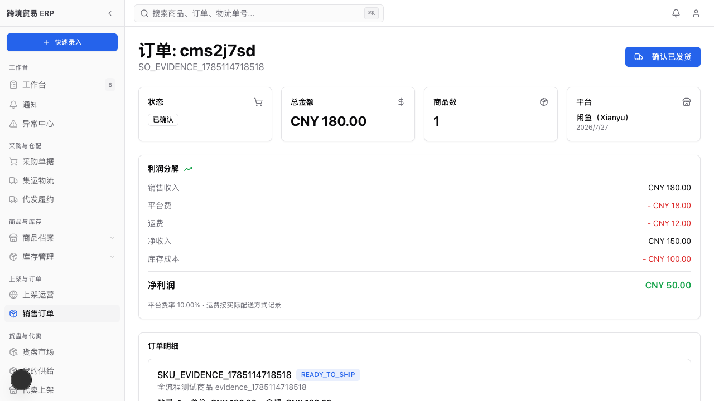
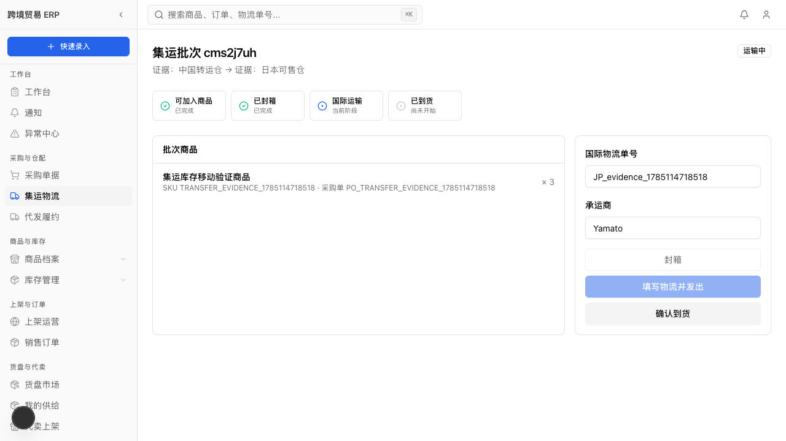
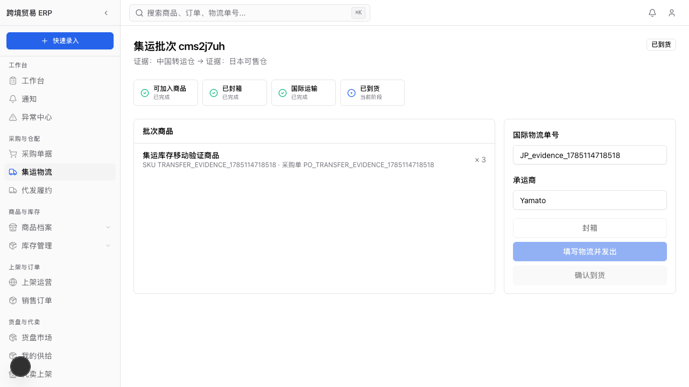
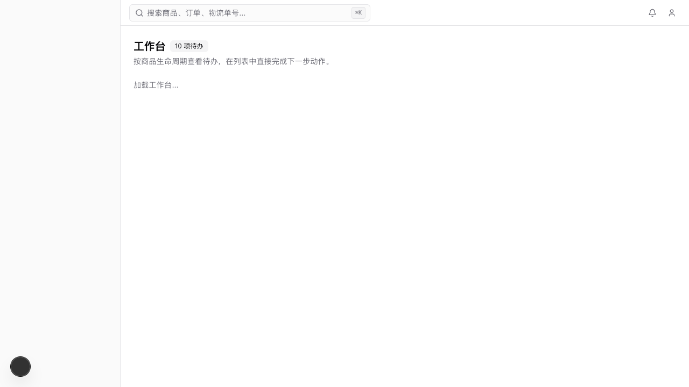
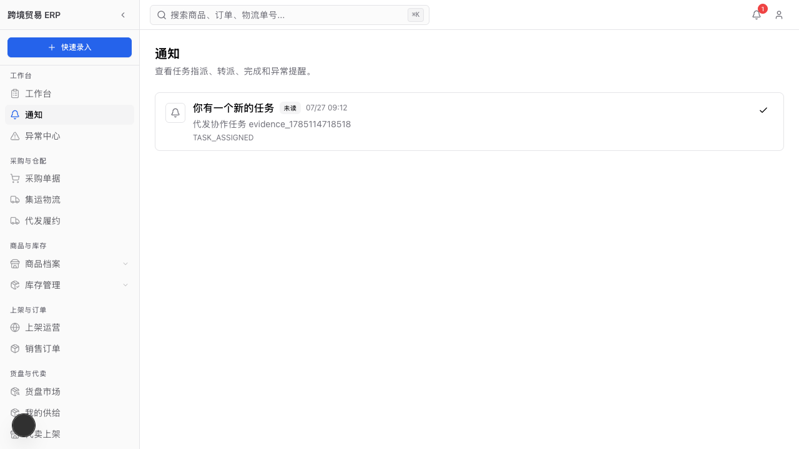
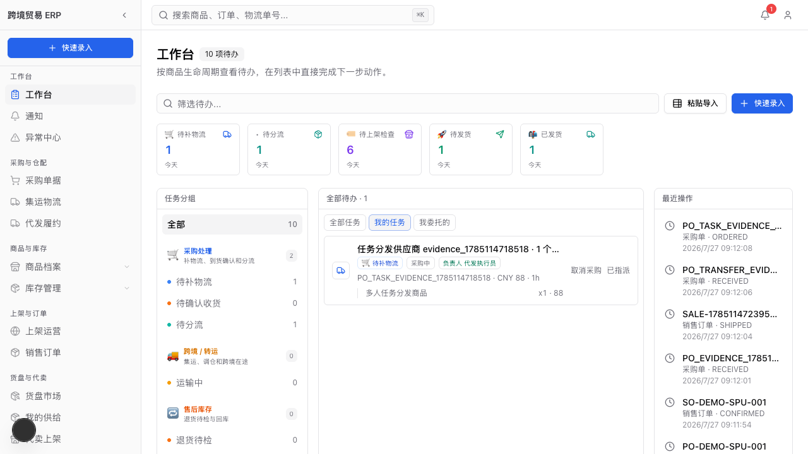
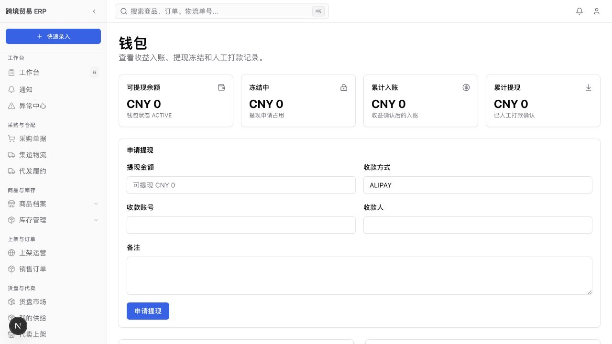

# ERP V2 全流程修复与复测报告

首次测试：2026-07-26
修复复测：2026-07-27
范围：采购、转运、入库、上架、售出、发货、利润、报表、多账号任务分发、代卖/代发结算、个人佣金钱包

## 结论

本轮发现的 F-01 至 F-09 已全部修复并通过对应回归测试。

- 单元/集成测试：`55` 个测试文件、`205` 项测试全部通过。
- 核心浏览器 smoke：`19/19` 通过。
- 带截图的串行全流程：`3/3` 通过。
- 生产构建：`next build` 通过。
- Prisma 结构校验、客户端生成与迁移部署：全部通过。
- 钱包页面已能正常打开，不再出现 `walletAccount.upsert()` 的 Prisma 运行时错误。

## 一、采购 → 入库 → 上架 → 售出 → 发货 → 利润

复测数据：

| 项目 | 结果 |
| --- | ---: |
| 采购币种 | CNY |
| 采购数量 | 2 |
| 采购单价 | CNY 100 |
| 采购总额 | CNY 200 |
| 收货后库存 | 2 |
| 售出数量 | 1 |
| 售价 | CNY 180 |
| 平台费率 | 10% |
| 平台费 | CNY 18 |
| 运费 | CNY 12 |
| 净收入 | CNY 150 |
| 库存成本 | CNY 100 |
| 净利润 | CNY 50 |
| 发货后剩余库存 | 1 |
| 最终状态 | SHIPPED |

计算复核：

```text
180 - 18 - 12 = 150
150 - 100 = 50
```

销售详情现在根据订单实际平台费反推有效费率，金额为 CNY 18 时说明文字显示 10%，不会再显示 0.00%。



## 二、集运到货与库存转仓

复测路线：

```text
证据：中国转运仓 → 证据：日本可售仓
OPEN → SEALED → SHIPPED → RECEIVED
```

复测数量为 3，单位成本 JPY 6,000。

确认到货现在在同一个数据库事务内执行以下动作：

1. 校验目的仓、起运仓、商品来源和可用数量。
2. 原库存写入 `TRANSFER_OUT -3`。
3. 目的仓生成转仓批次并写入 `TRANSFER_IN +3`。
4. 原批次可用量归零并标记 `CONSUMED`。
5. 最后才把集运批次更新为 `RECEIVED`。

如果库存不足或仓库不合法，整批事务回滚，状态不会被误标为已到货。重复点击也不会重复生成转仓台账。





页面同时完成了以下修复：

- 集运列表增加“新建集运批次”入口。
- 商品行显示商品名、SKU、采购单号或单品编号。
- Decimal 数量已转成可序列化字符串。
- 状态和时间轴改为中文，并区分已完成、当前阶段、尚未开始。

## 三、多账号、店铺隔离和任务分发

多账号复测：

- 管理员把任务指派给 `FULFILLMENT` 执行账号。
- 任务状态变为 `ASSIGNED`。
- `assignedToId` 与 `delegatedToId` 均正确。
- 接收方生成唯一的 `TASK_ASSIGNED` 通知。
- 接收账号登录后能在通知页和“我的任务”中看到任务。







账号和店铺修复：

- 登录页改为邮箱和密码，不再列出全部成员供任意选择。
- 密码使用 `scrypt` 加盐哈希。
- 登录 Cookie 使用 HMAC 签名并设置 HttpOnly、SameSite 和有效期。
- 生产环境必须配置会话密钥。
- 新增团队成员时必须设置至少 8 位初始密码。
- 侧栏和 26 个采购、库存、Listing、销售、报表页面已移除 `store_1` 硬编码。
- 顶部新增当前店铺选择器，只允许切换到账号有权访问的店铺。
- 侧栏待办和货盘数字跟随当前店铺刷新。

## 四、代卖、代发、结算和个人佣金钱包

代卖/代发测试数据：

| 项目 | 结果 |
| --- | ---: |
| 供给数量 | 2 |
| 供货单价 | JPY 6,000 |
| 代卖售价 | JPY 10,000 |
| 代卖数量 | 1 |
| 佣金率 | 20% |
| 平台费率 | 10% |
| 代发运费 | JPY 800 |
| 汇率 | JPY/CNY = 0.05 |

数量与结算结果：

- 创建履约后：可供 2，预留 1。
- 发货后：可供 1，预留 0。
- 取消未发货订单：预留正确释放。
- 结算原币总额：JPY 7,600。
- 本位币结算：CNY 380。
- 待净应付：CNY 330。
- 支付后待净应付：CNY 0，已净支付：CNY 330。
- 未授权店铺看不到 `PARTNER_ONLY` 货盘。

钱包修复：

- 补齐并部署钱包相关六张表。
- 结算从 `CONFIRMED` 进入 `PAID` 时，把代卖记录创建人的佣金写入个人钱包。
- 本例佣金为 `(10,000 - 6,000) × 20% = JPY 800`，按 0.05 换算后钱包入账 `CNY 40`。
- 同一结算、用户和收益类型有数据库唯一约束，重复支付不会重复入账。
- 每个收益事件只能生成一条钱包 `CREDIT`。
- 每个提现申请只能生成一条打款记录。
- 只有财务及以上角色可以确认提现打款。
- 已支付结算不允许再次支付或作废。



## 五、商品搜索与市场筛选

- 独立 `SIMPLE` SKU 不再因为名称相似被自动合并成一个展示卡片。
- 只有旧数据中的 `VARIANT` 才允许使用自动展示分组兜底。
- 新增回归测试确认同名、不同 SKU 编码会显示为两个商品卡片。
- 页面数据统一跟随当前店铺，避免中国货盘或日本货盘视图混入其他店铺数据。
- 上架脚本改用当前界面字段“系统 SKU 编码”“首上架”“登记售出”。

## 六、问题关闭情况

| 编号 | 原问题 | 状态 |
| --- | --- | --- |
| F-01 | 集运到货不移动库存 | 已修复并验证转仓台账 |
| F-02 | 核心页面硬编码 `store_1` | 已移除并增加活动店铺上下文 |
| F-03 | 集运 Decimal 传入客户端 | 已序列化 |
| F-04 | 集运无新建入口、商品只显示内部 ID | 已增加入口并丰富商品信息 |
| F-05 | 登录可任意选择操作人 | 已改为密码认证与签名会话 |
| F-06 | E2E 使用旧字段和按钮名称 | 已更新，smoke `19/19` 通过 |
| F-07 | 相似名称 SKU 被展示分组吞掉 | 已限制自动分组并增加测试 |
| F-08 | 平台费金额与说明费率矛盾 | 已按实际费用推导费率 |
| F-09 | 集运状态/来源显示英文枚举和 ID | 已中文化并显示业务标识 |

## 七、测试执行记录

```text
Prisma validate/generate/migrate deploy
全部通过

Vitest
Test Files  55 passed (55)
Tests       205 passed (205)

带截图全流程
3 passed

核心 smoke
19 passed

生产构建
Compiled successfully
```

可复跑用例：

```text
tests/application/consolidation-receipt.test.ts
tests/application/marketplace-resale-flow.test.ts
tests/e2e/full-flow-evidence.spec.ts
tests/e2e/purchase-to-profit-long-flow.spec.ts
```

## 八、截图索引

1. [采购基础信息](./e2e-2026-07-26/screenshots/01-purchase-basic-cny.png)
2. [采购数量与成本](./e2e-2026-07-26/screenshots/02-purchase-line-qty-cost.png)
3. [采购预览](./e2e-2026-07-26/screenshots/03-purchase-review-total.png)
4. [采购已下单](./e2e-2026-07-26/screenshots/04-purchase-ordered-receive.png)
5. [入库库存](./e2e-2026-07-26/screenshots/05-inventory-received-qty-2.png)
6. [首上架](./e2e-2026-07-26/screenshots/06-listing-create-cny-180.png)
7. [Listing 在售](./e2e-2026-07-26/screenshots/07-listing-active.png)
8. [售出费用输入](./e2e-2026-07-26/screenshots/08-sale-input-fees.png)
9. [订单利润](./e2e-2026-07-26/screenshots/09-sale-confirmed-profit-50.png)
10. [订单已发货](./e2e-2026-07-26/screenshots/10-sale-shipped.png)
11. [经营报表](./e2e-2026-07-26/screenshots/11-report-after-sale.png)
12. [集运列表及新建入口](./e2e-2026-07-26/screenshots/12-consolidation-list.png)
13. [集运待装箱](./e2e-2026-07-26/screenshots/13-consolidation-open.png)
14. [集运运输中](./e2e-2026-07-26/screenshots/14-consolidation-shipped.png)
15. [集运已到货](./e2e-2026-07-26/screenshots/15-consolidation-received.png)
16. [任务待指派](./e2e-2026-07-26/screenshots/16-task-unassigned.png)
17. [任务已指派](./e2e-2026-07-26/screenshots/17-task-assigned.png)
18. [接收方通知](./e2e-2026-07-26/screenshots/18-assignee-notification.png)
19. [接收方我的任务](./e2e-2026-07-26/screenshots/19-assignee-my-tasks.png)
20. [钱包页面](./e2e-2026-07-26/screenshots/20-wallet-fixed.png)
