# 经营报表：截图调查与改造验收

日期：2026-09-14。目标：`http://192.168.3.99:3000/reports`，当前本地工作区。实际操作已登录 Chrome 页面，逐步截图并检查；未创建或改动业务单据。

## 调查发现与处理

1. **原总览：需要改造。** 首屏是两排同等权重的卡片、空费用区和被挤到下方的图表，没有分类入口。数字也不能直接追溯。改为五个 Tab，首屏聚焦收入、贡献利润、采购、库存；指标可跳到对应分类，分类内再定位明细。

   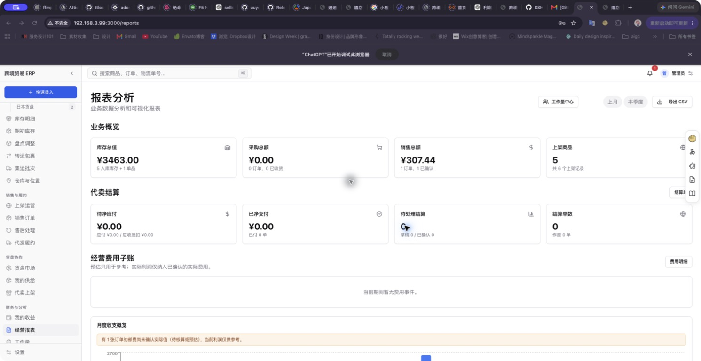

2. **原图表与统计范围：需要修正。** 实际页面两个饼图分别只有一个 100% 扇区；本月筛选下仍出现六个月收支，库存总值包含历史库存，而位置图只取本期入库。新版趋势按选定期间显示，渠道以金额、订单数和比较条展示，仓库分布改为可核对的数量/金额表；库存统一为当前快照。

   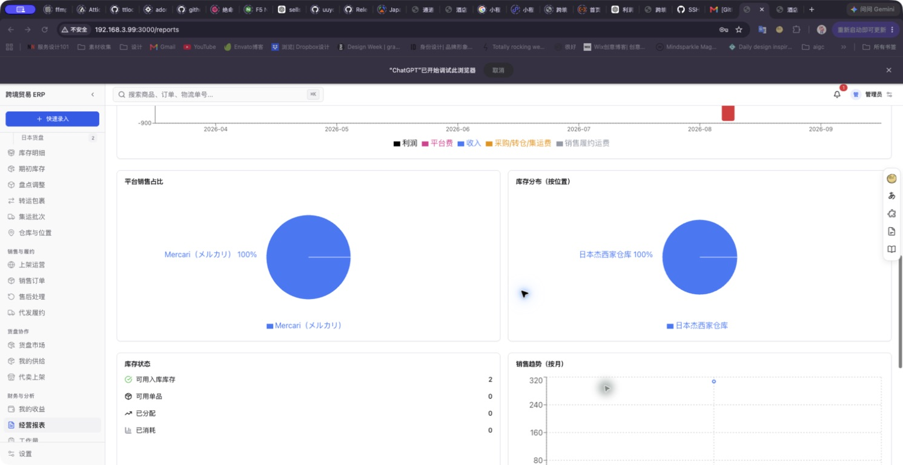

3. **新版总览：通过。** 使用已有 ERP 中性色、蓝色强调、细边框与紧凑表格。四个核心指标、利润成本拆解、期间趋势、渠道及结算运营入口有明确层级。窄屏重排，Tab 导航随滚动保持可见，切换分类回到页面顶部。

   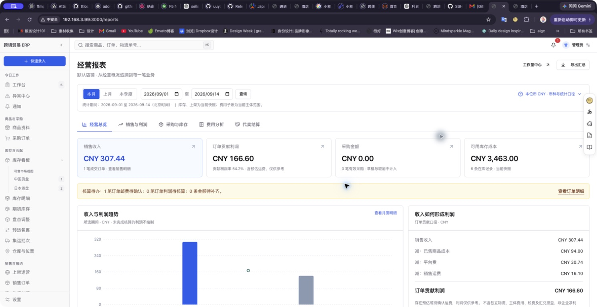

4. **销售明细及币种：通过。** 截图实测 JPY 6,300.00 × 0.0488 = CNY 307.44；成本由 CNY 38.00 + CNY 56.00 构成，平台费 30.74、运费 16.10，贡献利润 166.60。卡片、月度对账、币种核对、订单明细及 CSV 值一致。展开细节显示收入换算、成本原币、成本汇率、费用和核算状态。不存在的单号搜索显示明确空结果，清除后恢复记录，空结果不可导出。

   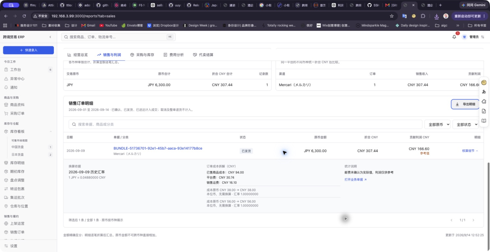

5. **采购与库存：通过。** 当前库存为六条记录、18 件、CNY 3,463.00；与仓库分布金额一致。季度采购 JPY 88,000.00 折合 CNY 4,400.00。库存选择 JPY 后由六条筛选为两条，分别显示 JPY 28,000 → CNY 1,400、JPY 30,000 → CNY 1,500。采购和库存保留独立统计范围。

   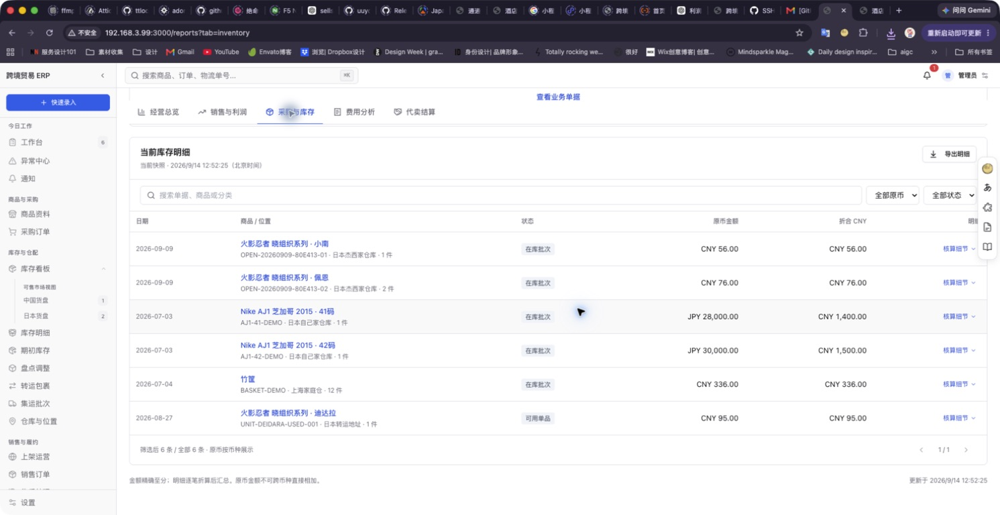
   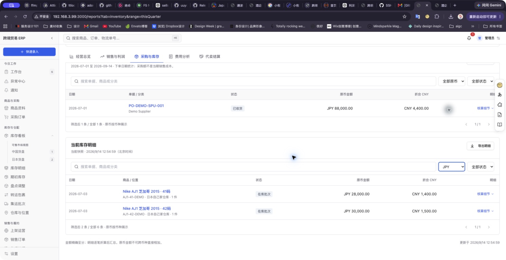

6. **费用分析：通过（真实数据及空状态）。** 平台费、销售运费、物流明细均可追溯。代理手续费按费率单独列为预估，不混入确认利润。季度实际集运费用 CNY 840.00 与来源链接可见；当前主体费用无记录，显示空状态及费用子账入口，不生成假数据。主体费用与店铺订单/物流可能重复，单独展示，不直接相加或重复扣减利润。

   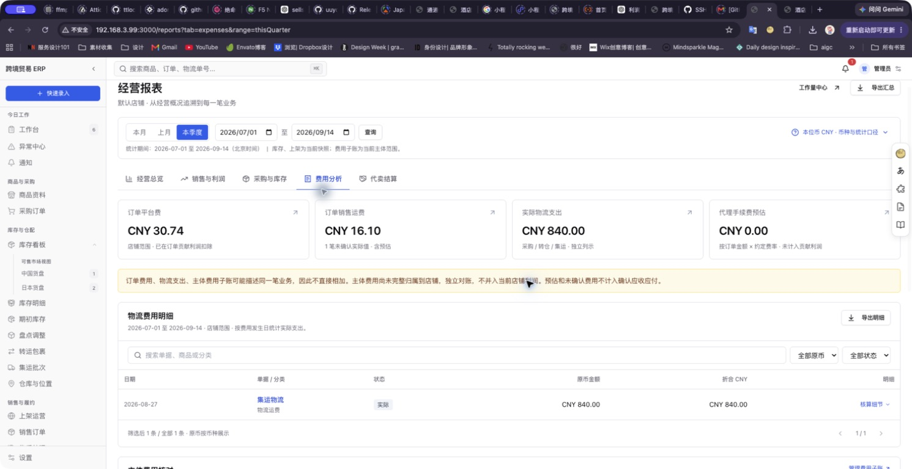
   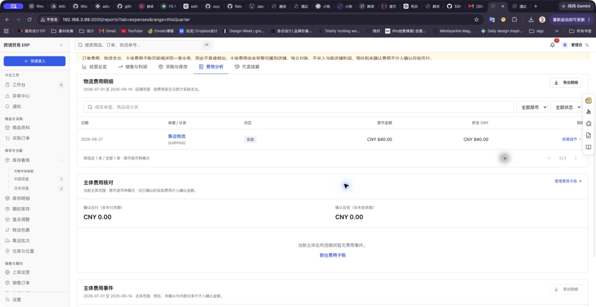

7. **代卖结算：空状态通过，非空计算由测试覆盖。** 当前数据无结算单。已确认应收、应付分别展示；草稿和正式待结算区分；说明行、作废行不计入金额。已付/已收按所选期间创建单据的状态统计，明确不称为本期现金流水。非空快照、零快照及草稿排除使用测试验证。

   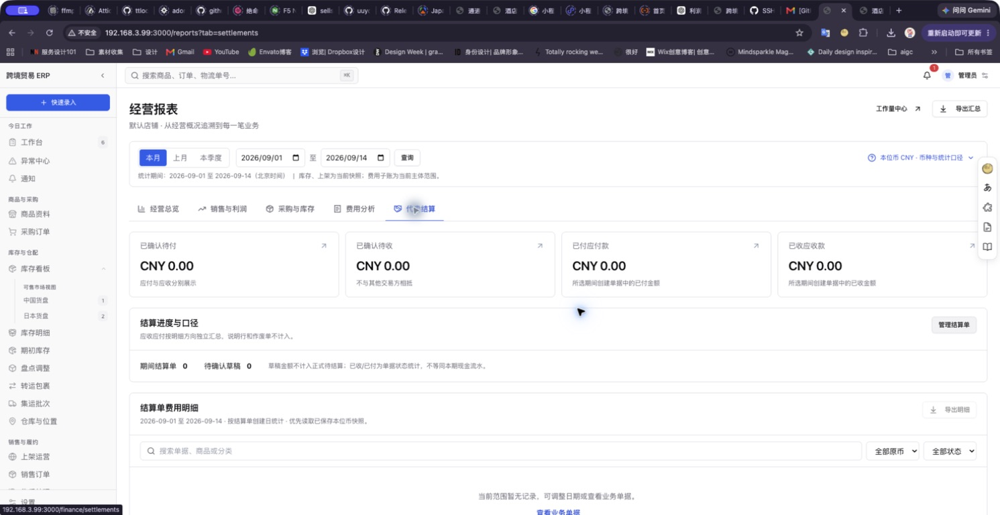

8. **日期与响应式：通过已检查范围。** 本季度切换到 2026-07-01 至 2026-09-14，收入变为 CNY 2,907.44，采购为 CNY 4,400.00，库存仍为 CNY 3,463.00；趋势仅显示七、八、九月。200% / 300% 浏览器缩放下筛选区正常重排、窄屏侧栏折叠。检查结束恢复 100% 缩放。

   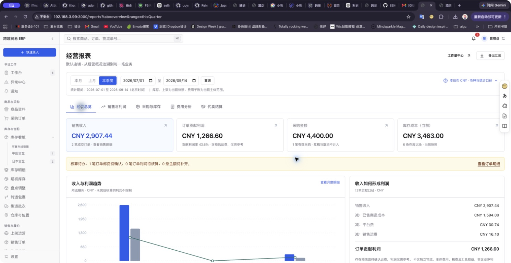
   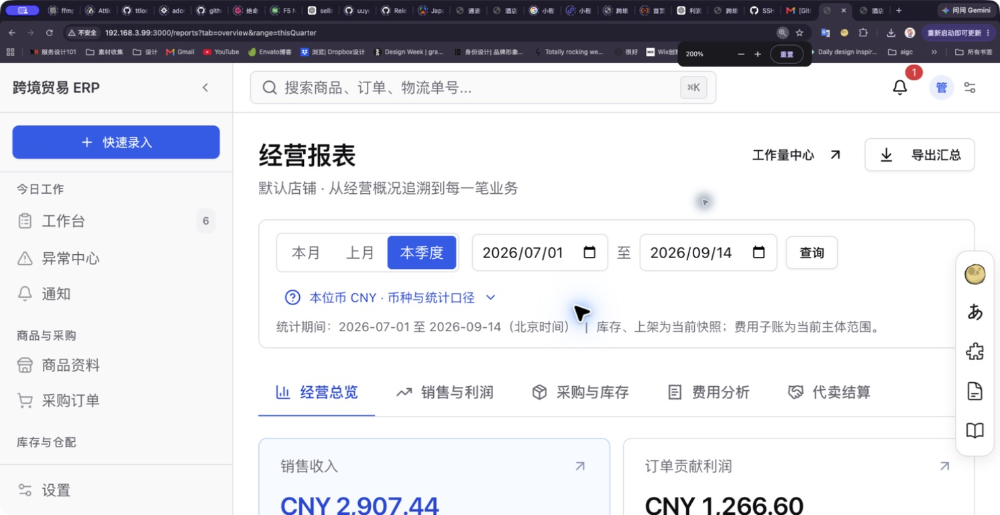
   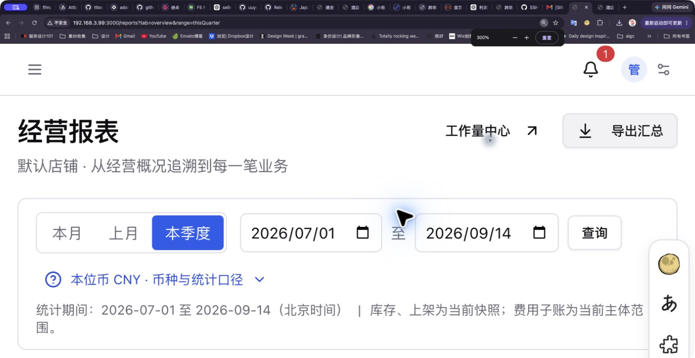

## 明确的金额与时间约定

- 延续项目既有 CNY 统一统计约定，不将店铺交易币种当作报表本位币。
- 原币金额逐币种展示；原币 × 兑 CNY 汇率 = 本位币金额。每笔折合至分后用 Decimal 汇总，明细与合计对账。
- 销售收入及订单费用按订单日历史汇率；成本使用库存成本币种及入库/建档日期，不能套用销售币种。
- 采购优先使用单据约定汇率；结算及确认费用优先使用已保存 CNY 金额（包括合法零金额），其次使用对应 CNY 汇率快照或业务日期汇率。
- 无汇率、过期汇率、未确认成本或未完整分配库存时，相关本位币/利润合计显示“待核算”；禁止按 1:1、0 或隐藏缺失记录后的部分合计展示。
- 销售只计已确认、已发货、已送达；草稿、未成交、取消、整单退货不计销售额。采购草稿及取消不计采购额。
- 订单贡献利润 = 销售收入 − 已售商品成本 − 平台费 − 已录入销售运费；运费仍为预估时明确仅供参考。这不是企业净利润；不合并独立物流、主体费用、税费和汇兑损益。
- 报表日界线统一 Asia/Shanghai；用户选取日期包括结束日。库存和上架为当前快照，不冒充所选期间末的历史余额。
- 费用子账为主体范围；只将自己作为单边付款/收款方且已确认的实际费用计入确认额。内部双向身份不产生虚假净支出。

## 专业产品参考

- Shopify 将指标摘要与可进入的详细报表关联，支持日期及币种配置。本次采用“总览 → 分类 → 可核对明细”的组织方式。[官方 Analytics dashboard 说明](https://help.shopify.com/en/manual/reports-and-analytics/shopify-reports/overview-dashboard/using-the-overview-dashboard)
- Odoo 区分交易币种与公司的主币种。本次保留原币，同时单独展示本位币及换算依据。[官方多币种文档](https://www.odoo.com/documentation/16.0/applications/finance/accounting/get_started/multi_currency.html)

专业产品文档用于研究参考；本报告的页面验收结论来自本次实际 ERP 截图及操作，不冒称登录审查过 Shopify/Odoo 产品。

## 验证与边界

- `npm run typecheck` 通过。
- 新报表和现有利润数学测试：2 个测试文件、15 个用例通过。新报表使用 Prisma mock 隔离数据，未向业务数据库写入测试数据。
- `NEXT_DIST_DIR=.next-e2e-reports-verify npm run build` 通过；本模块构建中发现的一个未使用 import 已清理；其他模块有既存未使用变量告警。构建产生的临时目录及配置改动已清理。
- 浏览器实际导出销售 CSV 成功，并读取下载文件核对原币、CNY 与贡献利润。
- 缺失汇率、混合币种成本、结算快照、有效零快照、草稿/取消排除、内部费用、时区边界及 CSV 转义已覆盖测试。
- 当前真实结算和主体费用为空，未通过造单或改业务数据制造非空截图。分页超过十条及真实移动设备尚未实测；200%/300% 是浏览器重排检查，不代替实体设备验收。截图不能证明完整无障碍合规。
- 这是本地实现与验收；未部署远端测试站点。
